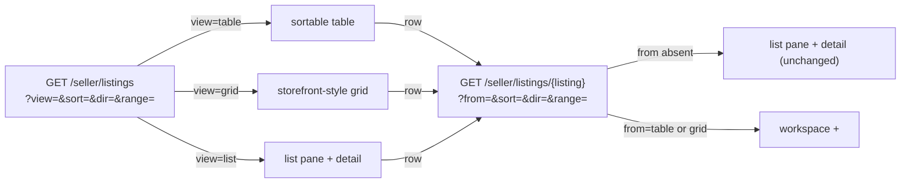

# Seller portal

The seller portal's tools beyond the backbone (dashboard, orders, messages,
earnings) covered in [`architecture.md`](architecture.md). Each tool gets its
own section here as its lane lands.

## Listings

Question: how does a seller look at their inventory, and how does one
listing's detail end up rendered in three different places without drifting?

### Query vocabulary

`App\Http\Requests\Seller\ListingsQueryRequest` owns every parameter both
routes share, the `docs/alignment.md` §5 idiom: an absent or emptied value
reads as its default, an unrecognised one answers a bare 400.

| Param   | Values                                                                | Default | Read by                     |
| ------- | ---------------------------------------------------------------------- | ------- | ---------------------------- |
| `view`  | `list` \| `table` \| `grid` (`App\Domain\Seller\ListingView`)          | `list`  | the index route              |
| `from`  | `table` \| `grid`                                                     | absent  | the detail route             |
| `sort`  | one of eleven `App\Domain\Seller\ListingSortColumn` cases               | `views` | table/grid, and the header's `<select>` |
| `dir`   | `asc` \| `desc` (`App\Domain\Seller\ListingSortDirection`)              | `desc`  | table/grid                   |
| `range` | `7` \| `30` \| `90` (`App\Domain\Analytics\AnalyticsRange::SIZES`)      | `30`    | the ranged columns and the detail's view strip |

The detail route carries `from`, not `view` — `ListingController::show()`
resolves `view` from it before building the header and, on table/grid,
the workspace behind the overlay, so every link there still names `view`
explicitly.

### Layers

`App\Seller\ListingTable::forSeller()` reads a seller's listings, their
Medium attribute (batched, one query for every listing), their sold count
and revenue, and their ranged analytics counts, joined by id in PHP into a
`list<ListingTableRow>`; `App\Domain\Seller\ListingTableSort::apply()`
orders them by the request's `ListingSort`. `ListingTable::forListing()`
builds the same row for one listing — the detail component's source, so a
listing's own page never disagrees with its row in the table.

**Sold and revenue** are all-time, unranged: an `order_items` row counts
only when its order has been paid (`OrderStatus::hasBeenPaid()`) and its
matching `fulfillments` row (same `order_id` + `seller_id`) is still live
(not `declined`, not `refunded`) — a fulfillment exists from the moment an
order is placed, before payment clears, so the paid gate keeps an
abandoned checkout from reading as a sale.

### Sorting is a link

Every table column header is an `<a href>` carrying `aria-sort`; clicking
the already-sorted column flips `dir`
(`App\Domain\Seller\ListingSort::nextDirectionFor()`), clicking another one
sorts it descending. The header's own `<select name="sort">` (every column
but Status, which the table's header link already covers) is the same
choice for Grid, which has no column headers to click; it posts back to
the index route by GET, with a `<noscript>` fallback submit button.

### Overlay vs takeover

A table or grid row links to `/seller/listings/{id}?from=table` (or
`grid`). `ListingController::show()` renders one view,
`seller/listings/detail-overlay.blade.php`, that carries three blocks:
the listings workspace (`hidden 2xl:flex`), a native `<dialog open>` over
it (`hidden 2xl:flex`) holding the detail, and a takeover of the full
content area (`2xl:hidden`) holding the same detail with a back link.
Tailwind's `2xl:` variants pick which shows — no JavaScript decides, and
the `<dialog>`'s "close" is a plain link back to the index at the
resolved view, sort, and range.

### One detail component

`x-seller.listing-detail` (`resources/views/components/seller/listing-detail.blade.php`)
renders identity, status transitions, an active-removal alert,
price/stock/dimensions/ranged-views/favorites/cart-adds/sold-and-revenue/last-sold,
a ranged view strip (`x-seller.bar-strip` over
`App\Domain\Analytics\BarStrip::bars()`), and the sales table. It takes a
`Listing` (eager loaded with `activeRemoval`, `category`, `images`) and its
`ListingTableRow`, and renders identically in the list pane, the overlay,
and the takeover.
