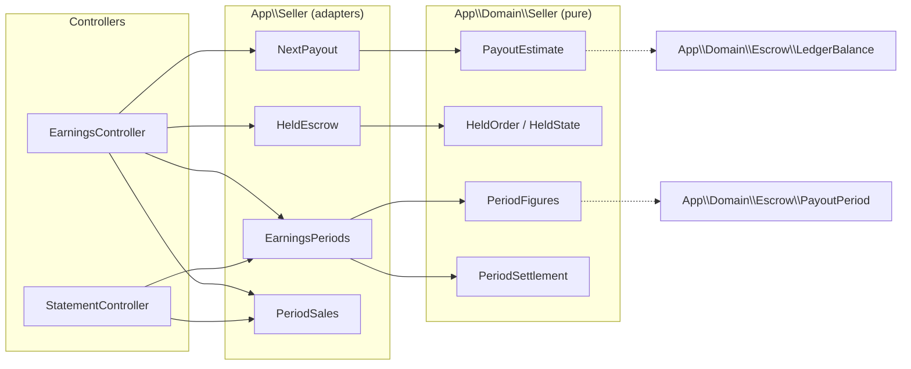

# Seller portal

## Earnings

`/seller/earnings` leads with the next payout, what is still held and why,
this payout period against the seven before it, and a printable statement
per period. Code: `app/Domain/Seller/{PayoutEstimate,HeldOrder,HeldState,
SaleFact,RefundFact,PeriodFigures,PeriodSettlement,PeriodPayoutStatus,
PeriodSaleRow}`, `app/Seller/{NextPayout,HeldEscrow,EarningsPeriods,
PeriodSales}`, `app/Http/Controllers/Seller/{EarningsController,
StatementController}`, `resources/views/seller/earnings.blade.php`,
`resources/views/seller/earnings/statement.blade.php`.

### Next payout

`PayoutEstimate::from(LedgerBalance, PayoutPeriod, releasedOrderCount)` reads
its amount straight from `LedgerBalance::available` — released money not yet
paid out, negative when a refund outran what escrow could cover
(docs/escrow.md). The payout date is the Monday after the payout period
`$now` falls in (`PayoutPeriod::containing()`), whether that period is
still in progress or already complete. `NextPayout::for()` counts the
delivered fulfillments since the seller's last real `payouts` row (every
delivered fulfillment, when there has never been one) as the released order
count.

### Held in escrow

`HeldEscrow::for()` lists every `awaiting_shipment` or `shipped`
fulfillment, oldest first, each carrying its net and a `HeldState`
(`NotYetShipped` or `InTransit`) read from `shipped_at` alone — the seller's
own flow steps (FEAT-051) are a separate lane and are not read here. The
total is `LedgerBalance::held`, not a sum of the rows below it, so the
figure always reconciles with the ledger fold even where a stray entry
would make the two diverge.

### This period, past periods, and statements

`EarningsPeriods::for()` opens an eight-payout-period window ending with
the period `$now` falls in. Sales and fees are folded from live
fulfillments (`FulfillmentStatus::isLive()`) grouped by `orders.placed_at`;
refunds are folded from `ledger_entries` of type `refunded` grouped by
`occurred_at` — a refund lands in the period it happened, not the period
its sale was placed in. A declined or refunded order still counts toward
`orderCount` for the period it was placed in; it earns no sales or fees.

`PeriodSettlement` reads a period's payout status from two facts an adapter
already has: whether it is the period in progress, and whether a `payouts`
row exists for it. A completed period with no row reads as settled at zero
— `RunWeeklyPayout` never writes one for a balance that was not payable
(docs/escrow.md) — rather than as a run still owed.

`PeriodSales::for()` lists every order placed inside one period, newest
first, whatever its status — the rows behind both the current period's
sales table and `StatementController`'s printable statement
(`/seller/earnings/statements/{period}`, `period` a payout period's start
date). A period outside the eight-period window, or a string that matches
no period in it, answers 404.
