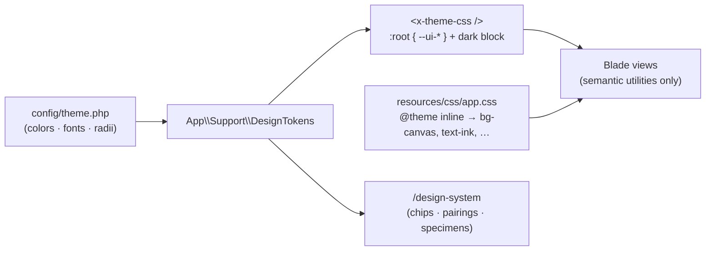

# Theming

The storefront's visual language is a token system with one source of
truth and three consumers.

## How it fits together

- `config/theme.php` holds every token: semantic color roles
  (`canvas`, `surface`, `ink`, `ink-muted`, `ink-faint`, `line`,
  `line-strong`, the `accent` family, `danger`/`success`/`notice`
  families, `tint-1..5`/`on-tint`), each with a light and a dark value,
  plus the two font stacks and the two radii.
- `App\Support\DesignTokens` renders that registry as CSS custom
  properties. Every layout's `<head>` includes `<x-theme-css />`, which
  emits light values on `:root` and dark values inside
  `@media (prefers-color-scheme: dark) { .supports-dark { … } }` — the
  same opt-in class the seller and admin layouts already carry, and the
  shop layout now carries too.
- `resources/css/app.css` maps Tailwind utilities onto those properties
  with `@theme inline` (`bg-canvas` → `var(--ui-canvas)`, `font-display`
  → `var(--ui-font-display)`, `rounded-card` → `var(--ui-radius-card)`,
  …). Utilities re-resolve at runtime, so no view ever names a color.

Changing the theme is editing `config/theme.php`. Dark mode is not a
second stylesheet — it is the same tokens with their dark values, so
views need no `dark:` variants.

## Rules

- Shop views speak semantic tokens only: no `neutral-*`, `gray-*`,
  `red-*`, or other raw palette utilities, and no `dark:` variants.
  (Seller and admin keep their gray `dark:` idiom for now.)
- Atoms live in `resources/views/components/ui/` (`button`, `chip`,
  `badge`, `avatar`, `alert`, `input`, `select`, `textarea`, `label`,
  `section-header`) and carry the canonical control styling; shared
  partials that need `@disabled`-style directives keep raw elements
  with token classes. `<x-ui.button>` takes an optional `href`: given
  one it renders an `<a>` wearing the button's classes instead of a
  `<button type="submit">`, for a "way in" that navigates rather than
  submits a form.
- The home page's browse vocabulary (DSGN-007) lives beside
  `listing-card` at the top of `resources/views/components/`:
  `<x-tile>` is the golden-ratio (1.618:1) browse tile — a photo cover
  when one exists, a tint fill otherwise — shared by the medium row,
  its drawer, and the category grid, so a tile is the exact same
  markup and size everywhere it renders; `<x-featured-band>` and
  `<x-wayfinding-footer>` render into the shop layout's `beforeMain`
  and `afterMain` slots (full viewport width, outside `<main>`'s
  centered column — set by whichever page needs them, unset elsewhere).
  `App\Support\Shop\FeaturedSubject::resolve()` reads
  `config('storefront.featured')` — a listing slug or a `/browse`
  category path, set by hand — and answers null (no band, no broken
  card, no substitute) when what it names is missing or no longer for
  sale. `App\Support\Shop\CategoryBrowse` carries a `coverUrl` per
  category the same way `MediumBrowse` does, nullable since a category
  can be genuinely empty.
- `App\Support\DesignTokensTest` enforces WCAG AA (4.5:1) on every
  promised text/background pairing in both modes, so a palette edit
  that breaks readability fails the suite.

## The living reference

`/design-system` renders the registry as paint-chip strips, rated
pairings (contrast computed by `App\Support\Contrast` from the same
config), type specimens, the atoms, and the storefront's real
components — listing cards, category tiles, and the configurator in
live preview mode — against real catalog data.
