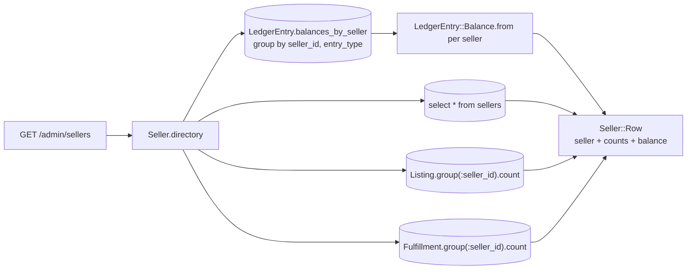
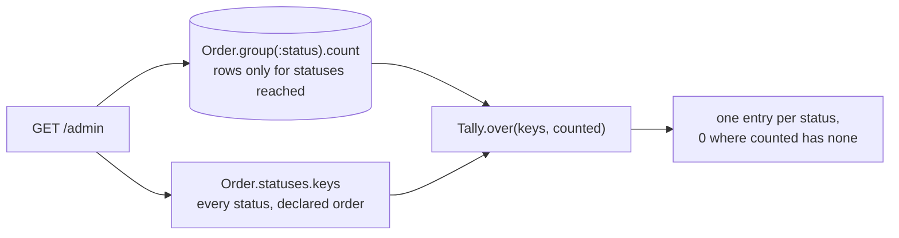
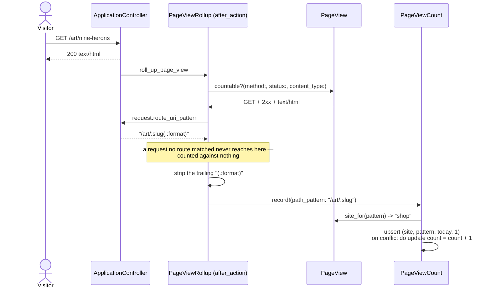
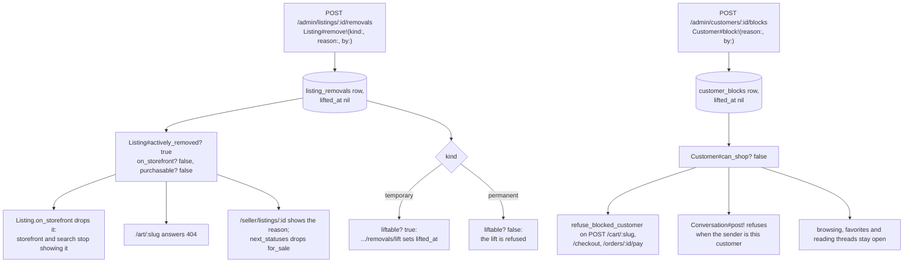

# Admin site

What a platform operator does here: find and read any seller, customer,
listing, order or fulfillment on the platform, read the platform's state and
money at a glance, reconcile every seller, browse the ledger, run the weekly
payout, moderate listings and customers, read site traffic, and reach the
messaging inbox.

Code: `app/controllers/admin/`, `app/views/admin/`,
`app/views/layouts/admin.html.erb`, `app/models/page_view.rb`,
`app/models/page_view_count.rb`, `app/models/tally.rb`,
`app/models/platform_money.rb`, `app/models/seller_account.rb`,
`app/models/listing_removal.rb`, `app/models/customer_block.rb`,
`app/controllers/concerns/page_view_rollup.rb`.

Admins are seeded, never created: `db/seeds.rb` writes the `admins` rows and
`Auth::AdminSessionsController` sends a link only to an address that already
holds one (see [`identity.md`](identity.md)). Every page hangs off
`Admin::BaseController`, whose one `before_action :require_admin!` is the whole
guard — a check on each action would let the next page forget it.

## Pages

| Path | Reads |
| --- | --- |
| `GET /admin` | seller and customer counts, a tally for every listing/order/fulfillment status, `PlatformMoney.fold`, and page views this week |
| `GET /admin/sellers` | `Seller.directory` — listing and sale counts beside a balance folded from one ledger read |
| `GET /admin/sellers/:id` | the seller's listings, fulfillments and payouts, and `Seller#escrow_balance` |
| `GET /admin/customers?standing=` | `Customer.standing(…).directory` (`all` \| `verified` \| `anonymous` \| `blocked`) — order, favorite and cart-line counts |
| `GET /admin/customers/:id` | the customer's orders, favorites, cart lines, block history and `Customer#merges` |
| `GET /admin/listings?status=&seller=&removed=` | `Listing.with_status(…).for_seller(…).removal_standing(…)` (`removed` is `any` \| `removed` \| `visible`) |
| `GET /admin/listings/:id` | one listing, its seller, and its removal history |
| `GET /admin/orders?status=&customer=` | `Order.with_status(…).for_customer(…)` with each order's items and fulfillments |
| `GET /admin/orders/:id` | the order's items, payments, fulfillments and refunds, and its cancel action |
| `GET /admin/fulfillments?status=&seller=` | `Fulfillment.with_status(…).for_seller(…)` with each fulfillment's seller and order |
| `GET /admin/fulfillments/:id` | one fulfillment, the lines of the order its seller ships, its refunds, and its refund action |
| `GET /admin/accounting` | `SellerAccount.for_every_seller` and `PlatformMoney.fold` — every seller reconciled, folded once |
| `GET /admin/ledger?seller=&type=` | `LedgerEntry.for_seller(…).with_type(…)`, plus `.balance` folded over that same filtered relation |
| `GET /admin/payouts?seller=` | `Payout.for_seller(…)`, newest first |
| `POST /admin/payouts` | runs `Payout.run_weekly` (optional `as_of`) — see [`escrow.md`](escrow.md) |
| `POST /admin/listings/:id/removals` | `Listing#remove!(kind:, reason:, by:)` |
| `POST /admin/listings/:id/removals/lift` | `Listing#lift_removal!` |
| `POST /admin/customers/:id/blocks` | `Customer#block!(reason:, by:)` |
| `POST /admin/customers/:id/blocks/lift` | `Customer#lift_block!` |
| `GET /admin/stats` | `PageViewCount.by_day`, `PageViewCount.by_pattern`, and a tally of every `listing_events` type |
| `GET\|POST /admin/messages`, `/admin/messages/:id` | the admin inbox (see [`messaging.md`](messaging.md)) |

Both lists reach across owners: `/admin/listings` shows every seller's
catalogue and `/admin/orders` every customer's orders, which is the difference
between the admin site and the two portals. The customers list and detail
include the anonymous rows — a browser the storefront is holding a cart for is
who an order was placed by until a link is followed for it.

Every id in a path names the table it came from. The routes carry
`PrefixedUlid.constraints(id: :sel)` and its siblings, so
`/admin/orders/ful_01J…` matches no route and answers the same 404 an id
nothing was written for answers.

## Every filter is optional, and an empty value means all

A directory's filters are one GET form of selects
(`app/views/admin/shared/_filters.html.erb`). The "All sellers" option submits
`seller=`, which `Admin::BaseController#optional_filter` reads as absent
through `params[name].presence`. The scope behind it is written to answer the
same way: a scope body that returns `nil` falls back to `all`, so
`Listing.with_status(nil)` narrows nothing.

```ruby
scope :with_status, ->(status) { where(status: status) if status.present? }
```

Two filters carry a value when nobody has chosen one, because "all" is a value
they name: `standing` defaults to `all` and `removed` to `any`.

A value outside the set a page offers — `?standing=wat` — is **400 Bad
Request**, not a quietly widened list. It is a query string this site does not
answer, the same judgement Node's route schema makes. An id filter of the
wrong shape (`?seller=cus_01J…`) answers 400 for the same reason; a
well-formed id that names nobody narrows to nothing and renders the empty
state.

Nothing in `Admin::BaseController` rescues the `ActionController::BadRequest`
this raises, and no site in this app renders its own error page, so the 400
falls through to Rails' static `public/400.html` — no admin nav, no admin
layout. Node's `plugins/error-pages.ts` renders the same status inside the
site's own layout; Rails matches the status code, not the rendering (see
`docs/review.md`'s known gaps).

## Balances are folded, never queried per seller

`/admin/sellers` shows every seller's held, available and paid-out balance.
Asking each seller for their own balance would put one `sum` per row on the
page. `Seller.directory` reads the whole ledger once, grouped, and folds it in
memory:



Four statements, whatever the number of sellers.
`Admin::SellersControllerTest` pins that: it renders the page with one seller
and again with five and asserts `count_queries` returns the same number. Every
other directory list carries the same assertion, and each preloads its
counterparts with `includes` so a row's seller, customer or order costs
nothing extra.

The seller detail asks one seller for their own balance
(`Seller#escrow_balance`), which is one grouped read for one seller and needs
no fold.

`/admin/accounting` folds the same way, over every seller rather than one
directory row's worth: `SellerAccount.for_every_seller` reads
`LedgerEntry.balances_by_seller` once and two more grouped reads —
`Fulfillment.settled.live.group(:seller_id).sum(:fee_cents)` for fees earned,
`Fulfillment.settled.reversed.group(:seller_id).sum(:fee_cents)` for fees
forgone — plus a grouped `Refund` sum for what went back. `/admin/ledger`
folds the filtered relation itself: `LedgerEntry.for_seller(…).with_type(…)`
scopes the rows, and `.balance` — the same class method
`Admin::AccountingControllerTest`'s neighbour tests already pin — runs against
that scoped relation rather than the whole table, because Active Record
delegates an unscoped class method called on a relation back through
`scoping`. `PlatformMoney.fold`, read on both `/admin` and
`/admin/accounting`, is `LedgerEntry.balance` beside three more folds
(`Fulfillment.fees_earned_cents`, `Fulfillment.fees_refunded_cents`,
`Refund.sum(:amount_cents)`) — four statements regardless of how many sellers
or fulfillments stand behind them.

## Every status is on the dashboard, including the ones nothing has reached

`/admin`'s listing, order and fulfillment tallies come from `Tally.over`, not
a bare `group(:status).count`: a `group by` only answers for the statuses that
have rows, and a dashboard that drops `payment_failed` because nothing has
failed today is lying about the state machine.



`Tally.over` is the same fold behind the listing and fulfillment tallies and
`/admin/stats`'s `listing_events` tally — one module, three call sites, all
keyed off the enum's own declared order (`Listing.statuses.keys`,
`Order.statuses.keys`, `Fulfillment.statuses.keys`,
`ListingEvent.event_types.keys`) so the dashboard's tiles stay in the order
the state machine declares them, not the order a `group by` happened to
return rows in.

## Page views, rolled up

Question: how does a request become a row on `/admin/stats`?



Caveats: `PageViewRollup` is included once on `ApplicationController`, so
every site's controllers carry it without asking — a per-route `after_action`
would let the next route forget it, the same reasoning behind
`Admin::BaseController`'s single `require_admin!`. The pattern is what is
stored — `request.route_uri_pattern` with its trailing `(.:format)` stripped,
e.g. `/art/:slug`, never the concrete URL — so a thousand listing pages share
one row and the table grows with routes and days, not with traffic. Node's
`page_view_counts` reads the same bare pattern (`docs/alignment.md` §5), so a
reader can put the two prototypes' tables side by side. `PageViewCount.record!`'s
`upsert` with `unique_by: %i[site path_pattern day]` and
`on_duplicate: Arel.sql("count = count + 1")` is what makes the first hit of a
day an insert and every later one an increment, in one statement with no read
first — `PageViewCountTest` pins the statement count at one.

`PageView.site_for` reads the site off the pattern's own prefix — `/seller`
and `/admin` claim theirs, matched against `pattern == prefix` or
`pattern.start_with?("#{prefix}/")` so a bare `/admin` and a nested
`/admin/customers/:id` both match while `/sellers-guide` and `/administration`
do not. Everything else is the storefront, which is what keeps a future
`/sellers-guide` there too.

"This week" on the dashboard is the seven days ending today
(`PageView.week`), not Monday-to-Sunday: a calendar week reads as almost
nothing every Monday, and the number exists to be compared with the day
before it. The payout period is a calendar week and is a different question —
see [`escrow.md`](escrow.md).

`listing_events` are the other half of `/admin/stats`: a `Tally.over` of every
`view`, `favorite`, `unfavorite` and `cart_add`, and a `view` is collapsed to
at most one per (listing, customer, UTC hour) by
`ListingEvent.recorded_once_per_hour?` and `ListingEvent.view_window_start`.
`Listing#record_event!` checks the window before writing and, on a collapse,
writes no row and returns `nil`. `Shop::ListingsController#show` already
opened a `listing.view` `Story` for the request, so it is the one that
answers it: a recorded view ends the story with `story.did`, a collapse ends
it with `story.refused(..., level: :debug, ...)` — `Story#refused` takes a
`level:` override for exactly this, a refusal ordinary enough that it should
not read at the `:info` `LEVELS` gives every other refusal. One `will` line
opens the story on every request regardless of the outcome; a collapse is one
of the two ways the same story can end, not a second story with nothing to
answer.

## Where the write actions attach

Each page carries the section its write hangs from:

| Action | Page and section | Where |
| --- | --- | --- |
| Cancel an unpaid order | `/admin/orders/:id`, beside the status | `POST /admin/orders/:id/cancellation` |
| Refund a fulfillment | `/admin/fulfillments/:id` Refunds, linked from each `/admin/orders/:id` fulfillment row | `POST /admin/fulfillments/:id/refund` |
| Remove a listing, lift a removal | `/admin/listings/:id` Removal history | `POST /admin/listings/:id/removals`, `…/removals/lift` |
| Block a customer, lift a block | `/admin/customers/:id` Block history | `POST /admin/customers/:id/blocks`, `…/blocks/lift` |
| Run the weekly payout | `/admin/payouts` | `POST /admin/payouts` |

Cancel and Refund are both `Admin::BaseController` actions
(`Admin::CancellationsController`, `Admin::RefundsController`) that call
`Order#cancel!` and `Fulfillment#refund!` and redirect back to the page the
action hangs off, with the refusal sentence in `flash[:alert]` when the model
says no. The refund form asks for a reason (1–500 characters) and the button
only appears where the move is still open — see `docs/orders.md`. Remove,
Lift, Block and Lift-block follow the same shape
(`Admin::ListingRemovalsController`, `Admin::CustomerBlocksController` calling
`Listing#remove!`/`#lift_removal!` and `Customer#block!`/`#lift_block!`) — see
[What a removal or a block actually does](#what-a-removal-or-a-block-actually-does)
below.

## What a removal or a block actually does

Question: an admin removes a listing or blocks a customer — what changes, and
where?



Caveats: a listing with an active removal is off the storefront **whatever
its status** — `Listing.on_storefront` (`where(status: ON_STOREFRONT).visible`)
and `Listing#on_storefront?` both read `actively_removed?`, and every page
that turns a slug into a visible listing goes through one of them, so the
storefront's 404 is the same page for an unknown slug, a draft, a removed
listing, or someone else's order — nothing reveals whether a thing exists.

The seller keeps their own page for a removed listing and reads the reason
there (`@listing.active_removal.reason`). `Listing#next_statuses` is
`TRANSITIONS.fetch(status, [])` with `for_sale` dropped while
`actively_removed?`, and it feeds both the status buttons
(`seller/listings/_status_buttons`) and `transition_to!`'s own refusal, so a
seller cannot put a removed piece back on the storefront by posting directly
either.

At most one active removal per listing and one active block per customer —
enforced by a partial unique index (`WHERE lifted_at IS NULL`) so two removals
racing each other cannot both land active. Raising a temporary removal to a
permanent one is lift then remove, which leaves the seller one reason to read
rather than two overlapping ones. Each refusal is a `TransitionError`:
`Listing#remove!` on an already-removed listing, `Listing#lift_removal!` on a
listing with nothing active or a `permanent` removal, `Customer#block!` on an
already-blocked customer, `Customer#lift_block!` on an unblocked one.

Both lifts key off the **subject**, not the removal or block row —
`Listing#active_removal` / `Customer#active_block` — so a page that knows the
listing or the customer needs nothing else, and "which one is active" stays a
single answer.

A blocked customer can still browse, favorite, and read their threads. What a
block removes is adding to a cart, checking out, paying, and sending
messages — which is why the predicate is named `can_shop?` rather than after
the block. Cart add, checkout, and pay share one guard,
`Shop::BaseController#refuse_blocked_customer`, called as a `before_action` on
each of the three write actions; message post is enforced at the one seam
every entry point posts through, `Conversation#post!`, since a seller's reply,
an admin's reply, a customer's reply, and a customer's opening question on a
listing all call it.

## Running a payout from the admin site

Payouts are a platform action: `Admin::PayoutsController#create` parses its
own `as_of` field and calls `Payout.run_weekly`, the same class method
`payouts:run` calls, for every seller rather than one. The seller portal's
earnings page shows a seller their held / available / paid-out balance and
their payout history and offers no control that runs one. The full sequence
and the re-run rule are in [`escrow.md`](escrow.md).
