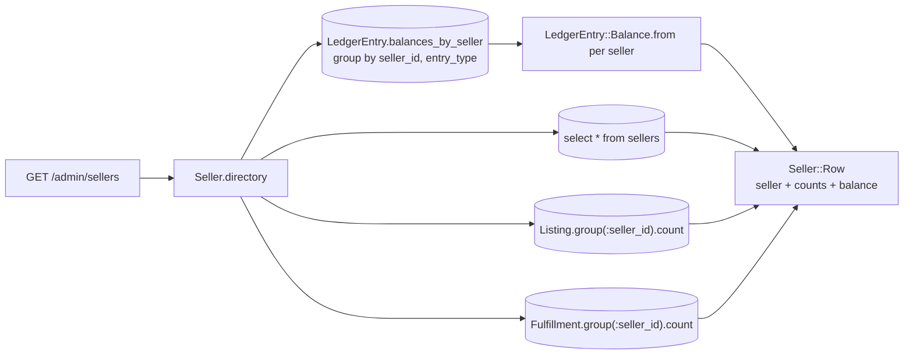

# Admin site

What a platform operator does here: find and read any seller, customer,
listing, order or fulfillment on the platform, and reach the messaging inbox.
Every page is read-only today — the write actions land with the tickets named
under [Where the write actions attach](#where-the-write-actions-attach).

Code: `app/controllers/admin/`, `app/views/admin/`,
`app/views/layouts/admin.html.erb`.

Admins are seeded, never created: `db/seeds.rb` writes the `admins` rows and
`Auth::AdminSessionsController` sends a link only to an address that already
holds one (see [`identity.md`](identity.md)). Every page hangs off
`Admin::BaseController`, whose one `before_action :require_admin!` is the whole
guard — a check on each action would let the next page forget it.

## Pages

| Path | Reads |
| --- | --- |
| `GET /admin` | every seller and every verified customer |
| `GET /admin/sellers` | `Seller.directory` — listing and sale counts beside a balance folded from one ledger read |
| `GET /admin/sellers/:id` | the seller's listings, fulfillments and payouts, and `Seller#escrow_balance` |
| `GET /admin/customers?standing=` | `Customer.standing(…).directory` (`all` \| `verified` \| `anonymous` \| `blocked`) — order, favorite and cart-line counts |
| `GET /admin/customers/:id` | the customer's orders, favorites, cart lines, block history and `Customer#merges` |
| `GET /admin/listings?status=&seller=&removed=` | `Listing.with_status(…).for_seller(…).removal_standing(…)` (`removed` is `any` \| `removed` \| `visible`) |
| `GET /admin/listings/:id` | one listing, its seller, and its removal history |
| `GET /admin/orders?status=&customer=` | `Order.with_status(…).for_customer(…)` with each order's items and fulfillments |
| `GET /admin/orders/:id` | the order's items, payments, fulfillments and refunds |
| `GET /admin/fulfillments?status=&seller=` | `Fulfillment.with_status(…).for_seller(…)` with each fulfillment's seller and order |
| `GET /admin/fulfillments/:id` | one fulfillment, the lines of the order its seller ships, and its refunds |
| `GET\|POST /admin/messages`, `/admin/messages/:id` | the admin inbox (see [`messaging.md`](messaging.md)) |

Both lists reach across owners: `/admin/listings` shows every seller's
catalogue and `/admin/orders` every customer's orders, which is the difference
between the admin site and the two portals. The customers list and detail
include the anonymous rows — a browser the storefront is holding a cart for is
who an order was placed by until a link is followed for it.

Every id in a path names the table it came from. The routes carry
`PrefixedUlid.constraints(id: :sel)` and its siblings, so
`/admin/orders/ful_01J…` matches no route and answers the same 404 an id
nothing was written for answers.

## Every filter is optional, and an empty value means all

A directory's filters are one GET form of selects
(`app/views/admin/shared/_filters.html.erb`). The "All sellers" option submits
`seller=`, which `Admin::BaseController#optional_filter` reads as absent
through `params[name].presence`. The scope behind it is written to answer the
same way: a scope body that returns `nil` falls back to `all`, so
`Listing.with_status(nil)` narrows nothing.

```ruby
scope :with_status, ->(status) { where(status: status) if status.present? }
```

Two filters carry a value when nobody has chosen one, because "all" is a value
they name: `standing` defaults to `all` and `removed` to `any`.

A value outside the set a page offers — `?standing=wat` — is **400 Bad
Request**, not a quietly widened list. It is a query string this site does not
answer, the same judgement Node's route schema makes. An id filter of the
wrong shape (`?seller=cus_01J…`) answers 400 for the same reason; a
well-formed id that names nobody narrows to nothing and renders the empty
state.

## Balances are folded, never queried per seller

`/admin/sellers` shows every seller's held, available and paid-out balance.
Asking each seller for their own balance would put one `sum` per row on the
page. `Seller.directory` reads the whole ledger once, grouped, and folds it in
memory:



Four statements, whatever the number of sellers.
`Admin::SellersControllerTest` pins that: it renders the page with one seller
and again with five and asserts `count_queries` returns the same number. Every
other directory list carries the same assertion, and each preloads its
counterparts with `includes` so a row's seller, customer or order costs
nothing extra.

The seller detail asks one seller for their own balance
(`Seller#escrow_balance`), which is one grouped read for one seller and needs
no fold.

## Where the write actions attach

The directory answers reads. Each page already carries the section a write
will hang from:

| Action | Page and section | Ticket |
| --- | --- | --- |
| Cancel an unpaid order | `/admin/orders/:id`, beside the status | FEAT-017 |
| Refund a fulfillment | `/admin/orders/:id` Fulfillments rows, and `/admin/fulfillments/:id` | FEAT-017 |
| Remove a listing, lift a removal | `/admin/listings/:id` Removal history | FEAT-021 |
| Block a customer, lift a block | `/admin/customers/:id` Block history | FEAT-021 |
| Run the weekly payout | `/admin/payouts` | FEAT-021 |
| Dashboard tallies, accounting, ledger, stats | `/admin`, `/admin/accounting`, `/admin/ledger`, `/admin/stats` | FEAT-020 |

The `refunds`, `listing_removals` and `customer_blocks` tables do not exist
yet. Three model methods stand in their place and render an empty section:
`Order#refunds`, `Fulfillment#refunds`, `Listing#removals` and
`Customer#blocks` each answer `[]`, and `Customer.blocked` /
`Listing.removed` are `none`. Each is one line to replace with the
`has_many` or the `where` once the table lands; no page changes.
