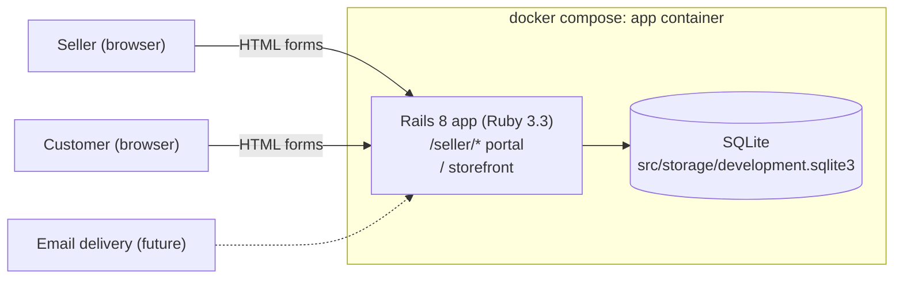
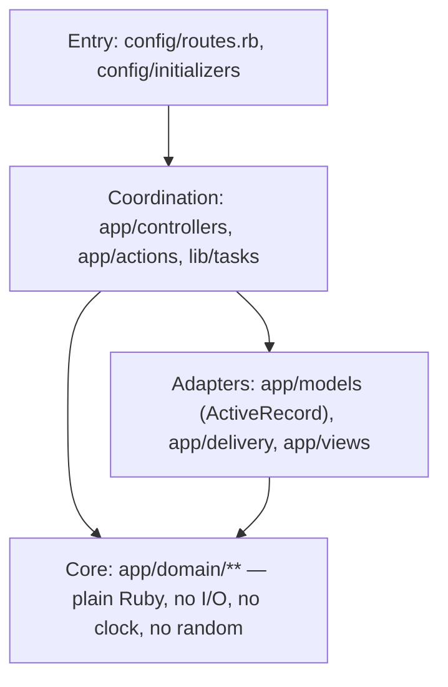
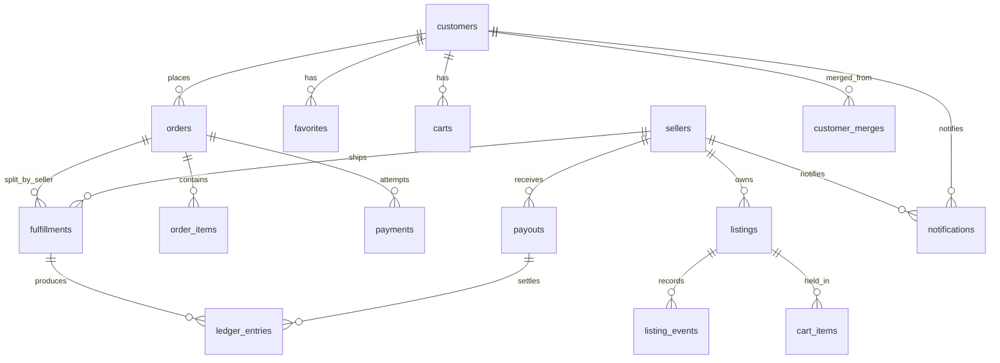
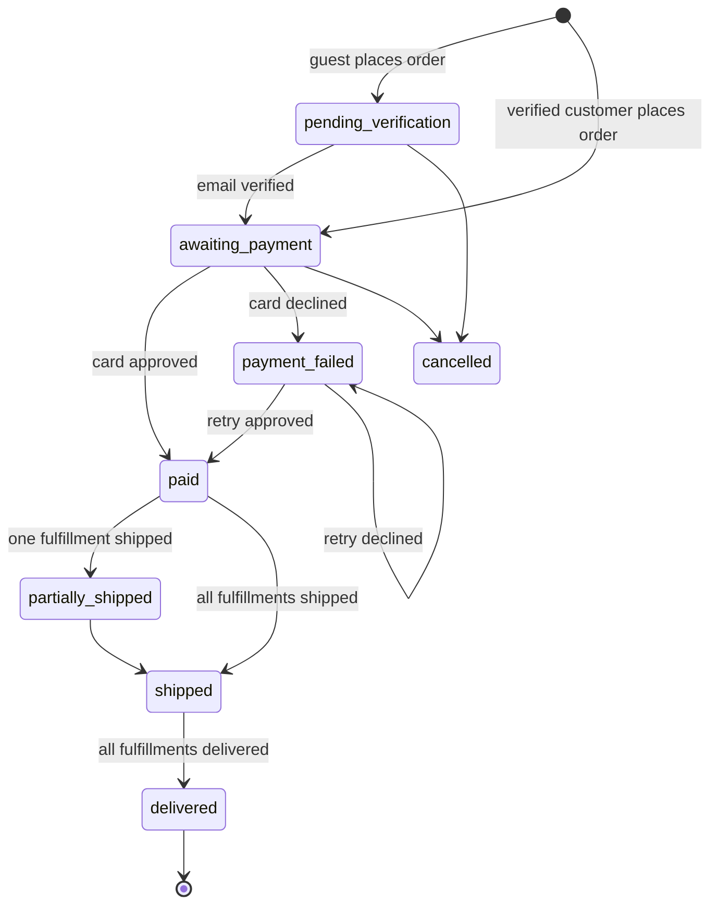

# Art Store prototype (Rails) — system architecture

Prototype of a two-sided art marketplace: a **seller portal** (back office) and a
**customer storefront**, one Rails deployable, one SQLite file, no JavaScript
required. Every agent working in `prototype/rails/` reads this doc first and
follows the conventions in it. The PHP spike in `prototype/php/` solved the same
product; its domain decisions carry over unless stated otherwise here.

## Deployables

Question: what runs, and what talks to what?



One container (`app`) holds Ruby, Bundler, the Tailwind standalone binary
(via `tailwindcss-rails`), and the SQLite file. Nothing is installed on the host.

## Layers inside the deployable

Functional core / imperative shell. Dependencies point inward only.



| Layer | Lives in | Rules |
| --- | --- | --- |
| Core | `app/domain/<concept>/` | Plain Ruby: `Data.define` value objects, frozen classes, `module_function` modules. Receives time/ids as parameters. Unit tested with no Rails boot (`require "minitest/autorun"` only, plus the file under test). |
| Adapters | `app/models/`, `app/delivery/`, `app/views/` | ActiveRecord models (thin: associations, scopes, enums mapped to domain enums), the magic-link delivery port implementations, ERB views. |
| Coordination | `app/actions/<feature>/`, `app/controllers/<site>/`, `lib/tasks/` | Sequence core + adapters. Own no domain `if`s — if one appears, extract to `app/domain`. Covered by integration tests. |
| Entry | `config/routes.rb`, `config/initializers/*` | Wiring only. |

Naming follows the `naming` skill: actions are verb phrases (`PlaceOrder`,
`RunWeeklyPayout`), domain enums name states (`OrderStatus`), events are past
tense.

## Sites

| Site | URL prefix | Session key | Theme |
| --- | --- | --- | --- |
| Seller portal | `/seller` | `session[:seller_id]` | Stock Tailwind, system font, vanilla controls, dense and tool-focused. |
| Storefront | `/` | `session[:customer_id]` + signed cookie `customer_id` for the anonymous identity | Bright, open, white space, large imagery, brand recedes. |

Controllers: `Seller::*Controller` under `app/controllers/seller/`,
`Shop::*Controller` under `app/controllers/shop/`, `Auth::*Controller` under
`app/controllers/auth/`. Layouts `app/views/layouts/seller.html.erb` and
`app/views/layouts/shop.html.erb`; both render `layouts/_debug_alert.html.erb`
which prints `flash[:debug_magic_link]`.

## Identity

- Passwordless. `magic_links` holds a hashed token, `email`, `actor_type`
  (`seller` | `customer`), `expires_at`, `consumed_at`, optional `redirect_to`.
- Delivery is a port: `MagicLinkDelivery` (duck-typed interface in
  `app/delivery/`) with `FlashMagicLinkDelivery` (prototype: flash the URL so
  the layout prints it in a debug alert) and `MailMagicLinkDelivery` (the hook
  for real email; raises `NotImplementedError`). Selected by
  `Rails.configuration.x.magic_links.delivery` (`flash` | `mail`, env
  `MAGIC_LINK_DELIVERY`).
- Customers: every visitor gets a `customers` row with `email = nil`; its id is
  stored in a signed cookie `customer_id`. Verifying an email either claims that
  row or **merges** the anonymous row into the existing verified customer
  (favorites, cart, orders, listing events, notifications re-pointed; a
  `customer_merges` row records `anonymous_customer_id -> customer_id` so stale
  cookies resolve). The merge decision is a pure function in
  `app/domain/customers`; the re-pointing is an action.
- Guest checkout = place the order as the anonymous customer, verify, then pay
  on `/orders/:id/pay`. The card is entered after verification and never stored.

## Commerce domain

Money is integer cents (`Domain::Money`). Orders may span sellers; fulfillment
and escrow are tracked **per (order, seller)** in `fulfillments`.



### Listing status

`draft → for_sale → sold`, `sold → for_sale` (stock restored after a declined
card), `archived` from `draft`/`for_sale`. Only `for_sale` listings appear on
the storefront. Quantity defaults to 1; a purchase decrements and `sold` is
reached at 0.

### Order status



### Fulfillment status (per order × seller)

`awaiting_shipment → shipped → delivered`. Seller marks shipped (carrier +
tracking). Customer confirms delivery from the order page.

### Escrow and payouts

- `ledger_entries` per seller: `held` (+net on paid), `released` (on delivered),
  `paid_out` (−amount when included in a payout). Balances: held = held −
  released; available = released − paid_out; paid_out.
- Platform fee: 10% of the fulfillment subtotal, taken at `held`. Net = subtotal
  − fee.
- Payout period = Monday–Sunday. `bin/rails payouts:run[AS_OF]` creates one
  `payouts` row per seller for released-not-paid amounts as of the most
  recently completed week. Period math is pure (`Domain::Escrow::PayoutPeriod`).
  The seller portal exposes a debug "Run weekly payout now" button.

### Fake payment

`Domain::Payments::FakeCard.decide(number)`:

| Number | Decision |
| --- | --- |
| `4242 4242 4242 4242` | approved |
| `4000 0000 0000 0002` | declined: generic decline |
| `4000 0000 0000 9995` | declined: insufficient funds |
| anything else | declined: invalid card number |

Spaces and dashes are ignored. Only the last four digits are stored.

### Notifications

`notifications` rows (nullable `seller_id` / `customer_id`, subject, body, url,
read_at) shown in each site's header. Seller receives "Item sold" on paid;
customer receives "Order shipped" on shipped. `Notify#deliver_by_email` is the
email hook.

## Testing

- Minitest (stock Rails). Tests are **sidecars**: `foo.rb` → `foo_test.rb` in
  the same directory. `bin/rails test app lib` runs them (the runner globs
  `**/*_test.rb`); `config/application.rb` tells Zeitwerk to ignore
  `**/*_test.rb` so test files are never autoloaded. `test/test_helper.rb`
  stays as the Rails base.
- Core tests (`app/domain/**`) require only `minitest/autorun` and the file
  under test — no `test_helper`, no database, no doubles. They also run under
  the Rails runner.
- Coordination tests (controllers, actions, tasks) are `ActionDispatch::IntegrationTest`
  / `ActiveSupport::TestCase` with fixtures or factories against the test
  SQLite database; they drive HTTP and assert on rendered HTML and DB state.
- Coverage via SimpleCov: `bin/rails test` writes `coverage/` and prints a
  summary; `COVERAGE_MIN` enforced ≥ 90% on `app/domain`, ≥ 80% overall.
- TDD: failing sidecar test, make it pass, refactor. Feature tickets are done
  when their flow has an integration test that walks it end to end.

## Repository layout

```
prototype/rails/
  README.md            how to run, serve, test
  docker-compose.yml   one service: app
  Dockerfile           ruby:3.3-slim + sqlite + build tools
  Makefile             host-side wrappers over docker compose
  docs/                architecture + feature docs (this folder)
  work/                tickets and journal (orchestration only)
  src/                 the Rails application
```

## Mapping the project skills onto this stack

| Skill says | Here it means |
| --- | --- |
| `npm run test:run -- <pattern>` | `docker compose run --rm app bin/rails test <path>` |
| Vitest unit test | Minitest sidecar requiring only `minitest/autorun` |
| React Testing Library integration test | `ActionDispatch::IntegrationTest` sidecar beside the controller |
| `src/` | `prototype/rails/src/` |
