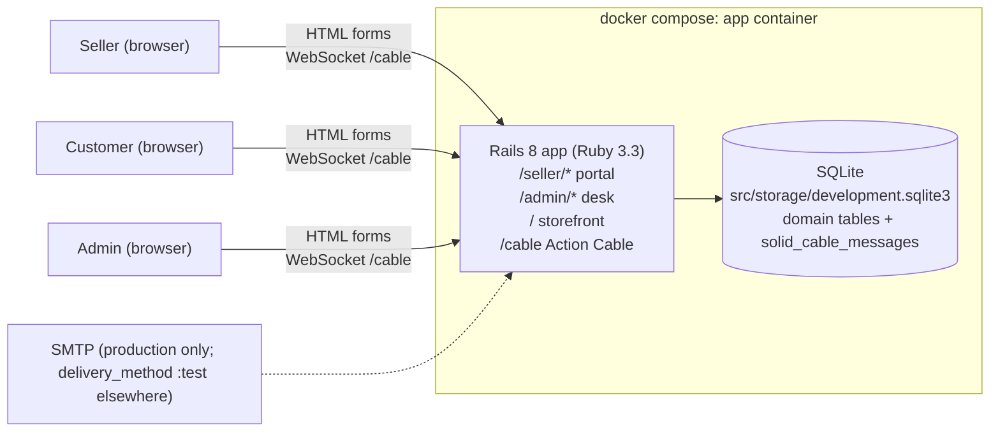
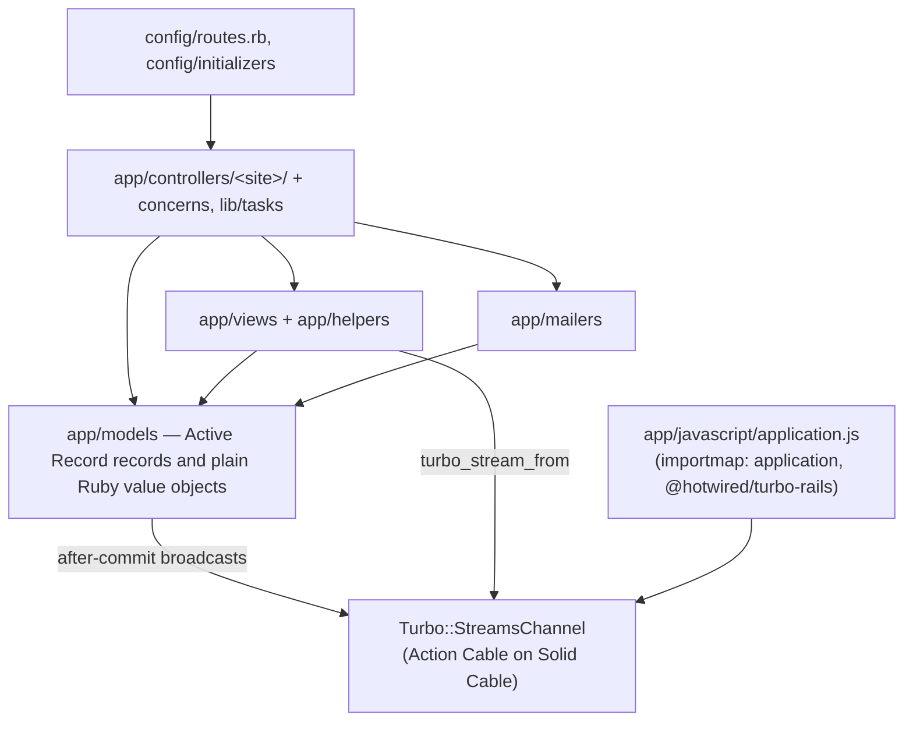
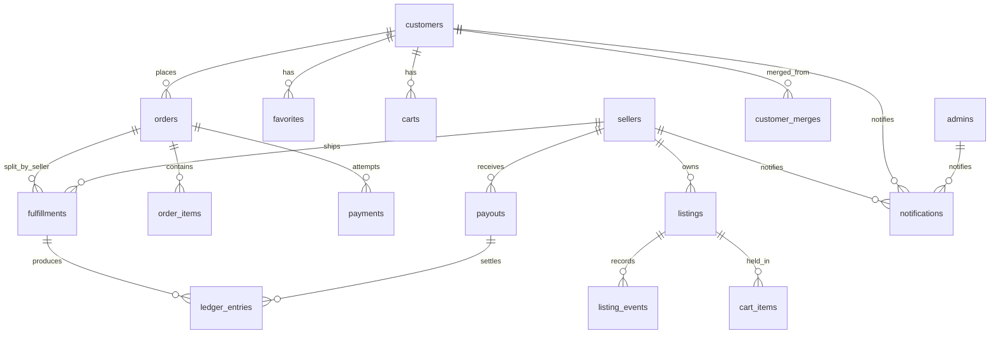
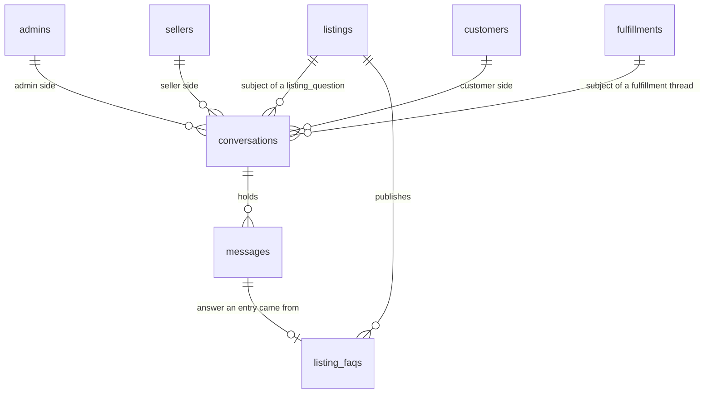
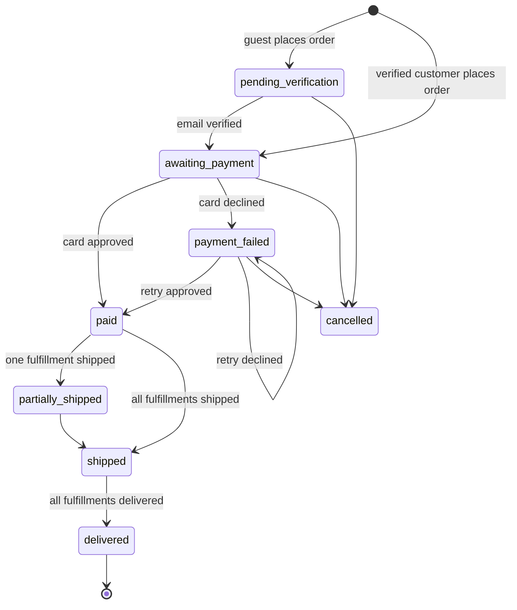

# Art Store prototype (Rails) — system architecture

Prototype of a two-sided art marketplace with a desk behind it: a **seller
portal** (back office), a **customer storefront**, and an **admin site**, one
Rails deployable, one SQLite file. Turbo is the only JavaScript and every page
works without it. Every agent working in `prototype/rails/` reads this doc first
and follows the conventions in it. The PHP spike in `prototype/php/` solved the
same product; its domain decisions carry over unless stated otherwise here.

## Deployables

Question: what runs, and what talks to what?



One container (`app`) holds Ruby, Bundler, the Tailwind standalone binary
(via `tailwindcss-rails`), and the SQLite file. Nothing is installed on the host.
Action Cable rides the same Puma process and the same SQLite file: Solid Cable
writes broadcasts to `solid_cable_messages` and subscribers poll it, so live
updates need no Redis and no second database.

## Layers inside the deployable

The stock Rails tree. `app/` holds `assets controllers helpers javascript
mailers models views`, `config/application.rb` has no autoloader configuration,
and `bin/rails zeitwerk:check` passes on the defaults.



| Lives in | Holds |
| --- | --- |
| `app/models/` | Active Record records — associations, scopes, enums, validations, and the behaviour that belongs to a record (`MagicLink.issue`, `Seller.claim`, `Customer#absorb`, `Cart#add`, `Listing.search`, `Order.place`, `Order#pay!`, `Fulfillment#ship!`, `Fulfillment#deliver!`, `Payout.run_weekly`, `Listing#take_stock!`, `Conversation.open`, `Conversation#post!`, `Conversation#read_by!`, `ListingFaq.publish`) — alongside the plain Ruby value objects they fold into: `Money`, `Page`, `PayoutPeriod`, `FakeCard`, `PlaceholderImage`, `TransitionError`, and the nested `LedgerEntry::Balance`, `ListingEvent::Totals`, `ListingEvent::Day`, `Conversation::Kind`, `Conversation::Side`. A value object takes time and ids as arguments and touches no database. `app/models/concerns/email_address.rb` carries the address normalisation the three accounts share, and `app/models/concerns/messaging.rb` the threads, sent messages and unread count they all carry. |
| `app/controllers/<site>/`, `app/controllers/concerns/`, `lib/tasks/` | Read params, call a model, redirect or render. Own no domain `if`s — a branch reads a record predicate or a shell fact (signed in, empty cart, missing row). `MessagingSite` is the inbox, thread and reply the three sites share, over the assigns `ThreadPage` names; `SellerThreadPage` adds the portal's publish-as-FAQ form to those assigns, which is what lets a refused entry come back on the thread it was lifted from. |
| `app/mailers/` | `MagicLinkMailer` and its views. |
| `app/views/`, `app/helpers/` | ERB templates and the two view helpers (`status_label`, and the storefront header counts plus `money`). The partials a broadcast renders live here too, one per site: `{shop,seller,admin}/conversations/_message` and `_unread_badge`. |
| `app/javascript/` | `application.js` — one `import "@hotwired/turbo-rails"` and nothing else. `config/importmap.rb` pins it and the Turbo the gem ships; `javascript_importmap_tags` in the three layouts serves the map. No bundler, no Node, no Stimulus. |
| `config/routes.rb`, `config/initializers/*`, `config/cable.yml`, `config/importmap.rb` | Wiring only. |

The gems outside stock Rails 8.1.3.1 on Ruby 3.3.12:

| Gem | Version | What it brings |
| --- | --- | --- |
| `tailwindcss-rails` | 4.6.0 (tailwindcss 4.3.3) | The standalone Tailwind binary, so the image needs no Node. |
| `turbo-rails` | 2.0.23 | Turbo Drive, `turbo_stream_from`, `broadcast_append_to` / `broadcast_replace_to`, `Turbo::StreamsChannel`, and the broadcast test helper. |
| `importmap-rails` | 2.2.3 | `config/importmap.rb` and `javascript_importmap_tags`; two pins, no bundler. |
| `solid_cable` | 4.0.2 | The Action Cable adapter that keeps broadcasts in `solid_cable_messages` in the application's own SQLite database. |

Naming follows the `naming` skill: model methods are the verb a record answers
to (`Order#pay!`, `Fulfillment#ship!`, `Payout.run_weekly`,
`Listing#take_stock!`), events are past tense.

Rails makes every `app/*` directory a Zeitwerk root, and `app/models/seller.rb`
already defines `Seller` as a class, so a `seller/` directory elsewhere under
`app/` declaring `module Seller` raises `TypeError: Seller is not a module`.
That collision makes every seller-portal controller `class Seller::XController <
Seller::BaseController` (compact form) instead of `module Seller`; `Shop::`,
`Admin::` and `Auth::` have no matching model and stay `module`.

There is no `app/channels/`. `action_cable/engine` is required in
`config/application.rb` and `Turbo::StreamsChannel` (from `turbo-rails`) is the
only channel the app subscribes to. Action Cable falls back to
`ActionCable::Connection::Base` when no `ApplicationCable::Connection` is
defined, and the signed stream names `turbo_stream_from` renders are the access
control, so an identified connection would add a file with nothing to say.

## Sites

| Site | URL prefix | Session key | Theme |
| --- | --- | --- | --- |
| Seller portal | `/seller` | `session[:seller_id]` | Stock Tailwind, system font, vanilla controls, dense and tool-focused. |
| Storefront | `/` | `session[:customer_id]` + signed cookie `customer_id` for the anonymous identity | Bright, open, white space, large imagery, brand recedes. |
| Admin site | `/admin` | `session[:admin_id]` | Slate — dark chrome, tabular, the operator's view of both sides. |

Controllers: `Seller::*Controller` under `app/controllers/seller/`,
`Shop::*Controller` under `app/controllers/shop/`, `Admin::*Controller` under
`app/controllers/admin/`, `Auth::*Controller` under `app/controllers/auth/`.
Layouts `app/views/layouts/seller.html.erb`, `shop.html.erb` and
`admin.html.erb`; all three render `layouts/_debug_alert.html.erb` which prints
`flash[:debug_magic_link]`, and all three carry a Messages link with the unread
badge.

## Identity

- Passwordless. `magic_links` holds a hashed token, `email`, `actor_type`
  (`seller` | `customer` | `admin`), `expires_at`, `consumed_at`, optional
  `redirect_to`. `MagicLink.issue` writes the row and returns the plaintext
  token beside it; `MagicLink.find_by_token`, `#usable?` and `#consume!` are the
  verify side. `Seller.claim` and `Customer.claim` turn a followed link into an
  account.
- Admins are seeded. `Admin.claim` finds the row rather than creating one, so a
  followed link for an address no `admins` row holds goes back to
  `/admin/login` with "That address does not reach the admin site."
  `Admin.on_duty` (the first admin by id) is who both support buttons open a
  thread against. `Auth::AdminSessionsController` and `Admin::BaseController`
  are the admin arm of the same magic-link flow.
- `MagicLinkSender#send_magic_link` issues the link and enqueues
  `MagicLinkMailer.with(link:, url:).sign_in.deliver_later`. Delivery is
  `:test` in development and test, so the mail stays in
  `ActionMailer::Base.deliveries`; production needs SMTP settings.
- The same URL goes into `flash[:debug_magic_link]` so the layout prints it in
  a debug alert, which is how a demo follows a link with no mailbox. Guarded by
  `Rails.configuration.x.magic_links.debug_alert` (env
  `MAGIC_LINK_DEBUG_ALERT`, on outside production).
- Customers: every visitor gets a `customers` row with `email = nil`; its id is
  stored in a signed cookie `customer_id`. Verifying an email either claims that
  row or **merges** the anonymous row into the existing verified customer
  (favorites, cart, orders, listing events, notifications re-pointed; a
  `customer_merges` row records `anonymous_customer_id -> customer_id` so stale
  cookies resolve). `Customer.claim` holds the decision, `Customer#absorb`
  moves the rows through the associations `Customer` declares, and
  `Customer.from_cookie` follows a merge forward.
- Guest checkout = place the order as the anonymous customer, verify, then pay
  on `/orders/:id/pay`. The card is entered after verification and never stored.
- Verifying does not by itself pay the order. It moves the order from
  `pending_verification` to `awaiting_payment` (`Order#mark_awaiting_payment!`,
  a no-op on any other status), so a guest order still has nowhere to go but
  `/orders/:id/pay`. `Shop::OrderPaymentsController` calls it on both `show`
  and `create`, since `Auth::MagicLinksController` (FEAT-002) knows nothing
  about orders.

## Commerce domain

Money is integer cents (`Money`). Orders may span sellers; fulfillment
and escrow are tracked **per (order, seller)** in `fulfillments`.



Messaging hangs off the same actors, one table for all four kinds of thread:



### Listing status

`draft → for_sale → sold`, `sold → for_sale` (stock restored after a declined
card), `archived` from `draft`/`for_sale`. The table is `Listing::TRANSITIONS`;
`listing.transition_to!(status)` raises `TransitionError` on a move it
does not allow. Search and browse (`Shop::StorefrontController`,
`Listing.search`, `Listing.media_for_sale`) show only `for_sale` listings; a
listing's own page
(`/art/:slug`) stays reachable through `sold` too (`Listing.on_storefront`), so
a link a buyer already followed keeps working. `draft` and `archived` are
unreachable either way. Quantity defaults to 1; a purchase decrements and
`sold` is reached at 0.

A seller's submitted title/description/medium/dimensions/price/quantity/image
are `validates` declarations on `Listing`. The form edits dollars and the
column stores cents, so `Listing#price` reads and writes `"249.00"` around
`price_cents`; a rejected form renders the text the seller typed back.
`Seller::ListingsController` is the stock new/create/edit/update shape and the
form is `form_with model: [:seller, listing]`.

### Order status



`cancelled` has no route to it from either UI in this prototype — the
transition exists in `Order::TRANSITIONS`, verified by
`test/models/order_test.rb`, but nothing calls it.

### Fulfillment status (per order × seller)

`awaiting_shipment → shipped → delivered`. Seller marks shipped (carrier +
tracking). Customer confirms delivery from the order page. A seller's order
**is a fulfillment** — `seller_order` (`/seller/orders/:id`) takes a
`fulfillments.id`, since that is the slice of a customer's order the seller
owns.

### Escrow and payouts

- `ledger_entries.entry_type` (not `type` — that column is reserved for Active
  Record's single-table inheritance, same reason `listing_events.event_type`
  isn't `type`) is `held` (+net, written when the order pays), `released`
  (+net, written when the fulfillment is delivered), or `paid_out` (−amount,
  written when included in a payout). `LedgerEntry.balance` (through
  `Seller#escrow_balance`) folds a seller's entries: `held = held_total −
  released_total`; `available = released_total + paid_out_total` (the
  `paid_out` entries are already negative, so this nets down as money leaves);
  `paid_out = −paid_out_total` (a positive lifetime figure). The three writers
  `LedgerEntry.hold` / `.release` / `.pay_out` are the only code that picks a
  sign.
- Platform fee: 10% of the fulfillment subtotal
  (`Fulfillment::PLATFORM_FEE_PERCENT`, `Fulfillment.fee_for` /
  `Fulfillment.net_for`), computed once at order placement (`Order.place`) and
  stored on the `fulfillments` row (`fee_cents`, `net_cents`). Net = subtotal −
  fee. `Order#pay!` (hold) and `Fulfillment#deliver!` (release) move
  `fulfillment.net` through escrow rather than recomputing it.
- Payout period = Monday–Sunday. `bin/rails payouts:run[AS_OF]` calls
  `Payout.run_weekly(as_of:)`, which creates one `payouts` row per seller for
  released-not-paid amounts as of the most recently completed week. Period math
  is pure (`PayoutPeriod`, a `Data` value object with no table). The seller
  portal exposes a debug "Run weekly payout now" button.

### Fake payment

`FakeCard.new(number)`:

| Number | Decision |
| --- | --- |
| `4242 4242 4242 4242` | approved |
| `4000 0000 0000 0002` | declined: generic decline |
| `4000 0000 0000 9995` | declined: insufficient funds |
| anything else | declined: invalid card number |

Spaces and dashes are ignored. Only the last four digits are stored.

### Notifications

`notifications` rows (polymorphic `recipient`, subject, body, url, read_at)
shown in each site's header. `Notification.item_sold` files "Item sold" under
the seller when an order is paid; `Notification.order_shipped` files "Order
shipped" under the customer when a fulfillment departs;
`Notification.new_message` files "New message" under the counterpart when a
thread gains a message, with `url` set to that recipient's own thread path
(`Conversation#thread_path_for`), since the three sites carry the same
conversation under three paths. `Notification#deliver_by_email` is the email
hook.

## Messaging

Four kinds of conversation over one `conversations` table, an inbox and a
thread page on each of the three sites, and a seller's answer published to a
listing as an FAQ. The kinds, the access rule, the unread count and the Turbo
broadcasts are in [`messaging.md`](messaging.md), beside
[`identity.md`](identity.md), [`orders.md`](orders.md) and
[`escrow.md`](escrow.md).

## Testing

- Minitest (stock Rails). Every test lives under `test/`, mirroring the tree it
  covers: `app/models/money.rb` → `test/models/money_test.rb`,
  `app/models/order.rb` → `test/models/order_test.rb`,
  `lib/tasks/payouts.rake` → `test/tasks/payouts_test.rb`. `bin/rails test`
  with no arguments runs the whole suite. `test/test_helper.rb` is the Rails
  base and starts SimpleCov.
- Every test declares itself with `test "..." do` and subclasses
  `ActiveSupport::TestCase`, `ActionDispatch::IntegrationTest` or
  `ActionView::TestCase`. There is no intermediate base class.
- `test/test_helper.rb` requires `test/support/**/*.rb` and mixes it in:
  `TestRecords` (the record builders and the card numbers) into
  `ActiveSupport::TestCase`, `IntegrationHelpers` (sign-in over HTTP, the
  cookie readers, the seller-portal order state) into
  `ActionDispatch::IntegrationTest`. There are no fixture files — `fixtures
  :all` loads one shared directory for every suite, so each test builds the
  rows it asks about.
- Model tests exercise the record or value object under test — no doubles. A
  value object test needs no database; a record test builds its rows through
  `TestRecords`.
- Controller and task tests run against the test SQLite database; they drive
  HTTP and assert on rendered HTML and DB state.
- Broadcasts are asserted with `Turbo::Broadcastable::TestHelper`, which the
  `turbo-rails` engine mixes into `ActiveSupport::TestCase` on load — the
  suite includes nothing of its own. `config/cable.yml` uses the `test`
  adapter, so `capture_turbo_stream_broadcasts([conversation, seller])` and
  `assert_turbo_stream_broadcasts([seller, :unread_messages], count: 0)` read
  what a post or a read enqueued without a running cable server. A rolled-back
  post asserts through the same helper, since the broadcasts are after-commit.
- Coverage via SimpleCov: `bin/rails test` writes `coverage/` and prints a
  per-group summary (Models, Controllers, Helpers, Mailers). `COVERAGE_MIN` is
  one global line-coverage minimum; `make test` sets it to 100, which is the
  suite's standing coverage. `make coverage` runs the same suite without the
  gate, for reading the report.
- `make test` runs `bin/rails db:test:prepare` before the suite. `seeds_test.rb`
  and `smoke_test.rb` write outside the transactional-fixture rollback, so
  without the reset a run killed mid-way leaves rows in `storage/test.sqlite3`
  that poison every run after it; the reset makes every run start clean
  whatever the run before it did.
- Style via RuboCop with `rubocop-rails-omakase` (`src/.rubocop.yml`). `make
  lint` is read-only, `make lint-fix` applies the auto-fixable subset, and
  `make check` runs lint before the suite.
- TDD: failing test, make it pass, refactor. Feature tickets are done
  when their flow has an integration test that walks it end to end.

## Repository layout

```
prototype/rails/
  README.md            how to run, serve, test
  docker-compose.yml   one service: app
  Dockerfile           ruby:3.3-slim + sqlite + build tools
  docker/              entrypoint.sh
  Makefile             host-side wrappers over docker compose
  docs/                architecture + feature docs (this folder)
  work/                tickets and journal (orchestration only)
  src/                 the Rails application
```

## Mapping the project skills onto this stack

| Skill says | Here it means |
| --- | --- |
| `npm run test:run -- <pattern>` | `docker compose run --rm app bin/rails test <path>` |
| Vitest unit test | Minitest `ActiveSupport::TestCase` under `test/models/` |
| React Testing Library integration test | `ActionDispatch::IntegrationTest` under `test/controllers/` |
| `src/` | `prototype/rails/src/` |
