# Data model

Generated from `src/db/schema.rb` (version `2026_08_24_000105`). Active
Storage's own tables (`active_storage_attachments`, `active_storage_blobs`,
`active_storage_variant_records`) are omitted — nothing in the domain reads
or writes them directly; `Listing#image_url` falls back to a generated
placeholder when no blob is attached. `solid_cable_messages` is omitted the
same way — Solid Cable owns it, and it holds the broadcast queue rather than
any part of the domain.

Every primary key below is a prefixed ULID stored as text: three letters
naming the table, an underscore, and a 26-character Crockford base32 ULID —
`ord_01J5X3M9A2K8YB7Q4R6T1V0WZE`. The primary key is the public id, so URLs
and log lines carry it whole, and a foreign key holds the same string.
`PrefixedUlid` mints them and the `PrefixedId` concern names each table's
prefix. Framework-owned tables keep the framework's keys; the one text column
among them is `active_storage_attachments.record_id`, which points at a
domain row.

Question: what tables exist, what does each row mean, and how do they
connect?

```mermaid
erDiagram
    sellers {
        string id PK "sel_<ulid>"
        string email UK
        string name
        string shop_name
        timestamp email_verified_at
    }
    customers {
        string id PK "cus_<ulid>"
        string email UK "nullable, anonymous rows have none"
        string name
        timestamp email_verified_at
    }
    customer_merges {
        string id PK "cmg_<ulid>"
        string anonymous_customer_id FK "UK, -> customers"
        string customer_id FK "-> customers, the verified survivor"
    }
    customer_blocks {
        string id PK "blk_<ulid>"
        string customer_id FK "UK while active"
        string admin_id FK
        text reason
        timestamp lifted_at "nullable, unlifted is active"
    }
    listings {
        string id PK "lst_<ulid>"
        string seller_id FK
        string title
        string slug UK
        integer price_cents
        integer quantity "default 1"
        string status "draft|for_sale|sold|archived"
        string medium
        string dimensions
        text description
    }
    listing_events {
        string id PK "lev_<ulid>"
        string listing_id FK
        string customer_id FK "nullable"
        string event_type "view|favorite|unfavorite|cart_add"
        timestamp occurred_at
    }
    listing_removals {
        string id PK "rmv_<ulid>"
        string listing_id FK "UK while active"
        string admin_id FK
        string kind "temporary|permanent"
        text reason
        timestamp lifted_at "nullable, unlifted is active"
    }
    favorites {
        string id PK "fav_<ulid>"
        string customer_id FK
        string listing_id FK
    }
    carts {
        string id PK "crt_<ulid>"
        string customer_id FK "not unique - a merge can leave two"
    }
    cart_items {
        string id PK "cti_<ulid>"
        string cart_id FK
        string listing_id FK
        integer quantity
    }
    orders {
        string id PK "ord_<ulid>"
        string customer_id FK
        string email
        string status
        string shipping_name
        string shipping_line1
        string shipping_line2 "nullable"
        string shipping_city
        string shipping_region
        string shipping_postal_code
        string shipping_country
        integer subtotal_cents
        integer total_cents
        integer refunded_cents "sum of the order's refunds"
        timestamp placed_at
        timestamp finalized_at "nullable, set on paid"
    }
    order_items {
        string id PK "oit_<ulid>"
        string order_id FK
        string listing_id FK
        string seller_id FK
        string title "snapshot"
        integer unit_price_cents "snapshot"
        integer quantity
    }
    payments {
        string id PK "pay_<ulid>"
        string order_id FK "one row per attempt"
        string status "approved|declined"
        integer amount_cents
        string card_last_four
        string decline_reason "nullable"
        timestamp processed_at
    }
    fulfillments {
        string id PK "ful_<ulid>"
        string order_id FK "UK with seller_id"
        string seller_id FK
        string status "awaiting_shipment|shipped|delivered|declined|refunded"
        string carrier "nullable"
        string tracking_number "nullable"
        integer subtotal_cents
        integer fee_cents
        integer net_cents
        timestamp shipped_at "nullable"
        timestamp delivered_at "nullable"
    }
    refunds {
        string id PK "rfd_<ulid>"
        string order_id FK
        string fulfillment_id FK
        string payment_id FK "the approved charge it reverses"
        integer amount_cents "always the whole fulfillment subtotal"
        text reason "1-500 chars"
        string issued_by_type "seller|admin"
        string issued_by_id "no FK, the actor's prefixed id"
        timestamp created_at
    }
    payouts {
        string id PK "pyt_<ulid>"
        string seller_id FK "UK with period_start"
        date period_start
        date period_end
        integer amount_cents
        timestamp paid_at
    }
    ledger_entries {
        string id PK "led_<ulid>"
        string seller_id FK
        string fulfillment_id FK "nullable"
        string payout_id FK "nullable"
        string entry_type "held|released|paid_out|refunded"
        integer amount_cents "signed"
        timestamp occurred_at
    }
    notifications {
        string id PK "ntf_<ulid>"
        string recipient_type "Seller|Customer|Admin"
        string recipient_id "polymorphic, no FK"
        string subject
        text body
        string url "nullable"
        timestamp read_at "nullable"
    }
    admins {
        string id PK "adm_<ulid>"
        string email UK
        string name
        timestamp email_verified_at
    }
    conversations {
        string id PK "cnv_<ulid>"
        string kind "admin_seller|admin_customer|fulfillment|listing_question"
        string seller_id FK "nullable, filled by the kind"
        string customer_id FK "nullable, filled by the kind"
        string admin_id FK "nullable, filled by the kind"
        string subject_type "nullable, Listing|Fulfillment"
        string subject_id "polymorphic, no FK"
        timestamp last_message_at
    }
    messages {
        string id PK "msg_<ulid>"
        string conversation_id FK
        string sender_type "Seller|Customer|Admin"
        string sender_id "polymorphic, no FK"
        text body
        timestamp read_at "nullable, read by the side that did not send it"
    }
    listing_faqs {
        string id PK "faq_<ulid>"
        string listing_id FK
        text question
        text answer
        string source_message_id FK "nullable, -> messages"
        timestamp published_at "the row exists only while published"
    }
    magic_links {
        string id PK "mlk_<ulid>"
        string token_digest UK
        string email
        string actor_type "seller|customer|admin"
        string redirect_to "nullable"
        timestamp expires_at
        timestamp consumed_at "nullable"
    }
    page_view_counts {
        string id PK "pvc_<ulid>"
        string site "shop|seller|admin, UK with path_pattern, day"
        string path_pattern "a route pattern, e.g. /art/:slug, UK with site, day"
        date day "UK with site, path_pattern"
        integer count
    }

    sellers ||--o{ listings : owns
    sellers ||--o{ order_items : sold_via
    sellers ||--o{ fulfillments : ships
    sellers ||--o{ ledger_entries : entries
    sellers ||--o{ payouts : receives
    customers ||--o{ listing_events : records
    customers ||--o{ favorites : has
    customers ||--o{ carts : has
    customers ||--o{ orders : places
    customers ||--o{ customer_merges : "merged from (anonymous)"
    customers ||--o{ customer_merges : "merged into (verified)"
    customers ||--o{ customer_blocks : has
    admins ||--o{ customer_blocks : blocks
    listings ||--o{ listing_events : has
    listings ||--o{ listing_removals : has
    admins ||--o{ listing_removals : removes
    listings ||--o{ favorites : favorited_in
    listings ||--o{ cart_items : held_in
    listings ||--o{ order_items : sold_as
    carts ||--o{ cart_items : contains
    orders ||--o{ order_items : contains
    orders ||--o{ payments : attempts
    orders ||--o{ fulfillments : split_by_seller
    orders ||--o{ refunds : sent_back
    fulfillments ||--o{ refunds : reversed_by
    payments ||--o{ refunds : reverses
    fulfillments ||--o{ ledger_entries : produces
    payouts ||--o{ ledger_entries : settles
    admins ||--o{ conversations : "admin side"
    sellers ||--o{ conversations : "seller side"
    customers ||--o{ conversations : "customer side"
    listings ||--o{ conversations : "subject of a listing_question"
    fulfillments ||--o{ conversations : "subject of a fulfillment thread"
    conversations ||--o{ messages : holds
    listings ||--o{ listing_faqs : publishes
    messages ||--o| listing_faqs : "answer an entry came from"
```

Caveats:

- `magic_links` has no foreign key to `sellers` or `customers` — it matches by
  `email` string plus `actor_type`, so it is drawn without a relationship line
  above. A seller, a customer and an admin can share an email address; each
  gets its own row in its own table.
- `page_view_counts` names no other table either — it is rolled up from a
  request's own route pattern, not from a row a request read. The unique
  index on `(site, path_pattern, day)` is what turns the first hit of a day
  into an insert and every later one into an increment, in the one `upsert`
  statement `PageViewCount.record!` runs. `count` defaults to `0` at the
  column level only because `create_table` asks for a default; every row that
  exists carries at least `1`, written by that same `upsert`.
- `notifications` addresses a polymorphic `recipient` (`recipient_type` is
  `Seller`, `Customer` or `Admin`), so the table carries no foreign key to any
  of them. An anonymous-customer merge re-points rows by `recipient_id` the
  same way it re-points `favorites` or `orders`.
- `conversations` fills two of its three participant columns and leaves the
  third null; which two is `kind`, and `Conversation::KINDS` is the one place
  that says so. `subject_type`/`subject_id` are polymorphic and null for the
  two support kinds. The indexes are one per participant column paired with
  `last_message_at` (the inbox's order), `(kind, subject_type, subject_id)`
  (find-or-open), and `index_conversations_on_shape` — unique over the kind,
  the three participant columns and the two subject columns, each read through
  `COALESCE` so the nulls a kind leaves compare as one value under SQLite.
- `messages.read_at` is one column for both sides. Every kind has exactly two
  participants, so the reader of a message is always the participant who did
  not send it, and `Message.unread_for(reader)` is the single definition of
  unread.
- `listing_faqs` rows exist only while published: `published_at` is
  `null: false` and unpublishing deletes the row, so the storefront reads the
  table with no predicate of its own. `source_message_id` is nullable — an
  entry outlives the answer it was lifted from, and an entry can be written
  from scratch.
- `payments` is one row per charge attempt, not one row per order — a
  declined card followed by a retry leaves two rows. The order's current
  payment is the latest one (`order.payments.order(:created_at, :id).last`).
- Ordering by creation reads `created_at`, never the id, even though a ULID
  sorts by the millisecond it was minted. The id breaks a tie between two
  rows written in the same millisecond, since ids minted on one clock reading
  count up.
- `ledger_entries.amount_cents` is signed: `held` and `released` are
  positive, `paid_out` and `refunded` are negative. See `docs/escrow.md`.
- `refunds` carries `issued_by_type` / `issued_by_id` with no foreign key and
  no polymorphic association: the column holds `seller` or `admin`, the name
  the log and the alignment contract use, rather than a class name. A refund
  is always the whole `fulfillment.subtotal_cents` — there are no partial line
  refunds in this cut — and the row has `created_at` with no `updated_at`,
  since nothing edits one. `orders.refunded_cents` carries the sum, so a page
  reads what went back without folding the table.
- `carts.customer_id` is not unique — `Customer#absorb` can
  re-point a second cart onto a customer that already has one
  (`Customer#current_cart` picks the one with the most items).
- `listing_removals.listing_id` and `customer_blocks.customer_id` are each
  unique only over the rows where `lifted_at IS NULL` (a partial index), which
  is what "at most one active removal / block" means at the schema level —
  lifting one and writing a fresh one is never blocked by the row it replaces.
- Two columns are named `entry_type` / `event_type` rather than `type`:
  `type` is Active Record's reserved single-table-inheritance column, and
  renaming beat disabling inheritance on `LedgerEntry` and `ListingEvent`.
- `payment.decline_reason` and `payment.status` are both mapped by Rails
  `enum`, sharing an underlying `string` column each — `decline_reason` is
  `nil` on an approved payment.
