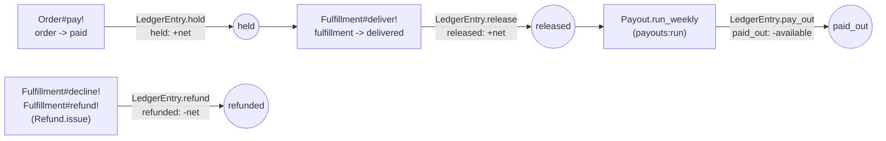
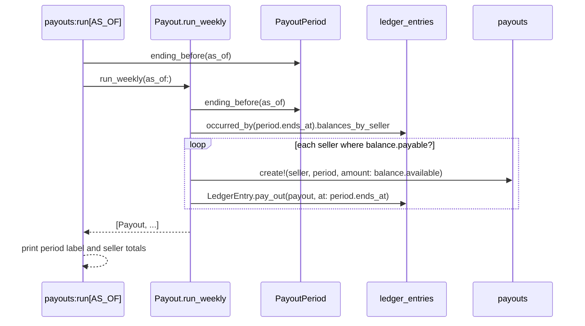

# Escrow and payouts

Per-seller money tracked in `ledger_entries`, settled weekly into `payouts`.
Code: `app/models/ledger_entry.rb`, `app/models/payout.rb`,
`app/models/payout_period.rb`, `app/models/order.rb`,
`app/models/fulfillment.rb`, `app/models/refund.rb`,
`lib/tasks/payouts.rake`.

## Ledger entry types through hold → release → payout, and back

Question: what event writes each `ledger_entries.entry_type`, and what does
each one do to a seller's balance?



Caveats: `amount_cents` is signed — `held` and `released` are positive,
`paid_out` and `refunded` are negative. The fee itself is computed once, in
`Order.place`, and stored on the `fulfillments` row (`fee_cents`,
`net_cents`) — everything downstream moves that stored `net_cents` rather
than recomputing it.

## How a refund folds

Question: a refund can land before the money is released, after it is
released, or after it has been paid out. How does one fold read all three?

A refund goes where that fulfillment's money currently stands, so the fold is
per fulfillment rather than per entry type. `LedgerEntry.balance` groups by
`(fulfillment_id, entry_type)` — `balances_by_seller` adds `seller_id` — and
`LedgerEntry::Balance.fold` adds up one part per fulfillment. Entries naming
no fulfillment (a payout) fold under the same rule as a group of their own.

For one fulfillment, with `held`, `released`, `paid_out`, `refunded` as that
fulfillment's totals:

```
still_held = released == 0

held      = held − released + (still_held ? refunded : 0)
available = released + paid_out + (still_held ? 0 : refunded)
paid_out  = −paid_out
```

The three timings of `docs/alignment.md` §4.2, for one $450.00 sale
(`net` $405.00), each verified by a test in `test/models/ledger_entry_test.rb`:

| Timing                | Entries                                             | held  | available    | paid out |
| --------------------- | --------------------------------------------------- | ----- | ------------ | -------- |
| Refund before release | `held +40500`, `refunded −40500`                    | $0.00 | $0.00        | $0.00    |
| Refund after release  | `held +40500`, `released +40500`, `refunded −40500` | $0.00 | $0.00        | $0.00    |
| Refund after payout   | the three above plus `paid_out −40500`              | $0.00 | **−$405.00** | $405.00  |

A refund before release reverses the hold and nothing becomes available. A
refund after release takes the money back out of what was available, so a
seller with other released sales sees their available balance drop by the
net. A refund after payout carries the balance negative: `payable?` is
`available > 0`, so a payout of $0.00 or less writes no `payouts` row and no
`paid_out` entry, and the negative sits in the ledger until a later sale nets
it down. The whole of the seller's history is inside every read — the payout
run reads `occurred_by(period.ends_at)`, not one week at a time — so the
carry needs no bookkeeping of its own.

The platform's fee on a reversed fulfillment is forgone rather than kept:
`Fulfillment.fees_earned_cents` sums `fee_cents` over fulfillments that have
a `held` entry and are not `declined`/`refunded`, and
`Fulfillment.fees_refunded_cents` sums the same column over the ones that
are. FEAT-020's `/admin/accounting` is where the pair is reported; the
figures live on the model now.

## `payouts:run`

Question: how does the weekly payout task turn released escrow into
`payouts` rows?



Caveats: the `paid_out` entry is dated at `period.ends_at`, not the moment the
task runs — that is what makes re-running the same period a no-op (the money
is already inside `occurred_at <= period.ends_at` on the next run, so it nets
to zero and `payable?` is false). `payouts` also has a unique index on
`(seller_id, period_start)`. `PayoutPeriod.ending_before` is pure —
Monday–Sunday, the most recently completed week as of `as_of`.

Two entry points call the same class method: the CLI, and `POST /admin/payouts`
on the admin site (`Admin::PayoutsController#create`, optional `as_of` field).
Both run the settlement for every seller, not just one. Payouts are a
platform action — the seller portal has no control that runs one; its
earnings page (`Seller::EarningsController#show`) shows a seller their
held / available / paid-out balance and their payout history only.

## Worked example

A $100.00 listing, one unit, one seller, no other activity that period.

| Step                         | Action                                      | `ledger_entries` written | Seller balance                             |
| ---------------------------- | ------------------------------------------- | ------------------------ | ------------------------------------------ |
| Order placed, card approved  | `Order#pay!`:                               | `held +9000`             | held $90.00, available $0.00               |
|                              | `Fulfillment.fee_for($100.00)` = $10.00,    |                          |                                            |
|                              | `Fulfillment.net_for($100.00)` = $90.00     |                          |                                            |
|                              | (computed at placement); `LedgerEntry.hold` |                          |                                            |
| Customer confirms delivery   | `Fulfillment#deliver!`:                     | `released +9000`         | held $0.00, available $90.00               |
|                              | `LedgerEntry.release`                       |                          |                                            |
| `payouts:run` (period ends)  | `Payout.run_weekly`: balance is payable,    | `paid_out -9000`         | available $0.00, paid out $90.00 lifetime  |
|                              | pays $90.00; `LedgerEntry.pay_out`          |                          |                                            |
| An admin refunds the dispute | `Fulfillment#refund!` → `Refund.issue` →    | `refunded -9000`         | available −$90.00, carried to the next run |
|                              | `LedgerEntry.refund`                        |                          |                                            |

`Fulfillment.fee_for` is 10% of the item subtotal
(`Fulfillment::PLATFORM_FEE_PERCENT`), taken off the top; `net = subtotal −
fee`. Both figures are computed once in `Order.place` and stored on the
`fulfillments` row (`fee_cents: 1000`, `net_cents: 9000`) — `Order#pay!` and
`Fulfillment#deliver!` read `fulfillment.net` rather than recomputing it.
