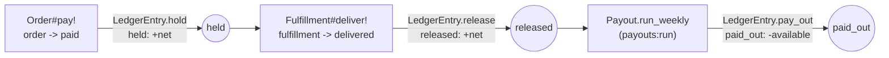
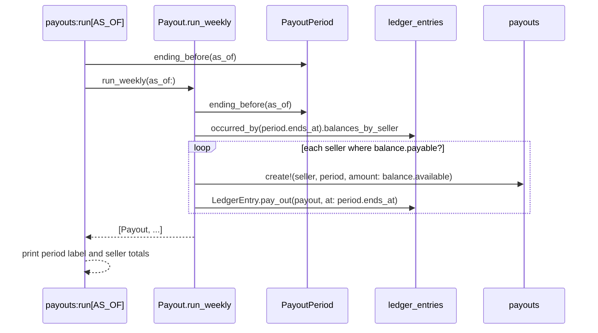

# Escrow and payouts

Per-seller money tracked in `ledger_entries`, settled weekly into `payouts`.
Code: `app/models/ledger_entry.rb`, `app/models/payout.rb`,
`app/models/payout_period.rb`, `app/models/order.rb`,
`app/models/fulfillment.rb`, `lib/tasks/payouts.rake`.

## Ledger entry types through hold → release → payout

Question: what event writes each `ledger_entries.entry_type`, and what does
each one do to a seller's balance?

Caveats: `amount_cents` is signed — `held` and `released` are positive,
`paid_out` is negative (`LedgerEntry.pay_out` negates the payout amount).
A seller's balance (`LedgerEntry.balance`, reached through
`Seller#escrow_balance`) folds every entry: `held = held_total −
released_total`, `available = released_total + paid_out_total` (adding a
negative number nets it down), `paid_out = −paid_out_total`. Only a seller with
`available > 0` (`payable?`) gets a payout row. The fee itself is computed
once, in `Order.place`, and stored on the `fulfillments` row (`fee_cents`,
`net_cents`) — `Order#pay!` and `Fulfillment#deliver!` move `fulfillment.net`
through escrow rather than recomputing it.

## `payouts:run`

Question: how does the weekly payout task turn released escrow into
`payouts` rows?

Caveats: the `paid_out` entry is dated at `period.ends_at`, not the moment the
task runs — that is what makes re-running the same period a no-op (the money
is already inside `occurred_at <= period.ends_at` on the next run, so it nets
to zero and `payable?` is false). `payouts` also has a unique index on
`(seller_id, period_start)`. `PayoutPeriod.ending_before` is pure —
Monday–Sunday, the most recently completed week as of `as_of`. The seller
portal's "Run weekly payout now" button (`Seller::PayoutsController#create`)
runs the same weekly settlement for every seller, not just the one signed in.

## Worked example

A $100.00 listing, one unit, one seller, no other activity that period.

| Step | Action | `ledger_entries` written | Seller balance |
| --- | --- | --- | --- |
| Order placed, card approved | `Order#pay!`: `Fulfillment.fee_for($100.00)` = $10.00, `Fulfillment.net_for($100.00)` = $90.00 (computed at placement); `LedgerEntry.hold` | `held +9000` | held $90.00, available $0.00 |
| Customer confirms delivery | `Fulfillment#deliver!`: `LedgerEntry.release` | `released +9000` | held $0.00, available $90.00 |
| `payouts:run` (period ends) | `Payout.run_weekly`: balance is payable, pays $90.00; `LedgerEntry.pay_out` | `paid_out -9000` | available $0.00, paid out $90.00 lifetime |

`Fulfillment.fee_for` is 10% of the item subtotal
(`Fulfillment::PLATFORM_FEE_PERCENT`), taken off the top; `net = subtotal −
fee`. Both figures are computed once in `Order.place` and stored on the
`fulfillments` row (`fee_cents: 1000`, `net_cents: 9000`) — `Order#pay!` and
`Fulfillment#deliver!` read `fulfillment.net` rather than recomputing it.
