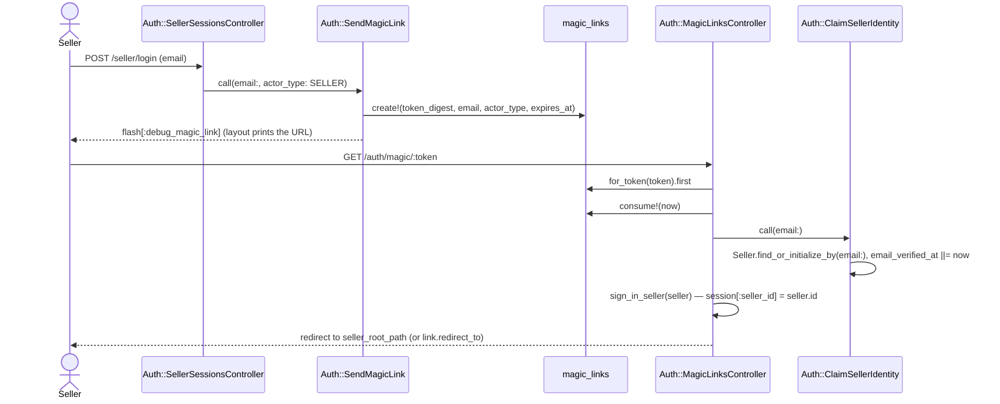
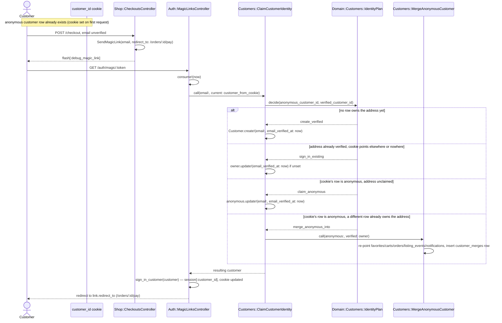
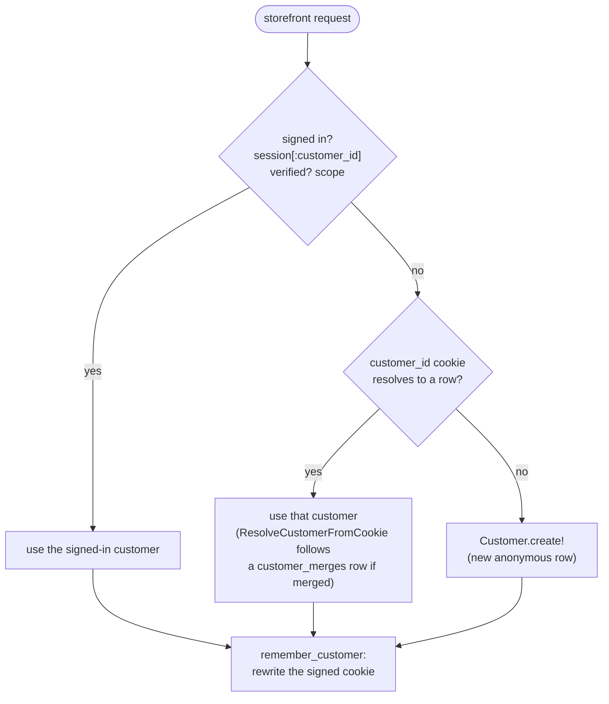

# Identity

Passwordless sign-in for both sites, plus the anonymous-customer cookie the
storefront hangs favorites, carts, and guest orders on before anyone verifies
an address. Code: `app/actions/auth/`, `app/actions/customers/`,
`app/controllers/concerns/customer_identity.rb`,
`app/domain/customers/identity_plan.rb`.

## Seller magic-link sign-in

Question: what happens between a seller submitting an email and landing on
the dashboard?

Caveats: a first-time email creates the seller row — there is no separate
sign-up step. An expired or already-consumed link (`Domain::Auth::MagicLinkStatus`)
redirects back to `seller_login_path` with an error instead of reaching
`ClaimSellerIdentity`.

## Customer guest verification with anonymous merge

Question: when a guest verifies an email mid-checkout, which customer row
ends up owning the order, and what happens to the anonymous one?

Caveats: `Domain::Customers::IdentityPlan.decide` folds to `sign_in_existing`
whenever `anonymous_customer_id == verified_customer_id` too — a customer
re-verifying an address they already hold. `MergeAnonymousCustomer` walks
`Domain::Customers::OwnedTables::ALL` inside a transaction and skips any
table/column that does not exist yet (a guard for schema drift across tickets
landing in parallel). The anonymous row is never deleted — the
`customer_merges` row lets a stale cookie on a second device resolve forward
to the verified customer (`Customers::ResolveCustomerFromCookie` follows it).

## Which identity a storefront request resolves to

Question: given a request, which customer does `current_customer` return?

Caveats: this is `CustomerIdentity#current_customer`, run by `Shop::BaseController`'s
`before_action :resolve_customer_identity` on every storefront request. It
never runs on `/auth/magic/:token`, `/login`, or `/logout`
(`Auth::BaseController` reads the cookie directly through
`Customers::ResolveCustomerFromCookie`), so a seller clicking a seller link
cannot accidentally create a customer row. A signed-in customer must also be
`verified` (`Customer.verified` scope, `email` not null) — the cookie alone
never reaches `/account` (`require_customer!`).
