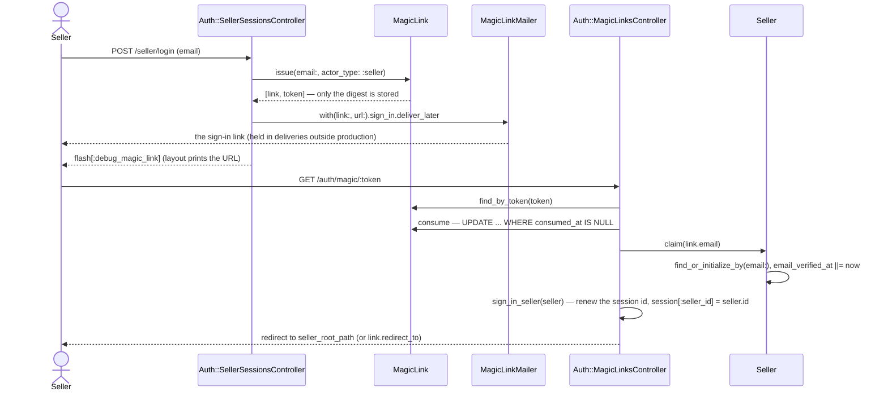
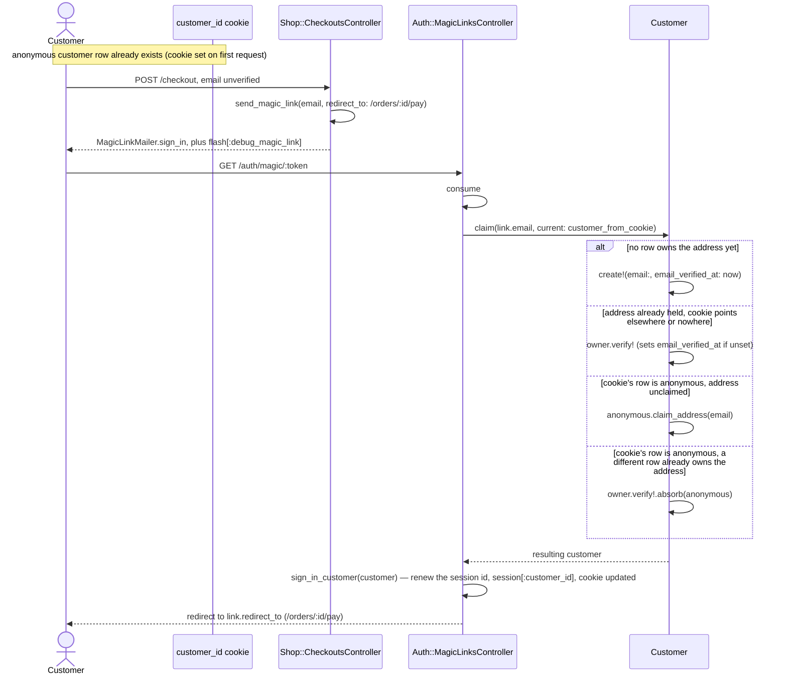
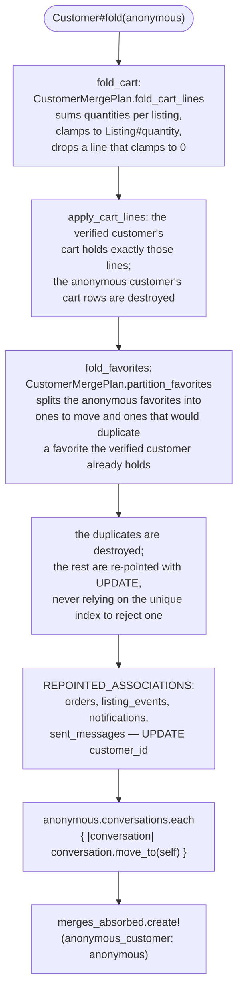

# Identity

Passwordless sign-in for all three sites, plus the anonymous-customer cookie
the storefront hangs favorites, carts, and guest orders on before anyone
verifies an address. Each site's sign-in lives under its own session key, so
one browser can hold a seller, a customer, and an admin at once.

Code: `app/models/{magic_link,seller,customer,customer_merge_plan}.rb`,
`app/models/concerns/email_address.rb`,
`app/controllers/concerns/magic_link_sender.rb`,
`app/controllers/concerns/{customer_identity,seller_authentication,admin_authentication}.rb`,
`app/controllers/concerns/request_story.rb`, `app/mailers/magic_link_mailer.rb`.

`MagicLinkSender#send_magic_link` does two things with the URL it builds from
the plaintext token: it enqueues `MagicLinkMailer.sign_in` with
`deliver_later`, and where
`Rails.configuration.x.magic_links.debug_alert` is on (everywhere but
production) it writes the URL into `flash[:debug_magic_link]`, which
`layouts/_debug_alert` prints. The container has no mailbox anyone can read —
`delivery_method :test` holds the mail in `ActionMailer::Base.deliveries` — so
the debug alert is how a demo and the integration tests follow a link.

## Seller magic-link sign-in

Question: what happens between a seller submitting an email and landing on
the dashboard?



Caveats: a first-time email creates the seller row — there is no separate
sign-up step. An address that is not an address comes back from
`MagicLink.issue` unsaved and undelivered, and the form re-renders with
`422`. A link that is not `usable?` (consumed, or past `expires_at`)
redirects back to `seller_login_path` with an error instead of reaching
`Seller.claim`.

One use is enforced by `MagicLink#consume`'s `UPDATE ... WHERE consumed_at IS
NULL` and the affected-row count it returns, not by the `usable?` read taken
before it — that read only chooses which message an already-spent or expired
link gets. Two requests that load the same unconsumed link before either
writes still race on the `UPDATE`: exactly one changes a row and returns
`true`; the other matches nothing, returns `false`, and `Auth::MagicLinksController#show`
sends it to `turn_away` with the same "already been used" message a
sequentially-replayed link gets. Every refusal — unknown token, expired,
consumed, or lost this race — logs `magic_link.consume` `refused` at `info`
without saying which of the three it was.

## Customer guest verification with anonymous merge

Question: when a guest verifies an email mid-checkout, which customer row
ends up owning the order, and what happens to the anonymous one?



Caveats: a cookie already pointing at the account signs in without a merge —
`Customer.claim` only treats `current` as an anonymous row when it holds no
address. `Customer#absorb` moves the anonymous customer's history into the
verified one inside one transaction (`Customer#fold`); what "moves" means
differs by table, and that difference is the point of the next section.
The anonymous row is never deleted — the `customer_merges` row lets a stale
cookie on a second device resolve forward to the verified customer
(`Customer.from_cookie` follows it).

## The merge is a fold, not a re-point

Question: a verified customer absorbing an anonymous one already has their
own cart and their own favorites some of the time. What happens to the
anonymous customer's cart and favorites, rather than just handing them over?



Caveats: `CustomerMergePlan` is a PORO — two class methods, `fold_cart_lines`
and `partition_favorites`, over plain hashes and arrays, no database access —
so the fold's arithmetic (sum, clamp, drop-at-zero, de-duplicate) is unit
tested without a customer or a listing existing anywhere. `Customer#fold`
is the rich-model half that reads the two customers' rows, calls the plan,
and writes the answer: a verified customer never ends up with two carts (the
anonymous cart rows are destroyed, not re-pointed) or a duplicate favorite
(the row that would collide is destroyed before the rest are re-pointed,
rather than leaning on the unique index on `(customer_id, listing_id)` to
reject it).

`Customer::MERGED_ASSOCIATIONS` names every association a merge folds or
re-points; `Customer::REPOINTED_ASSOCIATIONS` is the subset moved with a
plain `UPDATE` (carts, favorites, and conversations are the exceptions —
each has its own fold above). `Customer::LEFT_BEHIND_ASSOCIATIONS` names the
tables a `customer_id` column that a merge deliberately does not touch, and
why:

- **`customer_blocks` is not re-pointed.** An admin's block is a decision
  about the specific row it names. Node's `REPOINTED_CUSTOMER_TABLES`
  excludes `customer_blocks` for the same reason, and Rails matches it. This
  means a blocked anonymous customer who later verifies and merges into a
  different (unblocked) account starts shopping again — the block stays on
  the abandoned anonymous row. Weighed against re-pointing: `CustomerBlock`
  already carries a partial unique index enforcing at most one *active*
  block per customer (`FEAT-021`); re-pointing a block into an account that
  is already actively blocked would need to decide which block wins, a
  question moderation has no policy for today. The prototype's answer is the
  reference's answer — leave the block on the row an admin named — not a
  claim that evasion is desirable.
- **`customer_merges` is not re-pointed.** Its own `customer_id` column is
  the merge ledger's target, written once when a merge is recorded; a row
  already names the correct verified customer the moment it is inserted, so
  there is nothing for a later merge to rewrite.

`CustomerMergedAssociationsTest` reads `ActiveRecord::Base.connection`
directly rather than a hand-copied table list: every table with a
`customer_id` column must appear in `MERGED_ASSOCIATIONS` or
`LEFT_BEHIND_ASSOCIATIONS`, so a migration that adds one and forgets to
classify it fails the suite instead of merging silently.

## Which identity a storefront request resolves to

Question: given a request, which customer does `current_customer` return?


Caveats: this is `CustomerIdentity#current_customer`, run by `Shop::BaseController`'s
`before_action :resolve_customer_identity` on every storefront request. It
never runs on `/auth/magic/:token`, `/login`, or `/logout`
(`Auth::BaseController` reads the cookie directly through
`Customer.from_cookie`), so a seller clicking a seller link cannot
accidentally create a customer row. A signed-in customer must also be
`verified` (`Customer.verified` scope, `email` not null) — the cookie alone
never reaches `/account` (`require_customer!`).

## Three actors, one browser

Question: a reviewer signs in as a seller, then a customer, then an admin, all
in the same browser. Does each sign-in survive the next one?

```mermaid
sequenceDiagram
    actor Reviewer
    participant SellerCtrl as Auth::SellerSessionsController
    participant CustomerCtrl as Auth::CustomerSessionsController
    participant AdminCtrl as Auth::AdminSessionsController
    participant Session as the one Rack session

    Reviewer->>SellerCtrl: sign in
    SellerCtrl->>Session: session_options[:renew] = true<br/>session[:seller_id] = seller.id
    Reviewer->>CustomerCtrl: sign in
    CustomerCtrl->>Session: session_options[:renew] = true<br/>session[:customer_id] = customer.id
    Note over Session: renew rotates the session id;<br/>seller_id is still there
    Reviewer->>AdminCtrl: sign in
    AdminCtrl->>Session: session_options[:renew] = true<br/>session[:admin_id] = admin.id
    Note over Session: seller_id and customer_id both survive
```

Caveats: each of the three `sign_in_<actor>` methods
(`CustomerIdentity`, `SellerAuthentication`, `AdminAuthentication`) writes
one session key and sets `request.session_options[:renew] = true` instead of
calling `reset_session`. `renew` is Rack's session-fixation defense — the
session id the cookie carries changes on the next response — without
discarding the hash the other two actors' keys live in, which `reset_session`
would. Each `sign_out_<actor>` deletes only its own key
(`session.delete(:seller_id)`, and so on), so signing out of one site leaves
the other two signed in. `SharedSessionTest` proves all three combinations —
sign in as any one and the other two survive, sign out of any one and the
other two survive — and that the session id actually rotates on each sign-in
rather than merely relying on `renew` being set.

CSRF protection is unaffected: Rails' synchronizer token is a value stored in
the session hash, not derived from the session id, so renewing the id changes
nothing about it.

None of this touches the `sid` cookie `RequestStory` mints (`docs/alignment.md`
§2) — that cookie is written directly on the response, outside the session
store entirely, on the first response any browser gets and left alone by
every sign-in and sign-out. `LoggingTest` and `SharedSessionTest` both assert
it is byte-for-byte the same cookie value before and after all three actors
sign in and out.
