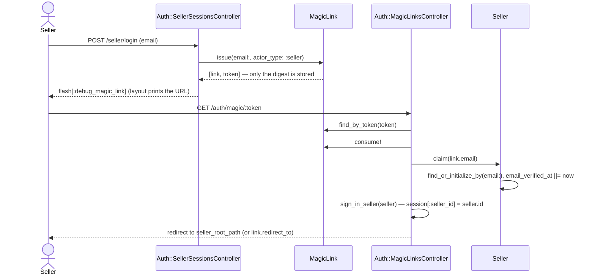
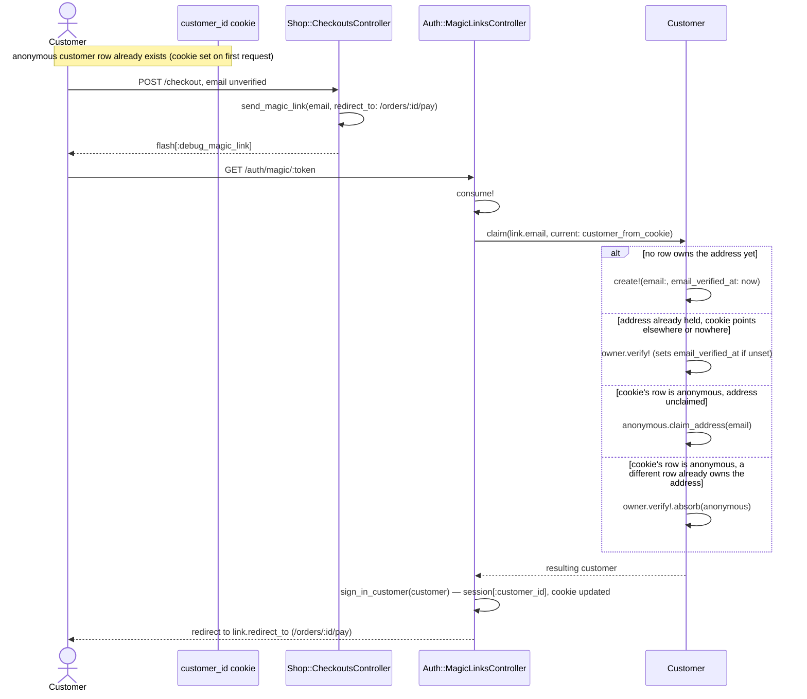

# Identity

Passwordless sign-in for both sites, plus the anonymous-customer cookie the
storefront hangs favorites, carts, and guest orders on before anyone verifies
an address. Code: `app/models/{magic_link,seller,customer}.rb`,
`app/models/concerns/email_address.rb`,
`app/controllers/concerns/{magic_link_sender,customer_identity}.rb`.

## Seller magic-link sign-in

Question: what happens between a seller submitting an email and landing on
the dashboard?

Caveats: a first-time email creates the seller row — there is no separate
sign-up step. An address that is not an address comes back from
`MagicLink.issue` unsaved and undelivered, and the form re-renders with
`422`. A link that is not `usable?` (consumed, or past `expires_at`)
redirects back to `seller_login_path` with an error instead of reaching
`Seller.claim`.

## Customer guest verification with anonymous merge

Question: when a guest verifies an email mid-checkout, which customer row
ends up owning the order, and what happens to the anonymous one?

Caveats: a cookie already pointing at the account signs in without a merge —
`Customer.claim` only treats `current` as an anonymous row when it holds no
address. `Customer#absorb` moves favorites, carts, orders, listing events, and
notifications through the associations `Customer` declares
(`Customer::MERGED_ASSOCIATIONS`) inside a transaction. The anonymous row is
never deleted — the `customer_merges` row lets a stale cookie on a second
device resolve forward to the verified customer (`Customer.from_cookie`
follows it).

## Which identity a storefront request resolves to

Question: given a request, which customer does `current_customer` return?

Caveats: this is `CustomerIdentity#current_customer`, run by `Shop::BaseController`'s
`before_action :resolve_customer_identity` on every storefront request. It
never runs on `/auth/magic/:token`, `/login`, or `/logout`
(`Auth::BaseController` reads the cookie directly through
`Customer.from_cookie`), so a seller clicking a seller link cannot
accidentally create a customer row. A signed-in customer must also be
`verified` (`Customer.verified` scope, `email` not null) — the cookie alone
never reaches `/account` (`require_customer!`).
