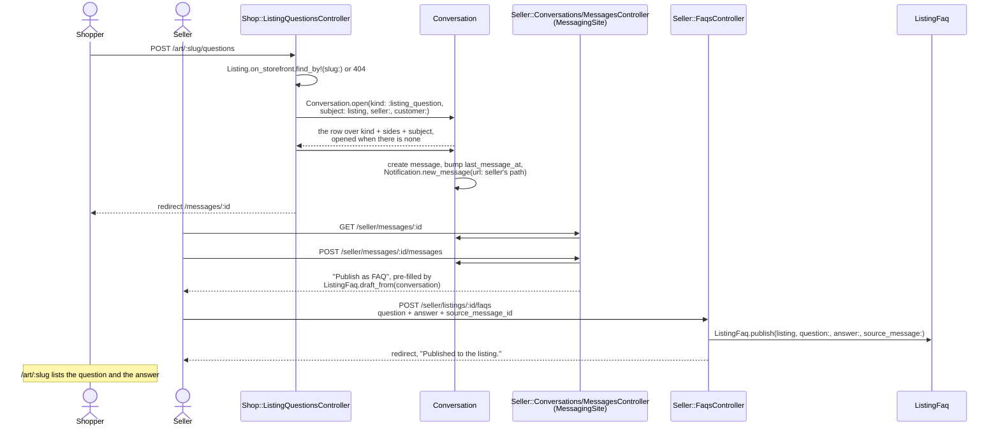
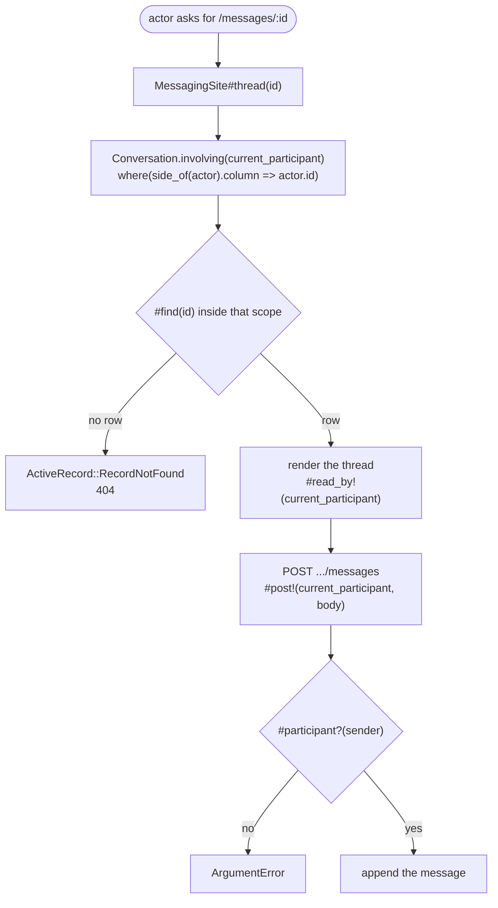
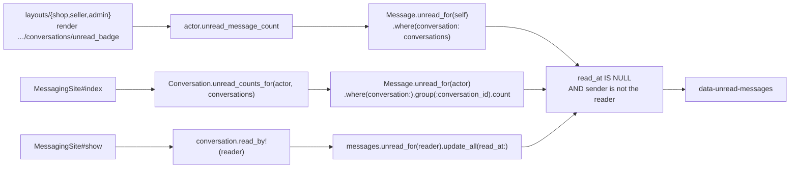
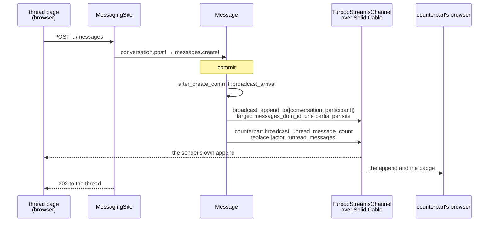

# Messaging

One conversation record serves every pairing on the marketplace, and one of the
four kinds carries the product feature that pays for it: a customer's question
on a listing, answered by the seller, published as an FAQ entry the whole
storefront can read.

Code: `app/models/conversation.rb`, `app/models/message.rb`,
`app/models/listing_faq.rb`, `app/models/concerns/messaging.rb`,
`app/controllers/concerns/messaging_site.rb` and the
`conversations_controller.rb` / `messages_controller.rb` pairs under
`app/controllers/{shop,seller,admin}/`,
`app/controllers/shop/listing_questions_controller.rb`,
`app/controllers/seller/faqs_controller.rb`. Tables:
`db/migrate/20260823000102_create_conversations.rb`,
`…000103_create_messages.rb`, `…000104_create_listing_faqs.rb`.

Four tables would repeat the same message store four times, so there is one:
`conversations.kind` says which two participant columns are filled and which
subject, if any, the thread hangs off (`Conversation::KINDS`, whose values are
`Kind` structs of `sides`, `subject_type` and `topic`).

## Conversation kinds

| `kind` | Participants | Subject | Opened by |
| --- | --- | --- | --- |
| `admin_seller` | `admin_id` ↔ `seller_id` | — | `POST /seller/support`, `POST /admin/sellers/:id/conversation` |
| `admin_customer` | `admin_id` ↔ `customer_id` | — | `POST /support`, `POST /admin/customers/:id/conversation` |
| `fulfillment` | `seller_id` ↔ `customer_id` | `Fulfillment` | `POST /seller/orders/:id/conversation`, `POST /orders/:order_id/fulfillments/:id/conversation` |
| `listing_question` | `seller_id` ↔ `customer_id` | `Listing` | `POST /art/:slug/questions` |

Every kind has exactly two participants. That is the invariant the rest of the
design rests on: one `read_at` per message is unambiguous, because the reader is
always the participant who did not send it. `Conversation#sides_match_the_kind`
and `#subject_matches_the_kind` are the validations that hold the shape, and
they read `KINDS` rather than listing the four cases again.

Each site reads the same threads through its own paths — `/messages`,
`/seller/messages`, `/admin/messages` for the inbox, and `.../messages/:id` for
one thread. `Conversation::SIDES` maps an actor type to its participant column,
its site, and its inbox path, so `#thread_path_for(actor)` can hand a
notification the **recipient's** path while a link on the page uses the
reader's.

Every "open a thread" entry point is a POST behind a `button_to`, and the
action redirects to the thread. Both support controllers open against
`Admin.on_duty` — the first admin by id. Admin rows are seeded and this
prototype has no assignment model; with no admin row the controller redirects
back with "Nobody is on the support desk yet."

The admin site's own Message buttons open against `current_admin` instead, so
the operator writing is the one named on the thread. Two admins are seeded
(Jonathan Beebe on duty, Anna Schmunk beside him), so the two doors reach one
thread only while the operator writing is the one on duty. A seller who presses
Support and is then messaged by the other operator holds two `admin_seller`
threads: `topic` for the support kinds is the desk rather than the operator, so
both inbox rows read "Art Store support" and the counterpart's name is what
tells them apart. Assignment is what would settle which operator a thread
belongs to, and this prototype has none.

## A question becomes a published FAQ

Question: what runs between a shopper asking about a listing and that answer
appearing on the listing page for everyone?

Caveats: an **anonymous** customer can ask. `Shop::ListingQuestionsController`
sits behind `Shop::BaseController`, whose `CustomerIdentity` mints a `customers`
row for every visitor, so the row behind the cookie is the participant. When
that visitor verifies an address, `sent_messages` is in
`Customer::MERGED_ASSOCIATIONS` and `Customer#absorb` hands each thread to
`Conversation#move_to`. A thread the verified customer already holds on the
same subject takes the anonymous thread's messages and the later
`last_message_at`, and the emptied row is destroyed, so one thread per shape
comes out of the merge. Each message keeps its own `read_at` through the move,
which is what keeps the unread counts on both sides right.

The open and the first post share one transaction (`ask` in that controller),
so a refused body leaves no empty thread in either inbox. `Conversation.open`
reads the kind, the kind's participant columns and the subject, takes the
lowest id it finds, and opens a row when there is none — which is what makes
"message this seller" reach the same thread every time. The database carries
the same rule: `index_conversations_on_shape` is unique over those six
columns, each read through `COALESCE`, since SQLite counts two nulls as
different values and every kind leaves some of the six null.

A `listing_faqs` row exists **only while it is published**. `published_at` is
`null: false`, unpublishing is `destroy!`, and the storefront reads
`listing.faqs.oldest_first` with no predicate of its own. There is no draft
state and no fourth action, because re-publishing is one button on the thread
the answer came from. `source_message_id` records which answer an entry was
lifted from, and `Seller::FaqsController#source_message` reads it through
`Message.where(conversation: @listing.conversations)`, so an answer from
outside this listing's threads answers 404. The seller edits
(`PATCH /seller/listings/:id/faqs/:id`) and unpublishes
(`DELETE .../faqs/:id`) from `/seller/listings/:id/faqs`.

Lengths are validations on the records: `Message::BODY_LIMIT` is 2000,
`ListingFaq::QUESTION_LIMIT` 500 and `ListingFaq::ANSWER_LIMIT` 2000. The form
fields carry the same numbers through `maxlength`, and the controllers rescue
`ActiveRecord::RecordInvalid` to re-render with the seller's own text. A
question is allowed 2000 characters as a message and 500 as an entry, so the
publish form can open pre-filled with a value the model refuses;
`Seller::FaqsController#render_refusal` sends a refused entry back where it was
written — the thread, when the entry names a `source_message`, and this
listing's FAQ page otherwise. `_fields.html.erb` carries `source_message_id` as
a hidden field whenever the record holds one, so the attribution survives the
round trip and the seller shortens the question in place.

## Who may read, who may post

Question: given an actor and a conversation, what is that actor allowed to do?

Caveats: the access rule is the scope. `Conversation.involving(actor)` filters
on the column `SIDES` gives that actor's type, so a thread the actor is not in
and an id no thread carries both come back as `RecordNotFound` — 404, never
403. `MessagingSite#thread` is the one place that reads it, and six controllers
include the concern — a `ConversationsController` (inbox and thread) and a
`MessagesController` (reply) per site. Each site supplies
`current_participant` (`current_customer`, `current_seller`,
`current_admin`); `Shop::MessagesController`, `Seller::MessagesController` and
`Admin::MessagesController` supply `thread_template`, the view a refused reply
comes back on.

`Conversation#post!` raises `ArgumentError` on a sender who is not a
participant. Controllers reach it through the scope, so the raise is the
model refusing what no route can ask for.

This prototype has no moderation feature, so reading and posting are one
predicate: being named in your side's column.

## Unread counts

Question: where does the number on every layout's Messages link come from?

Caveats: `Message.unread_for(reader)` is the single definition — a message is
unread for a reader while `read_at` is null and that reader is not its sender.
The nav badge, the per-thread badge in an inbox row, and the marking done when
a thread opens read that one scope, so the three answer the same question the
same way at the moment each runs. What arrives afterwards reaches two of them:
a broadcast replaces the nav badge and appends to an open thread page, while
the rows of an inbox page already rendered hold the numbers they were drawn
with until the next load.

`MessagingSite#index` costs the same number of queries whatever the inbox
holds. `Conversation.unread_counts_for(actor, conversations)` groups the whole
page's counts into one query and hands the view a hash that answers 0 for a
thread with nothing unread, and `includes(:subject, :seller, :customer,
:admin)` loads the row's subject and both participants, which is what
`#counterpart_of` reads. A 20-row inbox costs what a 1-row inbox costs;
`Seller::ConversationsControllerTest` asserts the two are equal.

`Messaging` is the concern `Seller`, `Customer` and `Admin` include. It gives
each of them `conversations`, `sent_messages`, `unread_message_count`,
`unread_badge_dom_id` and `broadcast_unread_message_count`, so the badge is one
partial per site fed by the actor the layout already has.

`Conversation#read_by!` returns how many rows it moved and broadcasts only when
that is positive, so opening a thread twice sends one badge update.

## Live updates

Question: what moves a message onto an open thread page and a number onto the
nav badge without a reload?

Every thread page carries `turbo_stream_from @conversation, current_<actor>`,
so a stream belongs to one conversation **and** one participant. That is what
lets `Message#broadcast_arrival` send each side the partial of the site it
reads on: `shop/conversations/_message` has no card, the portal's is a white
card, the admin's a slate one, and `Conversation.site_of(participant)` picks
between them. The badge rides its own stream, `[actor, :unread_messages]`, and
`Conversation#read_by!` broadcasts the reader's badge through
`ActiveRecord.after_all_transactions_commit`.

The transport is Action Cable on Solid Cable: `solid_cable_messages` lives in
the same SQLite file as the rest of the domain, so live updates need no Redis
and the stack stays one container. `config/cable.yml` uses the `test` adapter
under test, where `Turbo::Broadcastable::TestHelper`'s
`assert_turbo_stream_broadcasts` reads what a post enqueued.

Both broadcasts are after-commit, so a post that rolls back sends nothing.
`turbo_stream_from` renders a signed stream name, and
`Turbo::StreamsChannel.verified_stream_name` refuses a tampered one, so a
browser subscribes to the threads and the badge the server handed it and no
others. There is no `ApplicationCable::Connection`: with none defined Action
Cable connects its base class, and the signed names are the access control.

With JavaScript off, every path is unchanged. The question form, the reply
form and the publish form are `form_with` POSTs that redirect, `MessagingSite`
renders the refused form with `:unprocessable_content`, and the thread page and
the badge take their next state from the next load. Turbo repeats a `PATCH` or
`DELETE` on a 302, so the four redirects that follow one — the two FAQ writes,
a listing update, a cart-item removal — answer `:see_other`.
