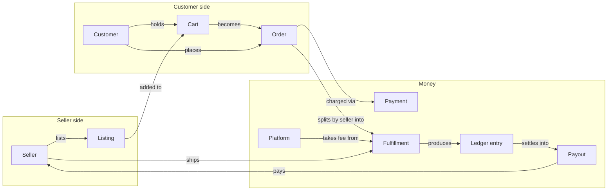

# Domain ontology

A two-sided marketplace for hand-made art: sellers list one-of-a-kind or
limited-quantity pieces, customers browse and buy them. Payment is captured
at checkout but held in escrow per seller until the customer confirms
delivery, then settled into a weekly payout.

Question: what are the entities in the product, and how does value move
between them at the concept level? (Table-level shape: `docs/data-model.md`.
Sequence and state detail: `docs/orders.md`, `docs/escrow.md`,
`docs/identity.md`.)

Smaller catalog and identity concepts (listing event, favorite, cart item,
order item, magic link, customer merge, notification) sit off this diagram —
they support the entities shown rather than carrying their own flow. Each
gets its own section below.

## Roles

### Seller

**Who/what.** A person or studio who lists art for sale and gets paid out.

**Why it exists.** Supplies the catalog; the platform's other side of the
marketplace.

**Lifecycle.** None — a seller row exists from first sign-in and does not
change state. `email_verified_at` is set the first time they sign in through
a magic link.

**Relates to.**
- owns Listings
- ships Fulfillments
- receives Ledger entries and Payouts
- receives Notifications

**In code.** `Seller` (table `sellers`).

### Customer

**Who/what.** A storefront visitor. Every visitor gets a row, verified or
not — see "verified customer" and "guest checkout" in Vocabulary notes.

**Why it exists.** Holds favorites, a cart, and orders across a visit, so
browsing state survives before anyone gives an address.

**Lifecycle.** None as a status field, but a row moves through three
conditions: anonymous (`email` null) → guest with an unverified address
(email set, `email_verified_at` null) → verified (`email_verified_at` set).
`Customer#anonymous?` reads the first.

**Relates to.**
- has Favorites, a Cart, and Listing events
- places Orders
- receives Notifications
- may be the source or the target of a Customer merge

**In code.** `Customer` (table `customers`).

### Anonymous visitor

**Who/what.** Not a separate table — a Customer row with `email = nil`,
identified by a signed `customer_id` cookie rather than sign-in.

**Why it exists.** Lets a visitor favorite, cart, and check out as a guest
before proving an email address.

**Lifecycle.** Ends when the visitor verifies an address: the row is either
claimed in place or merged into an existing verified Customer (see Customer
merge).

**Relates to.**
- is a Customer
- resolved per request by `CustomerIdentity#current_customer` (see
  `docs/identity.md`)

**In code.** No separate model or enum — `Customer#anonymous?`,
`Customer.claim`.

### Platform

**Who/what.** The marketplace operator. Not a database row — a role played
by the code that takes a cut of each sale and settles seller payouts.

**Why it exists.** Names who the platform fee belongs to and who runs the
weekly payout job.

**Lifecycle.** None.

**Relates to.**
- takes a Platform fee from each Fulfillment's subtotal
- runs Payouts (`payouts:run`)

**In code.** `Fulfillment::PLATFORM_FEE_PERCENT`; no model — the platform
holds no row of its own.

## Catalog

### Listing

**Who/what.** One piece (or a small run of identical pieces) a seller has
for sale.

**Why it exists.** The unit of inventory and the storefront's unit of
browsing.

**Lifecycle.** `draft → for_sale → sold`, plus `archived` from `draft` or
`for_sale`, plus `sold → for_sale` (a declined charge restores the stock it
took). Search and browse show only `for_sale` listings; a `sold` listing keeps
its own page. See "sold" in Vocabulary notes.

**Relates to.**
- belongs to one Seller
- records Listing events
- favorited by Customers via Favorite
- held in Cart items, sold as Order items

**In code.** `Listing` (table `listings`), which carries the `status` enum,
`TRANSITIONS`, `on_storefront`, `purchasable?`, `take_stock!` /
`restore_stock!` and the field validations.

### Listing event

**Who/what.** One recorded interaction with a listing: a view, a favorite,
an unfavorite, or a cart-add.

**Why it exists.** Feeds the seller's per-listing activity numbers (views,
favorites, cart adds) and the dashboard's daily activity timeline.

**Lifecycle.** None — write-once, timestamped fact.

**Relates to.**
- belongs to one Listing
- optionally attributed to one Customer (`customer_id` nullable)

**In code.** `ListingEvent` (table `listing_events`), whose `event_type` enum
is `view` | `favorite` | `unfavorite` | `cart_add`, written by
`Listing#record_event!`.

### Favorite

**Who/what.** A customer's bookmark on a listing.

**Why it exists.** Lets a customer track pieces of interest without adding
them to the cart.

**Lifecycle.** None — exists or does not; toggled on and off.

**Relates to.**
- belongs to one Customer and one Listing
- toggling one also records a Listing event (`favorite`/`unfavorite`)

**In code.** `Favorite` (table `favorites`), toggled by
`Customer#toggle_favorite`, which returns `:added` or `:removed` and records
the matching listing event.

## Buying

### Cart

**Who/what.** A customer's in-progress selection, held until checkout.

**Why it exists.** Lets a customer collect items from multiple sellers
before placing one order.

**Lifecycle.** None as a status; exists per customer, spawns an Order on
checkout. A merge can leave a customer with two cart rows (`carts.customer_id`
is not unique); `Customer#current_cart` picks the one with the most items.

**Relates to.**
- belongs to one Customer
- contains Cart items

**In code.** `Cart` (table `carts`), which carries `add`, `remove`,
`item_count`, `subtotal` and `subtotals_by_seller`.

### Cart item

**Who/what.** One listing and quantity held in a cart.

**Why it exists.** The line the cart totals and the order are built from.

**Lifecycle.** None — created on add, deleted on remove or on checkout.

**Relates to.**
- belongs to one Cart
- references one Listing

**In code.** `CartItem` (table `cart_items`), written by `Cart#add` and
`Cart#remove`; `CartItem#total` is the line's unit price times its quantity.

### Order

**Who/what.** A customer's purchase, possibly spanning several sellers.

**Why it exists.** The record of a transaction from checkout through
delivery; the parent of the per-seller Fulfillments.

**Lifecycle.** `pending_verification` (guest) or `awaiting_payment`
(verified) → `paid` or `payment_failed` → `partially_shipped` / `shipped` →
`delivered`; `cancelled` is a reachable state with no route to it in the UI.
A multi-seller order's status rolls up from its Fulfillments
(`Order#roll_up_status!`). Full diagram: `docs/orders.md`.

**Relates to.**
- placed by one Customer
- contains Order items
- attempts Payments
- splits by seller into Fulfillments
- triggers an "Item sold" Notification to each seller when it reaches `paid`

**In code.** `Order` (table `orders`), which carries the `status` enum,
`TRANSITIONS`, the shipping fields it validates, `place`, `pay!`,
`mark_awaiting_payment!` and `roll_up_status!`.

### Order item

**Who/what.** A snapshot of one purchased listing: title, unit price, and
quantity as they were at checkout.

**Why it exists.** An order reads the same after the seller edits or deletes
the listing behind it.

**Lifecycle.** None — written once at order placement.

**Relates to.**
- belongs to one Order
- references the Listing it was bought from, tagged with the selling Seller

**In code.** `OrderItem` (table `order_items`).

### Payment

**Who/what.** One charge attempt against an order's card.

**Why it exists.** Records the outcome (approved or declined) of trying to
collect the order total; a retry after a decline is a new attempt, not an
edit.

**Lifecycle.** `approved` or `declined`, one row per attempt — the order's
current payment is the latest row.

**Relates to.**
- belongs to one Order
- decided by a Card decision

**In code.** `Payment` (table `payments`), which carries the `status` and
`decline_reason` enums and the decline messages, written by `Order#pay!`.

### Fulfillment

**Who/what.** One seller's slice of an order — what that seller owes to ship
and what they're owed once it's delivered.

**Why it exists.** An order can span sellers; escrow and shipping status are
tracked per (order, seller) pair rather than per order.

**Lifecycle.** `awaiting_shipment → shipped → delivered`. Full diagram:
`docs/orders.md`.

**Relates to.**
- belongs to one Order and one Seller
- produces Ledger entries when the order is paid (`held`), when delivered
  (`released`), and when included in a Payout (`paid_out`)
- carries the Platform fee taken from its subtotal

**In code.** `Fulfillment` (table `fulfillments`), transitioned by
`Fulfillment#ship!` / `Fulfillment#deliver!`. See "Vocabulary notes" for the
seller portal's name for this entity.

## Money

### Money

**Who/what.** An integer-cents amount; the type every price, fee, and
balance in the system is expressed in.

**Why it exists.** Avoids float rounding on currency; every arithmetic
operation (add, multiply, percent) works in whole cents.

**Lifecycle.** None — an immutable value.

**Relates to.**
- used by Listing price, Order totals, Payment amount, Fulfillment
  subtotal/fee/net, Ledger entry amount, Payout amount

**In code.** `Money` (value object; no table — stored as `*_cents`
integer columns).

### Platform fee

**Who/what.** The percentage of an item's subtotal the platform keeps.

**Why it exists.** The platform's revenue; the reason "seller net" is less
than the sale subtotal.

**Lifecycle.** None — computed once at order placement, stored on the
Fulfillment row (`fee_cents`, `net_cents`) rather than recomputed later.

**Relates to.**
- computed from a Fulfillment's subtotal (10%,
  `Fulfillment::PLATFORM_FEE_PERCENT`)
- taken by the Platform

**In code.** `Fulfillment.fee_for` / `Fulfillment.net_for` (no table —
persisted as `fulfillments.fee_cents`/`net_cents`).

### Ledger entry

**Who/what.** One movement of escrowed money for one seller.

**Why it exists.** An auditable trail of every hold, release, and payout,
rather than a single mutable balance column.

**Lifecycle.** Written once per movement: `held` (order paid), `released`
(fulfillment delivered), `paid_out` (included in a payout run — negative
amount). A seller's balance is the fold of all their entries
(`LedgerEntry.balance`, through `Seller#escrow_balance`). Flowchart:
`docs/escrow.md`.

**Relates to.**
- belongs to one Seller
- produced by one Fulfillment (`held`/`released`) or one Payout (`paid_out`)

**In code.** `LedgerEntry` (table `ledger_entries`), written by
`LedgerEntry.hold` / `.release` / `.pay_out` and folded by
`LedgerEntry::Balance`. Column is `entry_type`, not `type` — see "Vocabulary
notes."

### Payout

**Who/what.** One weekly settlement of a seller's released-but-unpaid
escrow.

**Why it exists.** Turns "released" money (owed but sitting in the ledger)
into a single dated disbursement a seller can point to.

**Lifecycle.** Created once per (seller, period) by `payouts:run`; no status
field — its existence is the state. Re-running the same period is a no-op
(the `paid_out` entry it wrote is dated inside the period it settles, so the
balance nets to zero on the next run).

**Relates to.**
- belongs to one Seller
- settles Ledger entries (writes one `paid_out` entry per payout)
- covers one Payout period

**In code.** `Payout` (table `payouts`), created by `Payout.run_weekly`.

### Payout period

**Who/what.** The Monday–Sunday window a payout run settles.

**Why it exists.** Gives `payouts:run` a pure, deterministic window
(`PayoutPeriod.ending_before(as_of)`) instead of "everything released so
far."

**Lifecycle.** None — a value computed fresh from a moment in time.

**Relates to.**
- bounds which Ledger entries a Payout run settles

**In code.** `PayoutPeriod` (`app/models/payout_period.rb` — a value object
with no table; persisted as `payouts.period_start`/`period_end`).

## Identity and messaging

### Magic link

**Who/what.** A one-time, expiring, hashed token that signs someone in
without a password.

**Why it exists.** The product is passwordless for both sellers and
customers.

**Lifecycle.** `usable` → `expired` (past `expires_at`) or `consumed` (used
once). Sequence diagrams: `docs/identity.md`.

**Relates to.**
- matched to a Seller or a Customer by `email` string, not a foreign key (a
  seller and a customer can share an email address)
- carries an `actor_type` and an optional post-verification redirect

**In code.** `MagicLink` (table `magic_links`, column `token_digest`,
`actor_type` enum), issued by `MagicLink.issue` and spent through
`MagicLink.find_by_token`, `#usable?` and `#consume!`.

### Customer merge

**Who/what.** A record that an anonymous customer row was folded into an
already-verified one.

**Why it exists.** A visitor can browse anonymously on one device, then
verify an address that another device already claimed; the merge lets a
stale cookie on the first device keep resolving to the right account.

**Lifecycle.** None — written once by `Customer#absorb`; never undone.

**Relates to.**
- points one anonymous Customer at the verified Customer it merged into
- triggers re-pointing of that customer's Favorites, Cart, Orders, Listing
  events, and Notifications (`Customer::MERGED_ASSOCIATIONS`)

**In code.** `CustomerMerge` (table `customer_merges`), written by
`Customer#absorb` when `Customer.claim` finds both an anonymous row and an
account holding the address.

### Notification

**Who/what.** A message shown in a seller's or a customer's header: "Item
sold" or "Order shipped."

**Why it exists.** Tells each side of a transaction when the other side has
acted, without email.

**Lifecycle.** Unread → read (`read_at` set). No other state.

**Relates to.**
- belongs to exactly one Seller or one Customer (never both)
- raised by an Order reaching `paid` (seller) or a Fulfillment reaching
  `shipped` (customer)

**In code.** `Notification` (table `notifications`), addressed to a polymorphic
`recipient` and written by `Notification.item_sold` and
`Notification.order_shipped`.

## Decisions

### Card decision / Fake card

**Who/what.** The outcome of running a submitted card number through the
prototype's fake payment processor: approved, or declined with a reason.

**Why it exists.** Stands in for a real payment gateway; a fixed set of test
numbers makes every checkout outcome reproducible.

**Lifecycle.** None — computed fresh per attempt from the card number, never
stored as its own row (its outcome becomes a Payment).

**Relates to.**
- decides a Payment's status and a Payment's decline reason
- drives the Order's `paid`/`payment_failed` transition

**In code.** `FakeCard`, read by `Order#pay!`.

### Listing status

**Who/what.** The lifecycle state of a Listing (see Catalog above).

**In code.** `Listing::TRANSITIONS` and the `Listing` `status` enum.

### Order status

**Who/what.** The lifecycle state of an Order (see Buying above).

**In code.** `Order::TRANSITIONS` and the `Order` `status` enum.

### Fulfillment status

**Who/what.** The lifecycle state of a Fulfillment (see Buying above).

**In code.** The `status` enum on `Fulfillment`.

## Vocabulary notes

- The seller portal's "Orders" page (`seller_orders` / `seller_order`,
  `Seller::OrdersController`) lists **Fulfillments**, not Orders — a seller's
  order is the one fulfillment that belongs to them.
- "Verified customer" = a `customers` row with `email_verified_at` set.
- "Guest checkout" = an order placed by an anonymous customer
  (`OrderStatus::PENDING_VERIFICATION`); the order is not finalized (charged)
  until that customer verifies an email via magic link.
- "Sold" on a listing = `quantity` reached 0, not "no longer listed" — a
  `sold` listing keeps its storefront page; only `draft` and `archived`
  listings are unreachable.
- "Seller net" / a Fulfillment's `net_cents` = subtotal minus the Platform
  fee; this is the amount that moves through escrow (`held` → `released` →
  `paid_out`), not the sale's subtotal.
- "Available" (as in a seller's available balance,
  `LedgerEntry::Balance#available`) means released and not yet paid out — it
  does not mean "in the seller's bank account."
- An anonymous customer is not a distinct model — it is a `Customer` row
  with `email = nil`; "customer" in prose can mean either the anonymous or
  the verified case unless qualified.
- Seller-portal controllers are written in compact form (`class
  Seller::XController < Seller::BaseController`) — `app/models/seller.rb`
  already defines `Seller` as a class, so `module Seller` elsewhere under
  `app/` collides with the model. See `docs/architecture.md`.
