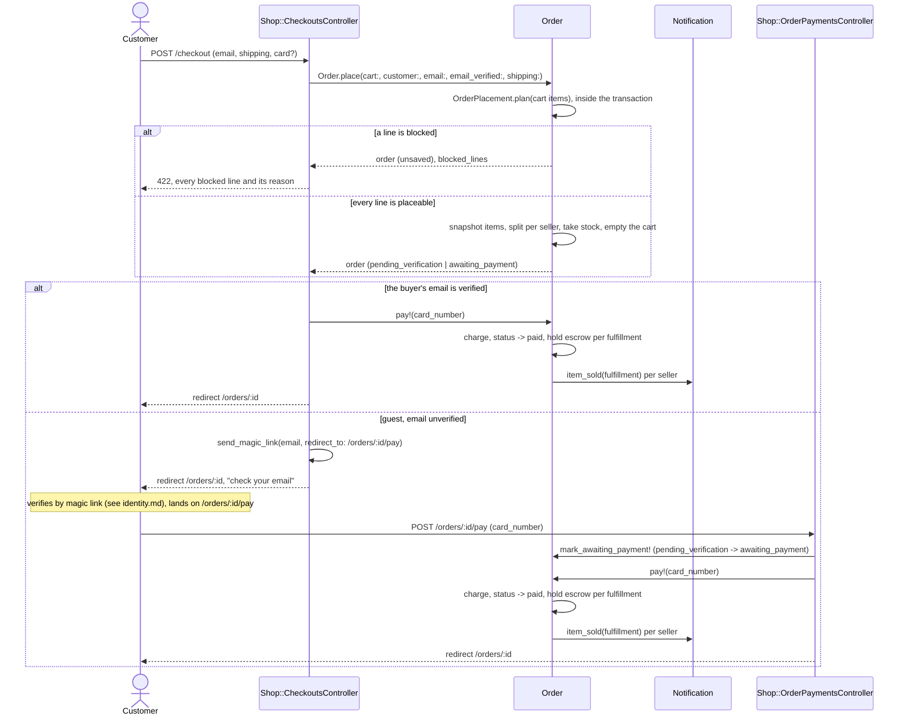
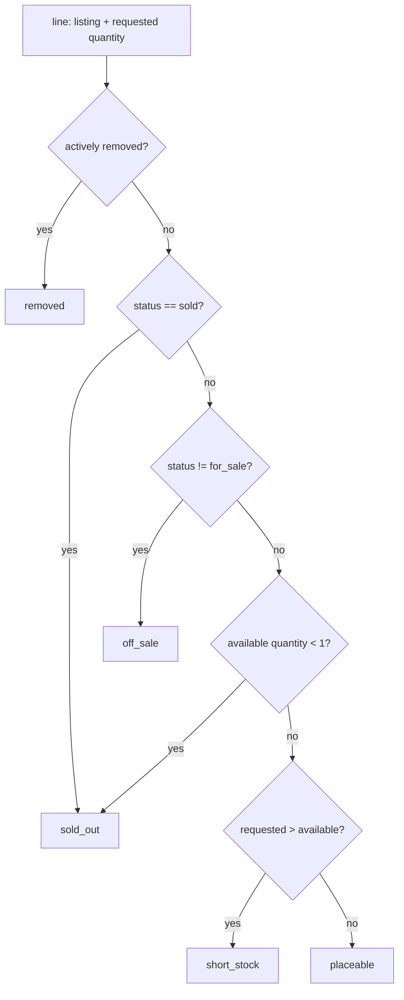
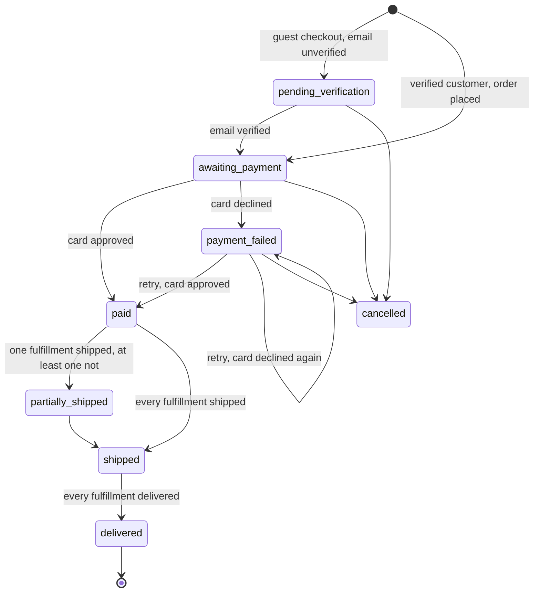
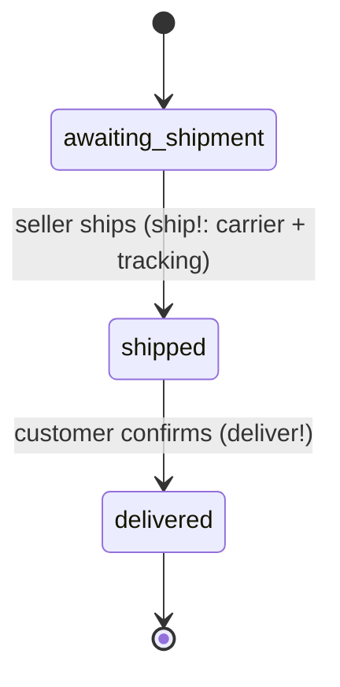

# Orders

Checkout, payment, and fulfillment. Code: `app/models/order.rb`,
`app/models/order_placement.rb`, `app/models/fulfillment.rb`,
`app/controllers/shop/checkouts_controller.rb`,
`app/controllers/shop/order_payments_controller.rb`.

## Checkout to a paid, seller-notified order

Question: from a submitted checkout form to a seller's "Item sold"
notification, what runs, and where does a guest's flow diverge from a
verified customer's?

Caveats: a declined card sets `payment_failed` and restores the stock
placement took (`Order::RELEASES_STOCK` -> `Listing#restore_stock!` -> `sold ->
for_sale` when the listing had reached zero). A retry — guest or signed-in —
posts back to the same `POST /orders/:id/pay`, which is why
`Shop::OrderPaymentsController#create` calls `mark_awaiting_payment!` before
`pay!` on every hit: the call is a no-op once the order is already
`awaiting_payment`. `pay!` writes one `payments` row per attempt, so two
declines followed by an approval leave three rows on the order. An address
checkout left incomplete never reaches an `orders` row: `Order` validates the
email and the shipping fields, `Order.place` hands an invalid order back
unsaved, and `Shop::CheckoutsController` re-renders the form with the
`INCOMPLETE` alert and the values that were submitted.

## Placement availability

Question: what stops a cart from becoming an order, and how does a customer
learn about it?

A cart sits for as long as its owner leaves it there, so what it holds is
judged fresh: `OrderPlacement.plan` folds a set of lines (cart items at
checkout, order items at a retried charge) into placeable lines and blocked
lines, each blocked line carrying one `OrderPlacement::Line`-derived reason —
`removed`, `off_sale`, `sold_out`, or `short_stock` (`OrderPlacement.reason_for`).
A removal outranks whatever the status says; a sold listing outranks a bare
quantity of zero reading as merely out of stock.

`Order.place` builds the plan as the first statement inside the transaction
that takes the stock, against the listing rows as they stand at that moment,
after `OrderPlacement.lock_listings` locks them (`Listing.lock`, in ascending
id order, so two placements locking the same listings cannot deadlock). Two
shoppers cannot both take the last piece because Rails' SQLite3 adapter opens
every top-level transaction with `BEGIN IMMEDIATE`, which serializes writers:
a second placement's transaction cannot begin until the first has committed
or rolled back, so its plan is always built against the first's outcome —
the row lock states that intent in code (and is what would carry the
guarantee on an adapter that runs transactions concurrently) but is not,
under SQLite, what stops the interleaving.

A blocked plan rolls the transaction back (`ActiveRecord::Rollback`) and
`Order.place` hands back an unsaved order carrying `blocked_lines`, named and
reasoned; `Shop::CheckoutsController#create` re-renders checkout at 422 with
every blocked line, rather than letting `Listing#take_stock!`'s `ArgumentError`
reach the customer as a 500. `Shop::CartsController#show` runs the same plan
read-only against the cart, so the cart page marks each blocked line and
disables the checkout control while any exists.

A charge can also reclaim stock: a retry from `payment_failed` to `paid`
takes the stock the earlier decline had restored. `Order#pay!` builds the same
plan from the order's own items before that retry, and a listing sold out
from under the order while it sat unpaid refuses the charge the same way —
`Shop::OrderPaymentsController#create` re-renders the pay page at 422 with the
blocked line, and no payment row is written. `removed` is implemented but
unreachable today: no admin removal exists in this prototype, so
`Listing#actively_removed?` always answers `false`. FEAT-021 backs it with a
`listing_removals` row.

Both refusals log through `Story`: `order.place` and `order.pay` write a
`refused` line at `info`, carrying `blocked_lines` (listing id, title, reason)
in `data` — never `failed` at `error`, since the world is unchanged.

## Order status

Question: what are the legal `Order` status transitions?

Source of truth: `Order::TRANSITIONS`, verified by
`test/models/order_test.rb`. `cancelled` has no route to it from the UI in this
prototype — the transition exists on the model but nothing calls it. A
guest order cannot jump straight from `pending_verification` to `paid`: the
table has no such edge, so `Order#pay!` on an unverified order raises
`TransitionError` — this is the one place the Rails design departs
from the PHP spike, where `pending_verification -> paid` was legal.
`Order#roll_up_status!` rolls a multi-seller order up from its
fulfillments: any fulfillment that has shipped or delivered counts as
"departed"; a delivered fulfillment mixed with an unshipped one still reads
`partially_shipped`, not `paid`.

## Fulfillment status (per order × seller)

Question: what are the legal `Fulfillment` status transitions?

Source of truth: `Fulfillment::TRANSITIONS`, verified by
`test/models/fulfillment_test.rb`. `Fulfillment#ship!` notifies the customer
("Order shipped") and calls `Order#roll_up_status!`; `Fulfillment#deliver!`
releases the fulfillment's held escrow (see `docs/escrow.md`) and also rolls
the order status up. Both refuse a move the table has no edge for, and `ship!`
refuses a carrier or a tracking number the seller left blank. Delivery confirmation is
the customer clicking a button on the order page — a stand-in for carrier
tracking in this prototype. A seller's own order page
(`/seller/orders/:id`) shows one fulfillment, not the whole order — see
"Vocabulary notes" in `docs/ontology.md`.
