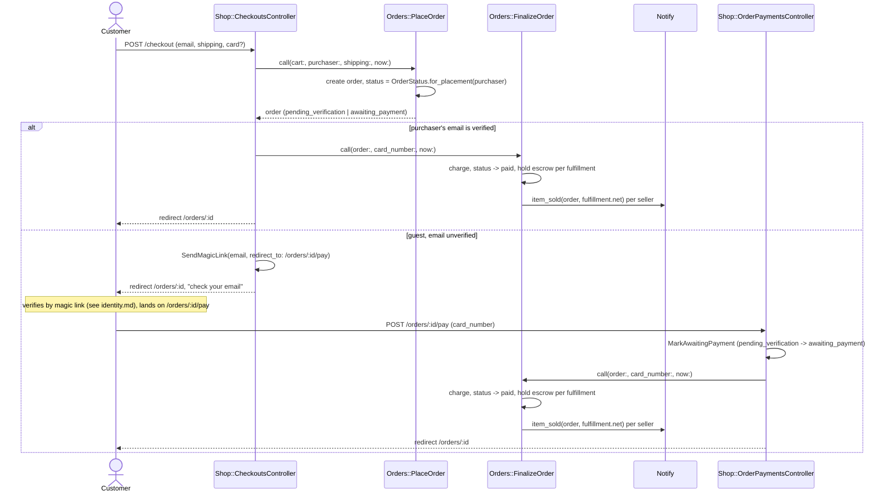
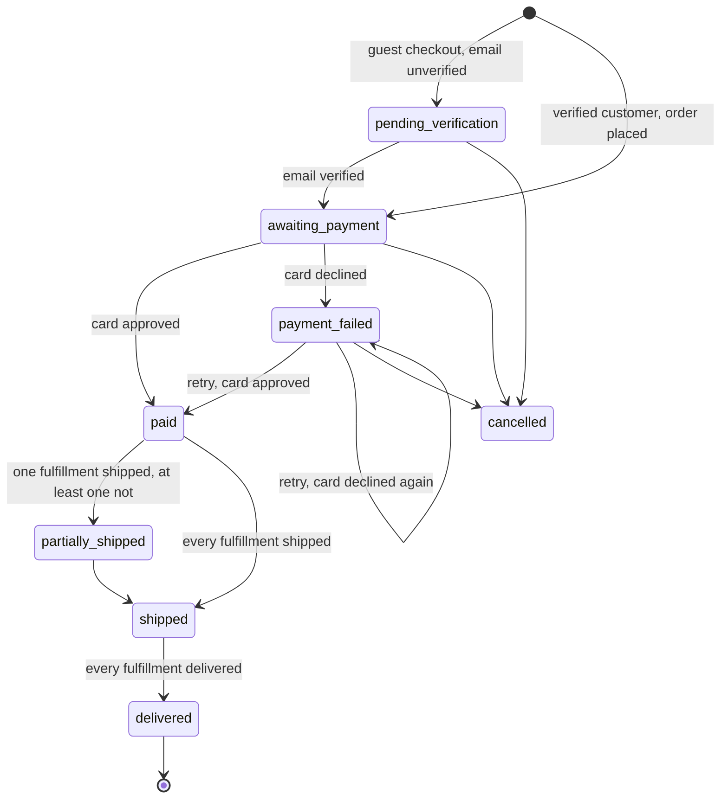
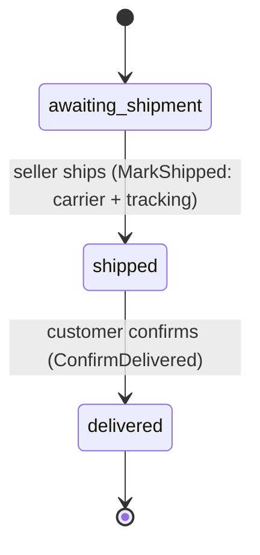

# Orders

Checkout, payment, and fulfillment. Code: `app/actions/orders/`,
`app/actions/fulfillments/`, `app/controllers/shop/checkouts_controller.rb`,
`app/controllers/shop/order_payments_controller.rb`,
`app/domain/orders/order_status.rb`, `app/domain/orders/fulfillment_status.rb`.

## Checkout to a paid, seller-notified order

Question: from a submitted checkout form to a seller's "Item sold"
notification, what runs, and where does a guest's flow diverge from a
verified customer's?

Caveats: a declined card sets `payment_failed` and restores the stock
`PlaceOrder` took (`Domain::Orders::OrderStock` -> `sold -> for_sale` when the
listing had reached zero). A retry — guest or signed-in — posts back to the
same `POST /orders/:id/pay`, which is why `Shop::OrderPaymentsController#create`
calls `MarkAwaitingPayment` before `FinalizeOrder` on every hit: the call is a
no-op once the order is already `awaiting_payment`. `FinalizeOrder` writes one
`payments` row per attempt, so two declines followed by an approval leave
three rows on the order.

## Order status

Question: what are the legal `OrderStatus` transitions?

Source of truth: `Domain::Orders::OrderStatus::TRANSITIONS`, verified by
`test/domain/orders/order_status_test.rb`. `cancelled` has no route to it from the UI in this
prototype — the transition exists in the domain but no action calls it. A
guest order cannot jump straight from `pending_verification` to `paid`: the
table has no such edge, so `FinalizeOrder` on an unverified order raises
`Domain::TransitionError` — this is the one place the Rails design departs
from the PHP spike, where `pending_verification -> paid` was legal.
`OrderStatus.from_fulfillments` rolls a multi-seller order up from its
fulfillments: any fulfillment that has shipped or delivered counts as
"departed"; a delivered fulfillment mixed with an unshipped one still reads
`partially_shipped`, not `paid`.

## Fulfillment status (per order × seller)

Question: what are the legal `FulfillmentStatus` transitions?

Source of truth: `Domain::Orders::FulfillmentStatus::TRANSITIONS`, verified by
`test/domain/orders/fulfillment_status_test.rb`. `Fulfillments::MarkShipped` notifies the
customer ("Order shipped") and calls `Orders::RollUpOrderStatus`;
`Fulfillments::ConfirmDelivered` releases the fulfillment's held escrow (see
`docs/escrow.md`) and also rolls the order status up. Delivery confirmation is
the customer clicking a button on the order page — a stand-in for carrier
tracking in this prototype. A seller's own order page
(`/seller/orders/:id`) shows one fulfillment, not the whole order — see
"Vocabulary notes" in `docs/ontology.md`.
