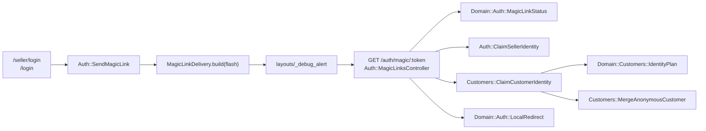

# FEAT-002: Magic-link identity for sellers and customers with anonymous merge

## Problem
Both sites need passwordless sign-in and account creation, and the storefront needs an anonymous customer identity that survives into a verified account. Nothing exists yet beyond the FEAT-001 scaffold.

## Goal
Any visitor can become a verified seller or customer by clicking a magic link, and a customer's anonymous history follows them into their account.

## Outcome
- A visitor to `/seller/login` enters an email; a magic link appears in the debug alert; clicking it creates the seller (first visit) or signs them in (returning), lands on `/seller`, and the link is single-use and expires after 15 minutes.
- A visitor to `/login` (storefront) gets the same flow for customers, landing on `/account`.
- Every storefront visitor has an anonymous `customers` row whose id is carried in a signed cookie; the row is created on first request and resolved on every request by a controller concern. `current_customer` is available to storefront controllers and views regardless of sign-in.
- When an anonymous customer verifies an email that already belongs to a verified customer, the anonymous row's favorites, cart, orders, listing events, and notifications are re-pointed to the verified customer, a `customer_merges` row is written, and a stale cookie holding the merged id resolves to the verified customer. When the email is new, the anonymous row is claimed in place.
- `MagicLinkDelivery` port with `FlashMagicLinkDelivery` (prototype) and `MailMagicLinkDelivery` (raises `NotImplementedError("Email delivery is not implemented yet")`); selected by `Rails.configuration.x.magic_links.delivery` from `MAGIC_LINK_DELIVERY` (default `flash`).
- Sign-out links on both sites.
- The merge decision and link-usability check are pure functions in `app/domain/auth` / `app/domain/customers` with sidecar unit tests; the whole flow has integration tests covering first visit, returning visit, expired link, consumed link, claim, merge, stale cookie, and sign-out.

## Why it matters
Magic links are the only way into either side. Guest checkout (FEAT-005) depends on "verify, then continue to the order" through the link's `redirect_to`.

## Discovery notes
Read `docs/architecture.md` → Identity. The PHP spike's `app/Domain/Auth`, `app/Domain/Customers`, `app/Actions/Auth`, `app/Actions/Customers` and `docs/identity.md` in `prototype/php/` are a worked reference of the same design.
- Migrations (prefix your migration filenames so they sort before FEAT-003's, e.g. timestamps `20260822000101`…): `sellers` (email unique, name, shop_name, email_verified_at), `customers` (email nullable unique, name, email_verified_at), `customer_merges`, `magic_links` (token_digest, email, actor_type, redirect_to, expires_at, consumed_at). FEAT-003 creates commerce tables in parallel with timestamps `20260822000201`…; do not create those.
- Token: `SecureRandom.hex(32)`; store `Digest::SHA256.hexdigest`; URL `/auth/magic/:token`.
- Concerns: `SellerAuthentication` (`current_seller`, `require_seller!`), `CustomerIdentity` (`current_customer`, resolves cookie → customer following `customer_merges`, creates anonymous row and sets `cookies.signed[:customer_id]`), `CustomerAuthentication` (`require_customer!` = verified customer signed in).
- Merge re-pointing is a table-driven list of `[model, column]` pairs guarded by `table_exists?` so this ticket's tests pass before FEAT-003's tables exist.
- Redirect after verification: `redirect_to` when present and local (`url_from` / `Rails.application.routes.recognize_path`), else `/seller` or `/account`. Add a minimal `/account` page (email + sign-out) under `shop`; FEAT-005 extends it.
- Route names: `seller_login`, `seller_send_magic_link`, `seller_logout`, `customer_login`, `customer_send_magic_link`, `customer_logout`, `verify_magic_link`, `shop_account`.

## Working

### Shape

### Decisions

- **`Seller::` controllers use the compact class form.** `app/models/seller.rb`
  defines `Seller` as a class, so the portal namespace nests inside it and
  `module Seller` raises `TypeError: Seller is not a module`. Every file under
  `app/controllers/seller/` declares `class Seller::XController`.
  FEAT-001's dashboard controller and its test were converted for this.
  `Shop::`, `Auth::` and `Customers::` have no matching model and stay
  `module`.
- **Constants inside a `Data.define do … end` block land in the enclosing
  lexical scope, not on the class.** `Domain::Auth::ActorType` and
  `Domain::Customers::IdentityPlan` subclass instead:
  `class ActorType < Data.define(:name, …)`.
- **Session is the sign-in; the cookie is only the identity.**
  `customer_signed_in?` reads `session[:customer_id]` and requires a verified
  row; `current_customer` falls back to the signed cookie and then to a fresh
  anonymous row. A cookie alone never reaches `/account`.
- **`Auth::SendMagicLink` receives `link_url:`**, a callable over the token.
  The host belongs to the request, so the controller supplies it and the action
  stays free of URL guessing.
- **`Customers::MergeAnonymousCustomer` takes `owned_tables:`**, defaulting to
  `Domain::Customers::OwnedTables::ALL`. The sidecar injects a probe table it
  creates and drops itself, so the re-pointing is proven without touching the
  commerce schema.
- **`Seller::BaseController` gets `SellerAuthentication` but no
  `require_seller!`.** Adding the filter would fail FEAT-001's dashboard test;
  FEAT-004 owns portal authorization and the filter is ready for it.
- **`layouts/_flash.html.erb`** renders `flash[:notice]` / `flash[:alert]` in
  both layouts, beside the debug alert.

### Parallel work

- `db/schema.rb` was committed with this ticket's four tables only; FEAT-003's
  migrations landed in the working tree afterwards and their tables come with
  their commit.
- `MAGIC_LINK_DELIVERY` and `MAGIC_LINK_EXPIRY_MINUTES` are read in
  `config/initializers/magic_links.rb`.
- A running `make up` server does not pick up a new `app/<dir>` (autoload paths
  are computed at boot). `docker compose restart app` after `app/actions`,
  `app/delivery` and `app/domain/auth` appeared.

### Verified

- `make test`: 347 runs, 0 failures (147 of them this ticket's, 253
  assertions). Line coverage 92.47%, Domain 99.74%, Controllers 98.57%.
- `bin/rails zeitwerk:check`: all is good.
- Core sidecars under `app/domain/auth` and `app/domain/customers` all pass
  under `ruby -Iapp <file>` with no Rails boot.
- Against the running server: seller submits an address at `/seller/login`,
  clicks the link from the debug alert, lands on `/seller` with the address and
  a sign-out form in the header. Customer does the same at `/login` and lands
  on `/account`. The storefront sets an HttpOnly signed `customer_id` cookie on
  the first request.
