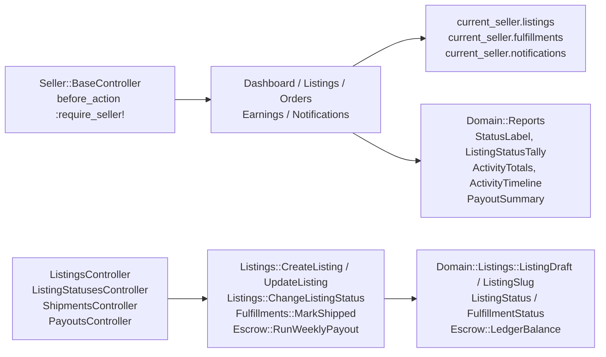

# FEAT-004: Seller portal for listings, activity, fulfillment, and earnings

## Problem
Sellers have a login (FEAT-002) and a domain (FEAT-003) but no screens.

## Goal
An artist can go from a fresh account to a listed, sold, shipped, and paid-out item using only the portal.

## Outcome
- `/seller` dashboard: listing counts by status, fulfillments awaiting shipment, held and available balance, unread notifications, five most recent notifications.
- `/seller/listings`: table with thumbnail, status, price, quantity, views, favorites, cart adds; actions to create, edit, and change status (only transitions `ListingStatus` allows render; a disallowed one is a validation error). Create/edit form: title, description, medium, dimensions, price in dollars (stored as cents via `Domain::Money.from_dollars`), quantity, image upload (Active Storage, content-verified). Inline validation errors.
- `/seller/listings/:id`: activity totals and a 14-day daily breakdown of views, favorites, cart adds; sales of this listing.
- `/seller/orders`: this seller's fulfillments grouped by status; `/seller/orders/:id` shows shipping address, items, mark-shipped form (carrier, tracking) or the shipped/delivered timestamps.
- `/seller/earnings`: per-fulfillment rows (date, order, items, subtotal, fee, net, status), balances (held, available, paid out), payouts table, and a debug "Run weekly payout now" button.
- `/seller/notifications` with mark-as-read.
- Seller layout, semantic HTML, stock Tailwind, no JavaScript, plain POST forms with CSRF.
- Integration tests beside each controller: unauthenticated redirect, happy path per page, create/edit/status validation, mark-shipped, payout run, and cross-seller isolation (404).

## Why it matters
This is the artist's whole back office; half of the end-to-end test.

## Discovery notes
Read `docs/architecture.md`. Controllers under `app/controllers/seller/`, views `app/views/seller/`, routes inside `namespace :seller`. Scope every query through `current_seller.listings` / `current_seller.fulfillments` so authorization is the query. Reporting math (balances, daily breakdown, status tallies) lives in `app/domain/reports/` as pure functions with sidecar tests. The PHP spike's `app/Http/Controllers/Seller/**` and `app/Domain/Reports/**` are a worked reference.

## Working

### Shape

### Routes

| Name                       | Verb and path                                      | Controller                                   |
| -------------------------- | -------------------------------------------------- | -------------------------------------------- |
| `seller_root`              | GET `/seller`                                      | `Seller::DashboardController#show`           |
| `seller_listings`          | GET `/seller/listings`                             | `Seller::ListingsController#index`           |
| `new_seller_listing`       | GET `/seller/listings/new`                         | `#new`                                       |
| `seller_listing`           | GET `/seller/listings/:id`, PATCH                  | `#show`, `#update`                           |
| `edit_seller_listing`      | GET `/seller/listings/:id/edit`                    | `#edit`                                      |
| `seller_listing_status`    | POST `/seller/listings/:listing_id/status`         | `Seller::ListingStatusesController#create`   |
| `seller_orders`            | GET `/seller/orders`                               | `Seller::OrdersController#index`             |
| `seller_order`             | GET `/seller/orders/:id`                           | `#show`                                      |
| `seller_order_shipment`    | POST `/seller/orders/:order_id/shipment`           | `Seller::ShipmentsController#create`         |
| `seller_earnings`          | GET `/seller/earnings`                             | `Seller::EarningsController#show`            |
| `seller_earnings_payout`   | POST `/seller/earnings/payout`                     | `Seller::PayoutsController#create`           |
| `seller_notifications`     | GET `/seller/notifications`                        | `Seller::NotificationsController#index`      |
| `seller_notification_read` | POST `/seller/notifications/:notification_id/read` | `Seller::NotificationReadsController#create` |

A seller's order **is a fulfillment** — `/seller/orders/:id` takes a
`fulfillments.id`, since that is the slice of a customer's order they own.

### Decisions

- **Authorization is the query.** Every read and write starts at
  `current_seller.listings` / `.fulfillments` / `.notifications`, so another
  seller's row is a `RecordNotFound` — 404, never a redirect. Each controller
  test asserts it on both a read and a write.
- **`ListingDraft` owns what a valid draft is,** including
  `ListingDraft.errors_for(fields)` over the submitted strings, so the rule
  sits in the core with the type it validates and the controller only branches
  on `errors.any?`. Validation deliberately did **not** go on the `Listing`
  model: `app/models/listing.rb` belongs to another ticket in this tree, and
  model-level validation would also reach the seeds and the storefront.
- **The image is checked by content type before Active Storage takes it.**
  `image_content_type` is one more submitted field, which keeps the check pure
  and the upload out of the domain. There is no libvips in the image, so the
  original is served and no variant is asked for.
- **Two refusals answer 422 with the domain's own sentence.** A status change
  the lifecycle forbids and a shipment on an order that already shipped both
  come back from `Domain::TransitionError`; the controller rescues it and
  renders a refusal page carrying `error.message`. Nothing in the portal
  restates the transition table — the buttons render
  `ListingStatus::TRANSITIONS`, and the mark-shipped form renders only while
  `FulfillmentStatus.can_transition?(status, shipped)`.
- **`Seller#escrow_balance`** folds the seller's ledger through
  `LedgerBalance`; the dashboard and the earnings page both read it.
- **`Domain::Reports` holds one value per report shape** — `ActivityTotals`
  (three counts and their sum), `DailyActivity` (a date plus totals),
  `ActivityTimeline` (a gapless run of days), `ListingStatusTally`,
  `ListingStatusCount`, `PayoutSummary`, `StatusLabel`. All pure, all with
  sidecars that run under `ruby -Iapp`.
- **`test/seller_portal_test_case.rb`** is the portal's own integration base:
  it signs in through the real magic-link flow and builds order state through
  the FEAT-003 actions. `CommerceTestCase` was left alone — it is an
  `ActiveSupport::TestCase`, and two other tickets were editing shared test
  files in this tree at the same time.
- **A `data-` hook per assertion target** (`data-stat`, `data-listing`,
  `data-activity`, `data-fulfillment`, `data-cell`, `data-field-error`,
  `data-refusal`), so the tests read state rather than Tailwind classes.

### Parallel work

- `config/routes.rb` is shared. The commit that adds the `namespace :seller`
  routes carries FEAT-005's `namespace :shop` block as well: the two blocks
  were in the working tree together and a partial commit of one file was not
  worth the surgery.
- `app/controllers/auth/seller_sessions_controller_test.rb` asked for the
  seller header from `/seller` while signed out. `require_seller!` now
  redirects that, so the test reads the header from `/seller/login`, which is
  the page a signed-out seller lands on.
- `make fresh` was run to re-seed the development database for the manual
  walk-through below.

### Verified

- `make test`: 639 runs, 1489 assertions, 0 failures. FEAT-004's own files are
  128 runs and 432 assertions — 47 core, 15 action, 66 controller.
- `make coverage` (`COVERAGE_MIN=80`): 99.64% overall, Domain 99.84%,
  Controllers 100%, Actions 100%, Models 100%.
- Core sidecars run with no Rails boot, e.g.
  `docker compose run --rm app ruby -Iapp app/domain/reports/activity_timeline_test.rb`.
- `bin/rails zeitwerk:check`: all is good.
- Against the running server, signed in as the seeded `maya@example.com`:
  `/seller` redirects to `/seller/login` while signed out; the dashboard reads
  6 for sale, 1 sold, 1 awaiting shipment, $76.50 held, 2 unread; the listings
  table renders 7 rows and offers only the allowed transitions; the activity
  page walks 14 days ending today; the orders index groups awaiting shipment,
  shipped, and delivered, and the order page carries the address, the net, and
  the mark-shipped form; earnings shows $76.50 held and $1,665.00 paid out.
