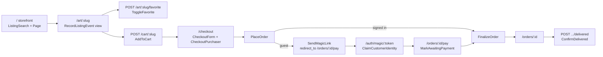

# FEAT-005: Customer storefront with cart, checkout, and guest verification

## Problem
Customers have an identity (FEAT-002) and the order lifecycle exists (FEAT-003), but there is no storefront.

## Goal
A first-time visitor can browse, favorite, add to cart, check out as a guest, verify their email, pay with a fake card, and watch the order ship and deliver.

## Outcome
- `/`: grid of `for_sale` listings (image, title, shop name, price), search (title/description/medium), medium filter, pagination (12). Listing page GET records a `view` event.
- `/art/:slug`: large image, details, price, quantity, Favorite/Unfavorite, Add to cart; sold listings show "Sold" and no cart button.
- `/favorites`, `/cart` (items, remove, subtotal, Checkout).
- `/checkout`: email (read-only when signed in) + shipping; for a verified signed-in customer the card fields are on the same form and the order is placed and finalized in one request. For an unverified email the order is created `pending_verification`, the page says a verification link was sent, and the debug alert shows the magic link whose `redirect_to` is `/orders/:id/pay`. Verification claims/merges the anonymous customer and lands on the pay page; the card is entered there and never stored.
- Declined cards (`4000 0000 0000 0002`, `…9995`, anything else) show the decline reason with a retry form; `4242 4242 4242 4242` succeeds.
- `/orders`, `/orders/:id`: status, items grouped by seller with fulfillment status, carrier/tracking, "Confirm delivery" per shipped fulfillment. `/orders/:id/pay` is owner-checked through `current_customer` (404 for strangers).
- `/account`: email, sign-in/out, notifications with mark-as-read.
- Cart, favorites, and orders survive verification/merge (tested).
- Shop layout: white, airy, large imagery, brand small; semantic HTML; no JavaScript. Integration tests beside each controller cover browse/search, view event, favorite toggle, cart add/remove, guest checkout through verification to paid, signed-in checkout, declined then retried card, confirm delivery, notifications.

## Why it matters
The customer half of the end-to-end test and the only place the payment mock and guest verification are exercised.

## Discovery notes
Read `docs/architecture.md`. Controllers under `app/controllers/shop/`, views `app/views/shop/`, routes inside `namespace :shop, path: ""`. Any domain `if` ("can this customer pay this order", "is this listing purchasable") is a pure function in `app/domain/` with a unit test. The PHP spike's `app/Http/Controllers/Shop/**` and `app/Domain/Shop/**` are a worked reference of the same flow and its checkout decision.

## Working

### Shape

### The checkout decision

**Verify before card.** A guest submits email and shipping only; `PlaceOrder`
opens the order `pending_verification`, `Auth::SendMagicLink` carries
`redirect_to = /orders/:id/pay`, and the debug alert prints the link. The card
is entered on the pay page after verification and is never persisted —
`FinalizeOrder` stores the last four and nothing else. A signed-in customer
gets the card fields on `/checkout` and the order is placed and finalized in
one request. This is the PHP spike's decision; the reason it holds here is
that an unverified order has nowhere to hold a card until the address behind
it is proved.

**`MarkAwaitingPayment` runs on the pay page, not on verification.** The Rails
status table is `pending_verification -> awaiting_payment -> paid`, so a guest
order cannot reach `paid` directly. `Auth::MagicLinksController` belongs to
FEAT-002 and knows nothing about orders, so `Shop::OrderPaymentsController`
calls the action itself, on both `show` and `create`, once it has established
that the visitor is signed in and owns the order.
`OrderStatus.after_verification` is a no-op for every other status, so the
call needs no guard of its own and a second visit changes nothing.

**Signed in, not merely verified.** `Domain::Orders::OrderPayment.payable?`
takes `customer_signed_in?`, not `email_verified_at`. A returning customer
arrives with the identity cookie but no session; they own the order, so they
are sent to `customer_login` with `redirect_to` rather than shown a card form
or a 404. A stranger's cookie does not own the order and gets 404.

### Decisions

- **`Domain::Shop::Page` is the pagination.** `of(requested:, size:,
  total_count:)` clamps anything a query string can carry onto a real page and
  hands the query an `offset` and a `limit`. No gem, and the page math is a
  core sidecar that runs with no Rails boot.
- **`Domain::Shop::CheckoutForm` holds the submitted checkout.** Without a
  model there is nowhere for validations to live, so completeness is a pure
  predicate over the trimmed email and the six required shipping parts. The
  inputs carry `required`, so the server check is the backstop that keeps a
  hand-rolled post from hitting a NOT NULL constraint.
- **A blank card number is a decline, not a validation error.**
  `FakeCard.decide("")` answers "invalid card number", which lands the visitor
  on the same retry form as any other declined card. One path instead of two.
- **`Domain::Shop::FavoriteChange` decides what one button does.** Which of
  favorite/unfavorite a toggle performs, and which listing event it records,
  follows from whether the visitor already saved the listing.
- **`ShopHelper` owns the header counts.** `/login` renders the shop layout
  from `Auth::CustomerSessionsController`, which is not a
  `Shop::BaseController`, so `current_cart`, `cart_item_count`, and
  `unread_notification_count` are view helpers. Controllers that need the cart
  keep their own `current_cart` memoized in the same ivar, so an action and
  the layout resolve it once between them.
- **`Domain::Shop::ShopName.of`** falls back to the local part of the seller's
  address, since `sellers.shop_name` is nullable and the storefront names the
  artist on every card.
- **`ListingAvailability::ON_STOREFRONT`** is the constant the controllers
  scope their queries with, so "for_sale or sold has a page" is stated once.
- **404, not 403, for another customer's order.** Saying "not found" tells a
  stranger nothing about whether the order exists.

### Deviations from the ticket

- **`Orders::MarkAwaitingPayment` is FEAT-003's addition and this ticket's
  caller**, which is the one place the flow departs from the PHP spike, where
  `pending_verification -> paid` was legal.
- **The listing page shows a quantity field only when more than one is in
  stock.** Most art is a single piece; `Carts::AddToCart` clamps to the stock
  either way.
- **`app/domain/shop/favorite_change.rb`, not `app/domain/favorites/`.**
  Favoriting exists only on the storefront, and the ticket's file ownership
  puts `app/domain/shop/**` on this ticket.

### Parallel work

- `config/routes.rb`: everything added sits inside `namespace :shop, path: ""`.
  The standalone `get "account"` line was folded into that block, keeping the
  `shop_account_path` helper name FEAT-002 already uses. `root
  "shop/storefront#show"` stays outside so `root_path` keeps working for the
  auth controllers.
- `test/shop_test_case.rb` is new: `ShopIntegrationTest < IdentityIntegrationTest`
  plus storefront record helpers. `CommerceTestCase` is a class, not a module,
  so its helpers could not be included; the overlap is a handful of factory
  methods.
- `app/helpers/shop_helper.rb` is new. Rails includes every helper in every
  view, so the seller layout can see it and does not use it.

### Verified

- `make test`: 597 runs, 1297 assertions, 0 failures. 99.63% line coverage,
  Controllers 100%, Actions 100%, Domain 99.83%.
- This ticket's files: 134 runs, 391 assertions — 50 core, 7 action, 77
  integration.
- Core sidecars run with no Rails boot, e.g.
  `docker compose run --rm app ruby -Iapp app/domain/shop/page_test.rb`.
- `bin/rails zeitwerk:check`: all is good. `make assets` rebuilt the
  stylesheet.
- Against the running server: browse, search, medium filter, and the listing
  page render; a guest fills a cart, checks out, reads the magic link from the
  debug alert, verifies onto `/orders/:id/pay`, is declined with
  `4000 0000 0000 0002`, retries with `4242 4242 4242 4242`, and lands on a
  paid order. `/account` then shows the address the guest typed.
