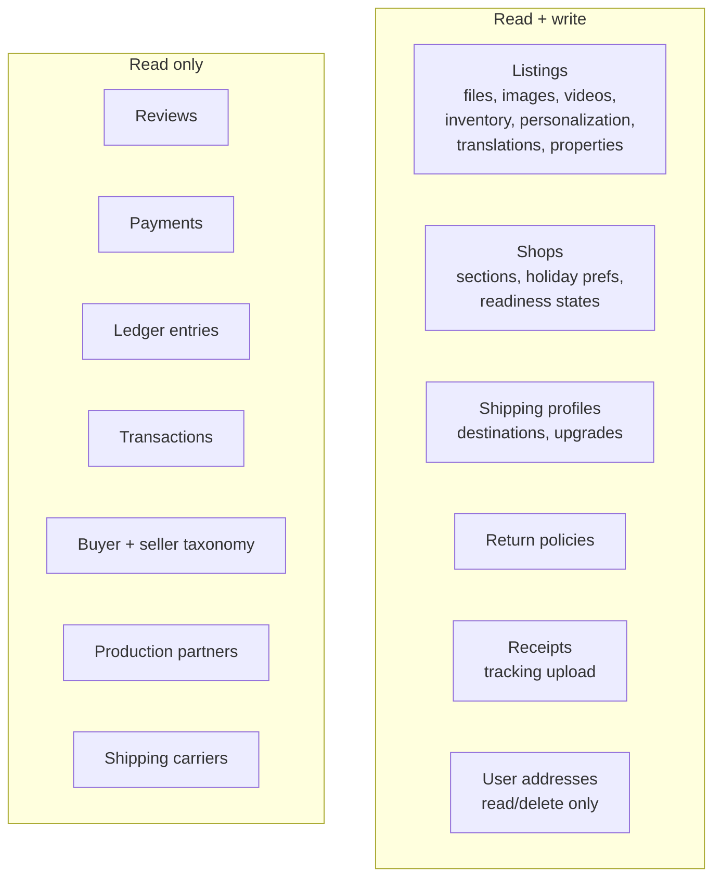

# Etsy.com — Technical Surface

Research date: 2026-08-13. Method: Track B (no authenticated access). Evidence tiers: **confirmed** = vendor document or machine-readable primary source read directly; **probable** = two independent secondary sources; **reported** = single source. Each claim cites a footnote. The strongest material here is the API section, which is built from a direct fetch of Etsy's live OpenAPI spec; the weakest is the architecture section, where Etsy's bot protection blocked direct reads of most engineering-blog posts and publication dates could not always be verified.

## Known blind spots

- **Admin and settings screens**: everything behind Shop Manager and account login is reconstructed from documentation, never observed. No screenshots of authenticated surfaces exist in this research.
- **Default API rate-limit numbers**: the mechanism is confirmed but the default per-key quota is not primary-sourced.
- **Integration partners not individually verified**: QuickBooks, ShipStation, Vela, Alura, Marmalead, Outfy (search budget exhausted before verification; only Printify, Printful, eRank, Make.com got direct evidence).
- **Page-source probes**: PWA manifest, analytics/tag inventory, and JS-bundle analysis were fully blocked by bot protection — unresolved, not absent.
- **Engineering-blog post dates**: several architecture claims carry approximate dates only.
- **Anything shipped in the last few months** that Etsy did not announce publicly.

---

## Domain: Public API (Open API v3)

The live OpenAPI 3.0 spec at `https://www.etsy.com/openapi/generated/oas/3.0.0.json` was fetched directly on 2026-08-13 and enumerates **76 paths / 105 operations**; its copyright line reads "© 2021-2026 Etsy, Inc.", so the spec is maintained through 2026.[^spec] The endpoint list is Etsy's own vocabulary for its seller-facing feature set.

### Resource surface

- **What it does**: full CRUD on listings (including per-listing files, images, videos, variation images, inventory/products/offerings, personalization, per-language translations, properties), shops (sections, holiday preferences, readiness-state definitions), shipping profiles (destinations, upgrades), and return policies (including a consolidate operation). Read-plus-update on receipts (order records) with a tracking-submission endpoint. Read-only on reviews, payments, payment-account ledger entries, transactions, production partners, shipping carriers, and the buyer/seller taxonomy trees.[^spec]
- **Where it lives**: `openapi.etsy.com/v3`, documented at developers.etsy.com.
- **Gating**: API key + OAuth per scopes below.
- **Confidence**: confirmed. **Last evidenced**: 2026-08-13.
- Notable absences, confirmed by absence in the spec: no public search endpoint over the general catalog (only `GET /listings/active` enumeration and per-shop listings), no favorites endpoints, no review-write, no Treasury resources (the discontinued curation feature has no scope).[^spec]

### Authentication

- **What it does**: every request carries an `x-api-key` header; user-scoped operations use OAuth 2.0 authorization-code flow with mandatory PKCE. Authorization at `etsy.com/oauth/connect`, token exchange at `openapi.etsy.com/v3/public/oauth/token`. Access tokens live 1 hour; refresh tokens live 90 days.[^auth]
- **Gating**: developer account with an app registered at etsy.com/developers/your-apps. Since July 2026 Etsy documents a tiered access model: **seller apps** (a seller's own shop data only — listings, orders, receipts, inventory, shop details; eligible sellers "usually approved within a few minutes"), **personal apps**, and a **commercial access** application for developers building tools for other sellers.[^sellerapp]
- **Confidence**: confirmed. **Last evidenced**: 2026-08-13.
- **Scopes** (all 12, verbatim from the spec): `address_r`, `address_w`, `email_r`, `listings_d`, `listings_r`, `listings_w`, `profile_r`, `profile_w`, `shops_r`, `shops_w`, `transactions_r`, `transactions_w`. There are no `receipts_*`, `reviews_*`, `payments_*`, or `ledger_*` scopes — those resources ride on shop/transaction scopes and stay read-only.[^spec]

### Rate limiting

- **What it does**: two per-key metrics — queries per second and queries per day — enforced on a sliding 24-hour window. Breaches return HTTP 429 with a `retry-after` header. Responses expose `x-limit-per-second`, `x-remaining-this-second`, `x-limit-per-day`, `x-remaining-today`. Higher quotas by request to developer@etsy.com.[^rate]
- **Confidence**: confirmed for the mechanism; the default quota numbers (commonly cited as 10 QPS / 10,000 QPD) are **not** primary-sourced. **Last evidenced**: 2026-08-13.

### v2 retirement

- **What it does**: API v2 was deprecated 2023-04-03; new apps are v3-only. Etsy's migration notes state 40+ v2 resources were retired without v3 replacements (e.g., `Payment` as a writable resource, `User` as a general resource, public favorites and feedback endpoints).[^v2]
- **Confidence**: reported (secondary sources; the canonical retired-resources page 404'd). The favorites/Treasury absences are independently confirmed by the live spec.[^spec]

---

## Domain: Integration ecosystem

### No first-party app marketplace

- **What it does**: Etsy has no public app-discovery storefront analogous to Shopify's App Store. Third-party tools are discovered through Zapier/Make catalogs and vendor marketing; developers self-serve at the Your Apps portal. The help center documents third-party apps under "How to Use Apps to Manage Your Shop."[^apps-article]
- **Confidence**: probable (consistent absence across searches; not a vendor statement). **Last evidenced**: 2026-08-13.

### Make.com connector

- **What it does**: 28 modules — 2 triggers, 19 actions, 7 searches (Create a Listing, Delete a Listing, Create/Update a Personalization, Get My Shop, Get a Ledger Entry, and so on). The module names map one-to-one onto the v3 endpoints, so Make is a thin wrapper over the official API.[^make]
- **Confidence**: confirmed (vendor page fetched 2026-08-13; module list partially truncated by pagination).

### Zapier connector

- **What it does**: triggers for new listing, new transaction, new shop receipt; a create-listing action. Polling-based at 5–15 minute cadence depending on plan tier.[^zapier]
- **Confidence**: reported (catalog page could not be fetched verbatim).

### n8n

- **What it does**: no native Etsy node exists; a community feature request is open. Etsy's mandatory PKCE was cited as a blocker for n8n's generic OAuth2 credential type; users fall back to raw HTTP Request nodes.[^n8n]
- **Confidence**: reported. **Last evidenced**: 2026-08-13.

### Print-on-demand sync (Printify, Printful)

- **What it does**: POD services sync products and route orders automatically via OAuth-connected v3 apps. Printify announced a February 2026 rollout on "the latest Etsy API" cutting order-import latency from up to 3 hours to under 1 minute, with orders pushed on "Paid" status — implying a push/webhook-style order notification that does **not** appear in the public OpenAPI spec (either a private partner capability or fast polling marketed as instant).[^printify] Printful documents that Etsy matches variants by Etsy's own listing/variant IDs rather than seller SKUs, and those IDs can change, which breaks syncs — an idiosyncrasy of the v3 inventory model.[^printful]
- **Confidence**: reported (both from vendor marketing/docs via search). **Last evidenced**: Feb 2026 (Printify announcement).

### Analytics/SEO tooling (eRank)

- **What it does**: shop-connect analytics (keyword research, competitor analysis, trend tracking, shop health scoring, listing optimization) claiming 2.5M+ Etsy sellers, plus a Chrome extension that reads Etsy's live search pages — so part of its data comes from scraping, not the API.[^erank]
- **Confidence**: confirmed for the product's existence and claims (vendor page fetched 2026-08-13); the scraping inference is probable.

---

## Domain: Platform architecture

Dates matter here; several posts resisted direct fetch, so treat undated claims as directional.

### Cloud and delivery infrastructure

- **What it does**: Etsy completed migration from on-prem datacenters to Google Cloud Platform in 2020.[^gcp] The storefront edge is Fastly (Varnish) — confirmed by response headers (`via: 1.1 varnish`, `x-served-by: cache-*`, `x-fastly-backend-reqs`) observed directly on 2026-08-13.[^probes] Bot management is DataDome: every logged-out fetch of `www.etsy.com` returned HTTP 403 with `server: DataDome` and `x-datadome-riskscore: 0.94`, with the captcha served from `ct.captcha-delivery.com`.[^probes]
- **Confidence**: GCP migration reported (widely corroborated); Fastly/DataDome confirmed by direct header inspection. **Last evidenced**: 2026-08-13.

### Search and recommendations

- **What it does**: two-pass search — candidate retrieval (roughly top-1000 by tags/titles/attributes) then ranking.[^cac-search] As of mid-2023 (the firmest dated data point), production retrieval used a unified embedding model combining graph, transformer, and term-based embeddings; Etsy's own paper reports +2.63% conversion and +5.58% search-purchase rate from it.[^arxiv] Personalized recommendations run on a multi-task canonical ranker; homepage modules are ML-ranked using purchase, click, taxonomy, and time-of-day features.[^cac-recs]
- **Confidence**: confirmed for the arXiv paper (June 2023); the Code as Craft posts are confirmed to exist but mostly undated in this pass.

### ML platform and deployment

- **What it does**: ongoing ML-platform investment — "Redesigning Etsy's Machine Learning Platform" (~Oct 2025) and "Building a Platform for Serving Recommendations at Etsy" (~Jan 2026) describe shared ML building blocks consumed by product teams; gradient-boosted trees remain in production alongside deep learning.[^cac-ml] The core application is a 10+ year-old codebase (the PHP monolith era) per the title of Etsy's own deployment-experience post; a custom "Canary Lite" canary-rollout system is reported for search infrastructure.[^cac-deploy]
- **Confidence**: reported (dates search-derived, fetches 403'd). **Last evidenced**: post titles observed 2026-08-13.

### Web routing facts (from robots.txt, fetched raw 2026-08-13)

- **What it does**: `www.etsy.com/robots.txt` publishes no `Sitemap:` directive, and `/sitemap*.xml` variants 404 — Etsy does not expose a crawler sitemap.[^probes] Disallow rules map the URL structure: `/c/*` category browse; `/listing/*/favoriters`; `/shop/*/sold`; `/people/*/circle*` and `/people/*/favorites*` (the "circle" follow-graph route still exists even though the API has no social endpoints); blocked search-filter params enumerate live search facets (`color=`, `price_bucket=`, `ship_to=`, `attr_*=`, `min=`/`max=`, `customizable=`, `gift_card=`, `handmade`); legacy routes `/treasury`, `/teams`, `/r/group/` persist; locale routing is path-prefix based across ~30 regional prefixes (`/uk/`, `/de-en/`, `/jp/`, …).[^probes]
- **Confidence**: confirmed (direct fetch). **Last evidenced**: 2026-08-13.

---

## Domain: Mobile apps

### Buyer app

- **What it does**: the buyer app is listed as "Etsy: Custom & Creative Goods" on the iOS App Store and "Etsy: Shop from Real People" on Google Play — two marketing names, one app.[^apps]
- **Confidence**: Play listing confirmed (fetched 2026-08-13); iOS name search-derived. Buyer-app feature detail is covered in `features-buyers.md`.

### Seller app

- **What it does**: "Etsy Seller: Manage Your Shop" (iOS v2.4.1 at capture, iOS 15.0+ minimum, ~58k ratings).[^apps] Fall 2025 feature themes from Etsy's own What's-New post: shipping-label barcode scanner that opens the matching order, in-app listing photo/video capture and editing, repeat-buyer tags in Messages, an updated fulfillment view, and an AI "Writing Assistant" for listing copy on desktop and app.[^fall2025]
- **Confidence**: App Store listing confirmed; Fall-2025 feature list reported (Seller Handbook post via search). **Last evidenced**: 2026-08-13.

---

[^spec]: Etsy Open API v3 OpenAPI 3.0 spec, fetched directly 2026-08-13. https://www.etsy.com/openapi/generated/oas/3.0.0.json
[^auth]: Etsy Open API essentials — Authentication, fetched 2026-08-13. https://developers.etsy.com/documentation/essentials/authentication
[^rate]: Etsy Open API essentials — Rate Limits, fetched 2026-08-13. https://developers.etsy.com/documentation/essentials/rate-limits
[^v2]: v2 deprecation (2023-04-03) and retired-resource notes via secondary sources (cedcommerce.com, knowband.com summaries of Etsy migration docs); canonical Etsy page unreachable this pass.
[^apps-article]: Etsy Help — How to Use Apps to Manage Your Shop. https://help.etsy.com/hc/en-us/articles/360001931728
[^make]: Make.com Etsy integration page, fetched 2026-08-13. https://www.make.com/en/integrations/etsy
[^zapier]: Zapier Etsy integration, via search synthesis (catalog page not fetched verbatim). https://zapier.com/apps/etsy/integrations
[^n8n]: n8n community feature request for an Etsy node. https://community.n8n.io/t/etsy-node-for-n8n-integration/206203
[^printify]: Printify Etsy integration and Feb 2026 API-rollout announcement, via search synthesis. https://printify.com/etsy/
[^printful]: Printful Etsy integration docs on variant-ID matching. https://www.printful.com/integrations/etsy
[^erank]: eRank vendor site, fetched 2026-08-13. https://erank.com
[^gcp]: Etsy GCP migration completed 2020 — widely corroborated Code as Craft milestone; fresh primary post not fetched this pass.
[^cac-search]: Etsy Code as Craft — "Bringing Personalized Search to Etsy" (direct fetch blocked; content via search). https://www.etsy.com/codeascraft/bringing-personalized-search-to-etsy
[^arxiv]: "Unified Embedding Based Personalized Retrieval in Etsy Search," arXiv:2306.04833, June 2023. https://arxiv.org/abs/2306.04833
[^cac-recs]: Etsy Code as Craft — "Personalized Recommendations at Etsy" and "How We Built a Multi-Task Canonical Ranker for Recommendations at Etsy". https://www.etsy.com/codeascraft/personalized-recommendations-at-etsy/
[^cac-ml]: Etsy Code as Craft — "Redesigning Etsy's Machine Learning Platform" (~Oct 2025), "Building a Platform for Serving Recommendations at Etsy" (~Jan 2026); dates search-derived, fetches 403'd.
[^cac-deploy]: Etsy Code as Craft — "Improving the Deployment Experience of a Ten-Year-Old Application"; "Canary Lite" reference via search synthesis, undated.
[^probes]: Direct curl probes of www.etsy.com and www.etsy.com/robots.txt, 2026-08-13: DataDome 403s with `x-datadome` headers, Fastly/Varnish cache headers, robots.txt disallow rules, sitemap 404s.
[^apps]: Apple App Store listing "Etsy Seller: Manage Your Shop" (id1534619962) and Google Play "Etsy: Shop from Real People", fetched 2026-08-13; iOS buyer-app title via search.
[^fall2025]: Etsy Seller Handbook — "What's New on Etsy: Fall 2025", via search synthesis (direct fetch blocked).
[^sellerapp]: Etsy Help — "How to Register a Seller App with Etsy's API" (article 41918478450967, created 2026-07-13), body fetched directly via the help-center API, 2026-08-13.
