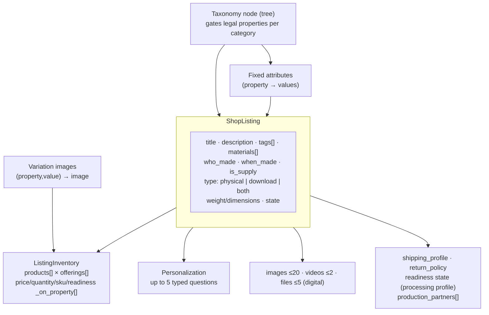
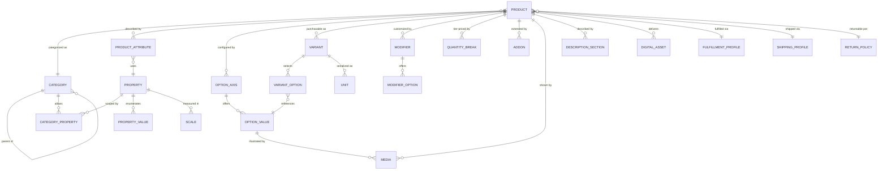

# Product Descriptions, Setup, and Configuration

Research date: 2026-08-26. Question: how does Etsy describe and configure products, what patterns emerge per category, and what data model generalizes from it.

Evidence tiers:
- **live** — observed directly on etsy.com listing pages via browser session on 2026-08-26 (8 listings across 8 category archetypes; variation dropdowns, personalization controls, JSON-LD, description text read from the DOM). Each is footnoted with its listing URL.[^l-ring][^l-mug][^l-tee][^l-dig][^l-table][^l-vintage][^l-wedding][^l-pet]
- **primary** — Etsy's OpenAPI 3.0 spec (fetched directly)[^spec], developers.etsy.com tutorials, help.etsy.com articles (each cited individually below).
- **secondary** — seller-tool guides (Alura, Craftybase, Insight Agent, SpySeller, Printify, DodgePrint, eRank, Size.ly; cited individually below).

---

## 1. Etsy's configuration model (primary sources)

A listing is one taxonomy-anchored record with satellite structures. From the OpenAPI spec:[^spec]



### 1.1 Taxonomy gates everything

Category selection (`taxonomy_id`, required at creation) determines which properties a listing may use. Each property carries two independent flags: `supports_attributes` (usable as a fixed, search-filterable attribute) and `supports_variations` (usable as a buyer-selected variation axis).[^spec] The same "Color" property can be attribute, variation, both, or neither depending on category. Properties can carry **scales** (e.g., ring size US/EU/UK) with cross-scale `equal_to` value mappings, `is_required`, `is_multivalued`, and enumerated `possible_values`.[^spec] Attributes are predefined option lists, not free text; sellers pick the closest match and compensate with tags.[^help-attr] Sustainability attributes exist for only 4 categories and are self-attested.[^help-attr]

Etsy maintains two views of one tree: a deep **seller taxonomy** (drives listing setup) and a shallower **buyer taxonomy** (drives browse/filter).[^tut-listings]

### 1.2 Variations: products × offerings

Inventory is a flat array of **products** — one per selected option combination (Color×Size with 3×4 options → 12 products). Each product holds its `property_values` (identity) and an `offerings` array with `price`, `quantity`, `is_enabled`, `readiness_state_id` (in practice 1 offering per product).[^tut-listings] Four parallel arrays — `price_on_property`, `quantity_on_property`, `sku_on_property`, `readiness_state_on_property` — declare which axis *drives* each of those values; each array must name zero, one, or all axes, never a partial subset, and products sharing the driving axis's value must carry identical dependent values.[^tut-listings] Listing-level `price` and `quantity` are derived aggregates (minimum price, summed quantity).[^spec]

Limits: currently 2 variation types (mid-migration to 3 — the API gate `max_variations_supported=3` GA's ~Aug 17 2026,[^tut-third] and the Help Center already documents 3 types[^help-var]); ~70 options per type;[^help-var] 4,900 combinations max at 2 types, 2,500 at 3; unique price/quantity/SKU for at most 400 combinations.[^tut-third][^help-var] Custom (non-taxonomy) variation types are allowed — reserved property IDs 513/514/516, max 3[^tut-listings] — but buyers cannot search-filter on them.[^help-var] Variation photos link a single (property, value) pair to an image via a separate join (`ListingVariationImage`), color-like axes only, 20-option cap.[^spec][^help-var] Updating inventory is a full-replace PUT.[^tut-listings]

### 1.3 Personalization is a separate subsystem

Personalization does not multiply inventory. It migrated from four flat fields (toggle, required flag, char limit, instructions — deprecated, removal 2026-04-09[^spec]) to a typed question schema: up to **5 questions** per listing, types `text_input` (seller-set char limit 1–1024; optional add-on price $0.20–$500[^tut-persprice]), `dropdown` (≤30 options), and one file-`upload` question (≤10 files, 100MB each, jpg/png/svg/heic/pdf); `required` is per-question.[^spec][^help-pers][^tut-persmig] Buyer answers land on the order/receipt as pseudo-variation entries (`property_id: 54`), one per question.[^tut-persmig]

### 1.4 Fulfillment configuration

- **Processing**: every physical listing needs a readiness state — `ready_to_ship` or `made_to_order` plus a 1–10 day/week processing window — settable per listing or per variation axis.[^spec][^tut-procmig] Buyer-facing "ship by" dates derive from it, and Etsy overrides shown estimates with the seller's actual last-120-day shipping performance.[^help-proc]
- **Shipping profiles**: reusable shop-level objects (manual or calculated) with per-destination costs, carrier or 1–45-day delivery estimates, and upgrades.[^spec][^help-ship]
- **Return policies**: reusable, mandatory on physical listings (non-EU), deadline restricted to {7, 14, 21, 30, 45, 60, 90} days.[^spec][^help-ret] Digital listings cannot have one.[^help-dig]
- **Digital listings**: `type: download`; ≤5 files, 20MB each, 70-char filenames; instant vs made-to-order delivery; no variations, no processing profile, no returns.[^help-dig][^alura]
- **Production partners**: disclosed per listing (name/descriptive title, location, description) — required for outsourced production such as POD.[^help-pp][^printify]

### 1.5 Description and media

Title ≤140 chars;[^help-create] description is unformatted free text with no stated cap (a `rich_description` HTML field exists in the API[^spec]); ≤13 tags of ≤20 chars;[^help-tags] ≤20 photos (alt text ≤500 chars per the API,[^spec] ~250 recommended, AI-generated if omitted[^help-alt]); ≤2 videos of 5–15s.[^help-create] The Materials free-tag field was removed March 2026, folded into the category Materials attribute.[^help-newly] Listings live 4 months per $0.20 renewal (auto by default);[^help-renew] states: draft, active, inactive, expired, sold_out.[^spec][^help-inactive]

---

## 2. Observed patterns on real listings (live)

Eight listings sampled 2026-08-26, one per archetype. What the structured model looks like when sellers actually use it:

| Archetype (listing)        | Variation axes as           | Personalization             | Notable                     |
|                            | configured                  |                             |                             |
| -------------------------- | --------------------------- | --------------------------- | --------------------------- |
| Engraved ring[^l-ring]     | "Color - Engraving Sides"   | Font dropdown (14) +        | Price varies within         |
|                            | (9), "Size - Ring Width"    | free-text box               | compound axis (both-sides   |
|                            | (20) — **4 logical axes     |                             | engraving +$8.50); made to  |
|                            | compounded into 2**         |                             | order                       |
| Personalized mug[^l-mug]   | "Mug Size"                  | Free-text box               | Product-type option inside  |
|                            | (11oz/15oz/**"BLANK / EMPTY |                             | the size axis; per-option   |
|                            | MUG"**), "Mug Color" (10)   |                             | price shows as a range      |
|                            |                             |                             | until the other axis is     |
|                            |                             |                             | picked                      |
| POD tee[^l-tee]            | "Comfort Colors® Colors"    | none                        | Size-tier upcharges (2XL    |
|                            | (10) × "Clothing sizes"     |                             | $25.55 → 4XL $32.85)        |
|                            | S–4XL                       |                             |                             |
| Digital wall-art           | none (platform-enforced)    | Free-text box (present even | "Instant Download" badge;   |
| bundle[^l-dig]             |                             | on digital)                 | no-returns boilerplate      |
| Walnut table[^l-table]     | "Length" (17, dual-unit     | none                        | Parametric dimensions       |
|                            | labels) × "Width" (8) —     |                             | discretized into options    |
|                            | **~136-cell dimensional     |                             |                             |
|                            | price matrix**,             |                             |                             |
|                            | $699.75–$3,360              |                             |                             |
| Vintage                    | "Style" (52) — **each       | n/a                         | Variation axis as OOAK unit |
| candlesticks[^l-vintage]   | option is a distinct        |                             | catalog; buyer-side         |
|                            | one-of-a-kind unit**        |                             | Highlights renders          |
|                            | numbered against photos     |                             | when_made / materials /     |
|                            |                             |                             | sustainability as badges    |
| Wedding invitation         | "Size Of Cards" (size ×     | **Paper-stock dropdown (6   | Third config axis pushed    |
| printing[^l-wedding]       | sidedness, 6), "Quantity Of | GSM options)** + free text  | into personalization;       |
|                            | Cards" (50–200 **bulk       |                             | bespoke order channeled     |
|                            | tiers** + "Preet Custom     |                             | through a variation option  |
|                            | Order")                     |                             |                             |
| Custom pet                 | "Option" (pets 1–5 × pose,  | Free-text box; photos       | Digital delivery as an      |
| portrait[^l-pet]           | 10), "Size and framing"     | exchanged post-purchase via | option inside a physical    |
|                            | (16, incl. **"Print         | Messages                    | listing                     |
|                            | file"**)                    |                             |                             |

Description conventions, from the live samples and secondary sources:

- **Pseudo-structure in plain text**: no formatting support, so sellers fake headers with emoji/caps dividers — "👉🏻 How to Order" / "👉🏻 Product Details" on the ring,[^l-ring] "🌼STARTER PACK🌻" on a bead lot,[^l-beads] "HOW TO ORDER:" in caps on the mug.[^l-mug] Secondary guides teach this as standard practice.[^gyc]
- **Numbered "How to Order" blocks** on every personalized listing sampled: the ring's 5 steps (select finish/size → add personalization → choose placement → mention font from listing images → notes),[^l-ring] the mug's 3 steps ending "leave the personalization in the box".[^l-mug] Seller guides document the same convention.[^craftybase][^spyseller-pers]
- **Spec blocks**: terse line lists — material/plating on the ring,[^l-ring] material/sizes/care/print method on the mug,[^l-mug] per-unit dimensions on the candlesticks.[^l-vintage] Craft-supply listings state exact counts/weights ("Price is for 100 grams").[^l-beads]
- **Size charts** pasted as description text with body-vs-garment measurement caveats (apparel/jewelry; secondary-sourced).[^spyseller-size][^sizely]
- **Disclaimers**: monitor color variance ("colors may differ depending on your monitor"),[^l-beads] handmade variance;[^gyc] vintage discloses condition per unit instead.[^l-vintage][^handbook-vintage]
- **Digital**: "you will receive" file manifests, format/DPI specs, license tier (personal vs commercial), no-refund notice.[^l-dig][^ia-dig]
- **Stationery**: proof-and-approval workflow described step-by-step in prose (purchase → submit wording → proof in 24–48h → revision rounds → approve → print); rush fees and samples sold as separate linked listings.[^ia-var][^dodgeprint]
- Every sampled listing page embeds a JSON-LD `Product` (name, description, offers with price or lowPrice/highPrice, aggregateRating).[^l-ring][^l-mug][^l-tee][^l-dig][^l-table][^l-vintage][^l-wedding][^l-pet]

### 2.1 The gap: where sellers fight the model

Each workaround observed live maps to a missing primitive:

| Observed workaround                  | Seen at                               | What sellers actually need            |
| ------------------------------------ | ------------------------------------- | ------------------------------------- |
| Compound option strings ("Gold -     | ring[^l-ring], wedding[^l-wedding],   | More variation axes than the platform |
| Inside", "3 US - 4mm", "2 pets \|    | pet portrait[^l-pet] [^spyseller-var] | allows                                |
| Full-body") — 6 of 8 physical        |                                       |                                       |
| listings                             |                                       |                                       |
| Personalization dropdowns holding    | ring[^l-ring], wedding[^l-wedding]    | Non-inventory option axes (choices    |
| config (fonts, paper stock)          |                                       | that don't multiply stock)            |
| "BLANK / EMPTY MUG", "Print file" as | mug[^l-mug], pet portrait[^l-pet]     | Product-type / delivery-method choice |
| variation options                    |                                       | within one listing                    |
| Personalization box shown regardless | mug[^l-mug]                           | Modifiers conditional on the selected |
| of selection — buyer picks the blank |                                       | variant (personalization is           |
| mug and is still asked for custom    |                                       | listing-scoped in Etsy's              |
| text; seller compensates in prose    |                                       | model[^spec])                         |
| ("If this is a personalized item,    |                                       |                                       |
| leave the personalization in the     |                                       |                                       |
| box")                                |                                       |                                       |
| Quantity tiers (50/60/…/200 cards)   | wedding[^l-wedding] [^ia-craft]       | Quantity-break pricing                |
| as variation options                 |                                       |                                       |
| 52-option "Style" axis of numbered   | candlesticks[^l-vintage]              | Unit-level (serialized) inventory     |
| one-of-a-kind units                  |                                       | under one listing                     |
| "Preet Custom Order" option; photo   | wedding[^l-wedding], pet              | Bespoke-order flow: structured        |
| handoff via Messages; stationery     | portrait[^l-pet] [^craftybase]        | intake, file upload, proof/approval   |
| proof loops in prose                 |                                       | workflow                              |
| 17×8 discretized table dimensions    | walnut table[^l-table]                | Parametric (formula-priced)           |
|                                      |                                       | dimensions                            |
| Emoji headers, How-to-Order blocks,  | ring[^l-ring], mug[^l-mug] [^gyc]     | Structured description sections       |
| pasted size charts                   |                                       |                                       |
| Rush fee / samples / commercial      | secondary-sourced [^dodgeprint]       | First-class add-ons                   |
| license as separate linked listings  | [^ia-dig]                             |                                       |

### 2.2 Case studies: how each seller hacked the model

Six of the eight sampled listings configure around the platform rather than with it. Per case: the seller's problem, the outcome they wanted, and the hack they chose.

#### Engraved ring — 6 configuration inputs, 2 variation slots

[etsy.com/listing/4377464635](https://www.etsy.com/listing/4377464635/personalized-name-ring-4mm-engraved-band)[^l-ring]

- **Problem**: the product has four discrete axes (metal finish, engraving placement, US ring size, band width) plus two open inputs (engraving text, font), and engraving placement changes the price (both sides +$8.50). The platform offers 2 variation slots and a personalization box.
- **Intended outcome**: one listing selling every combination, priced correctly per engraving placement.
- **Hack**: two compound axes — "Color - Engraving Sides" (3 finishes × 3 placements = 9 options, price on the placement half) and "Size - Ring Width" (10 sizes × 2 widths = 20 options). Font becomes a 14-option personalization dropdown; engraving text a personalization text box. The description carries a 5-step "How to Order" protocol, including "mention your font choice from the listing images" — the font specimens live in the photo gallery because options can't carry preview images of their own.
- **Cost**: 180 option combinations to manage; the size axis can't map to Etsy's ring-size scale (so no size-based search filtering); buyers cross-reference fonts by eye between a dropdown and photo captions.

#### Personalized mug — a second product inside the size axis

[etsy.com/listing/4385436268](https://www.etsy.com/listing/4385436268/personalized-ceramic-coffee-mug-tea-cup)[^l-mug]

- **Problem**: the seller offers the same mug decorated (personalized print) and blank, in two sizes and ten colors. Decorated and blank differ in price and in whether personalization applies. One listing consolidates the shop's 280-review social proof; separate listings would split it.
- **Intended outcome**: one listing where the buyer picks decorated-11oz, decorated-15oz, or blank, then a color, and only sees the text box when it applies.
- **Hack**: "BLANK / EMPTY MUG ($6.30 - $8.75)" added as a third option on the "Mug Size" axis — a product-type choice wearing a size costume. Price varies on both axes, so every color shows a range ("$8.75 - $15.22") until size is chosen.
- **Cost**: the personalization box is listing-scoped, so a blank-mug buyer is still asked for custom text; the seller patches the contradiction in prose ("If this is a personalized item, leave the personalization in the box"). The buyer holds the burden of ignoring a visible input.

#### Walnut table — parametric pricing without a formula

[etsy.com/listing/4346481367](https://www.etsy.com/listing/4346481367/walnut-dining-table-living-room-table)[^l-table]

- **Problem**: a made-to-order table is priced by its dimensions — a continuous function of length × width, roughly proportional to area ($699.75 to $3,360+). The platform prices discrete option combinations only.
- **Intended outcome**: buyer specifies a size, sees the correct price.
- **Hack**: discretize both dimensions — "Length" as 17 options in ~10cm steps, "Width" as 8 options — and hand-price the ~136-cell matrix. Each option label carries both units ("40\" - 100 cm") because a label is a string, not a measurement.
- **Cost**: 136 prices maintained by hand; sizes between steps are unsellable without a custom-order conversation; no unit conversion, sorting, or validation on what are really numbers.

#### Vintage candlesticks — 52 one-of-a-kind items, one listing

[etsy.com/listing/1758882682](https://www.etsy.com/listing/1758882682/vintage-brass-candlestick-holder-elegant)[^l-vintage]

- **Problem**: 52 similar but unique brass candlesticks, each with its own shape, height, and condition. The canonical route is one listing per item — 52 listings to photograph, describe, pay $0.20 renewals on, and none of which share reviews or search rank.
- **Intended outcome**: one strong listing where a buyer picks the exact physical unit they'll receive.
- **Hack**: a "Style" variation axis with 52 options, each option a number keyed to the listing photos ("The available candleholders are numbered in the images and listed in the drop-down menu"), per-unit dimensions listed in the description, quantity 1 per option so sold units vanish from the dropdown.
- **Cost**: the buyer assembles the unit's identity from three places (dropdown number → photo → dimension line); per-unit condition and measurements live in prose; the seller re-plumbs the numbering every time stock changes.

#### Wedding invitation printing — tiered service pricing plus bespoke orders

[etsy.com/listing/4516314769](https://www.etsy.com/listing/4516314769/custom-printing-service-wedding)[^l-wedding]

- **Problem**: a printing service priced on four axes — card size, single/double-sided, order quantity (with non-linear bulk discounts), paper stock — plus genuinely bespoke jobs quoted per customer. Two variation slots, no quantity-break pricing, no quoting mechanism.
- **Intended outcome**: buyer configures size, sidedness, quantity, and paper in one flow; repeat/custom clients pay a quoted price.
- **Hack**: three at once. "Size Of Cards" compounds size × sidedness (6 options). "Quantity Of Cards" turns bulk tiers into options (50/60/80/100/125/150/200, each hand-priced to encode the per-unit discount) — and smuggles in "Preet Custom Order ($461.25)", a specific customer's quote published as a public dropdown option. Paper stock, the axis that no longer fits, moves to a 6-option personalization dropdown (Hammered/Linen/Seed/Cotton/Cream Smooth/Matte GSM).
- **Cost**: quantity is a dropdown, so the platform's own quantity field is meaningless here; any buyer can select another customer's quote; paper choice — a priced, finite axis — rides in the personalization channel with no stock or image linkage.

#### Custom pet portrait — digital and physical in one product

[etsy.com/listing/1656546341](https://www.etsy.com/listing/1656546341/mini-custom-watercolor-pet-portrait-cat)[^l-pet]

- **Problem**: the commission varies on subject count (1–5 pets), pose (full-body/headshot), output (digital file, unframed print in several sizes, framed in several colors), and requires the buyer's photos as input. Listings are physical *or* digital; two variation slots; the classic personalization flow can't take file uploads.
- **Intended outcome**: one listing covering the full commission space, from an $18 digital file to a $254 multi-pet framed piece, with photo intake.
- **Hack**: "Option" compounds pets × pose (10 options); "Size and framing" compounds output format × frame color (16 options), with "Print file" — digital delivery — listed as just another option inside the physical listing. Photos are collected after purchase via Etsy Messages, per description instructions.
- **Cost**: the digital variant inherits physical-listing plumbing (shipping profile, processing) it doesn't need; photo intake happens outside the order, so the order isn't actionable until a Messages exchange completes — invisible to any fulfillment tooling.

The common shape: each hack relocates configuration from a structured channel that can't hold it into one that can — option labels absorb extra axes and product types, personalization absorbs overflow axes, the description absorbs protocol, Messages absorbs files. §3 promotes each destination into a primitive so the data stays structured.

---

## 3. Generalized data model

Design position: keep Etsy's proven three-layer split — **category-gated option catalog → inventory-bearing variants → non-inventory modifiers** — and promote each observed workaround into a primitive. Etsy's own trajectory validates the direction: it is currently shipping the third variation axis[^tut-third] and multi-question personalization,[^tut-persmig] i.e., relaxing exactly the constraints sellers route around.

### 3.1 Entities



### 3.2 Entity definitions

**Category / Property / PropertyValue / Scale** — Etsy's strongest idea, kept intact. A category tree where each node whitelists properties; each property declares `usable_as_attribute`, `usable_as_option_axis`, `required`, `multivalued`, optional value enumeration, and optional scales with cross-scale value equivalence (ring size US↔EU).[^spec] One tree with per-node `browse_depth` replaces Etsy's dual seller/buyer trees.[^tut-listings]

**Product** — the listing. Identity (title, category, state, timestamps), provenance (`who_made`, `when_made`, `is_supply`[^spec] — these drive marketplace-integrity labeling like "Vintage from before 2007"[^l-vintage] and the handmade/vintage/supply boundary), physical facts (weight, dimensions + units), and **delivery methods** as a set — `{physical, digital}` per variant, not a listing-level trichotomy. That one change absorbs both the "BLANK / EMPTY MUG"[^l-mug] and "Print file"[^l-pet] hacks.

**ProductAttribute** — fixed property→value assignments; feed search facets and the buyer-side Highlights panel, not cart selection.[^l-vintage][^erank] Not buyer-selectable.

**OptionAxis / OptionValue** — buyer-facing variation axes. No hardcoded axis count; cap the **variant count** (Etsy's real limit is combinations, not axes — 400 fully-priced combos at 2 axes[^tut-third]). An axis references a catalog property when one fits (search-filterable) or is custom (label only).[^help-var] Option values carry `label`, optional `surcharge` (delta pricing — what sellers approximate today with per-combination totals[^help-var]), optional linked media, `position`.

**Variant** — one sellable combination. **Sparse, not Cartesian**: rows exist only for combinations the seller enables (Etsy materializes the full product matrix and then disables cells;[^tut-listings] sparse rows make the 52-of-52[^l-vintage] and 136-cell[^l-table] cases cheap). Fields: `sku`, `price` (explicit, or derived base+surcharges — the two pricing modes replace `*_on_property` declarations), `quantity`, `enabled`, `delivery_method`, optional `fulfillment_profile_id` override. Product-level `price_min`/`in_stock` are derived aggregates, as on Etsy.[^spec]

**Unit** — serialized inventory: an individual physical item under a variant (`serial`, per-unit photos, condition grade, dimensions). Gives vintage/OOAK sellers "one listing, 52 numbered candlesticks" natively;[^l-vintage] `quantity` for a serialized variant is `count(units where state=available)`.

**Modifier / ModifierOption** — Etsy's personalization subsystem,[^help-pers] generalized: typed per-order-line questions that never multiply inventory. Types `text` (char limit), `select` (options), `file_upload` (count/size/type caps), `date`, `measurement`. Each carries `required`, `instructions`, optional `add_on_price` (per-option for selects — the paper-stock case[^l-wedding] prices GSM tiers honestly), and an `applies_to` scope: product-wide, or limited to specific option values/variants. Etsy scopes personalization to the whole listing, so a buyer who selects the blank mug is still shown the custom-text box and the seller can only patch it in prose[^l-mug] — `applies_to` makes the question disappear for configurations it doesn't fit. Answers snapshot onto the order line.[^tut-persmig]

**QuantityBreak** — `(min_qty, unit_price)` tiers per product or variant. Replaces quantity-as-variation (50/60/80… cards[^l-wedding]) and the craft-supply lot pattern.[^ia-craft]

**Addon** — a link `product → addon product` with role (`rush`, `sample`, `license_upgrade`, `gift_wrap`), orderable in the same cart line context. Replaces "buy this other listing alongside."[^dodgeprint]

**DescriptionSection** — the description as an ordered list of typed sections: `text` (markdown), `specs` (key/value list), `size_chart` (table + unit + body-vs-garment flag[^spyseller-size]), `how_to_order` (ordered steps — render automatically for products with required modifiers[^l-ring][^l-mug]), `included_files` (auto-derived from digital assets), `faq`, `care`, `disclaimer`. Sellers stop faking structure with emoji;[^gyc] buyers get consistent, machine-readable pages; search gets clean text.

**DigitalAsset** — files on product or variant (`filename`, `size`, `mime`, `license_tier`, delivery `instant | after_fulfillment`[^help-dig]). License tiers (personal/commercial) become data instead of description prose plus a duplicate listing.[^ia-dig]

**FulfillmentProfile** — `ready_to_ship | made_to_order | bespoke`, processing window (value + unit), and for `bespoke` an ordered workflow: `intake → proof → approval_rounds(n) → production` with per-step due times. Assignable per product, overridable per variant (Etsy allows readiness per axis;[^tut-procmig] mixed-fulfillment listings are real — in-stock silver vs made-to-order gold[^ia-var]). Stationery's proof loop becomes trackable order state instead of prose.

**ShippingProfile / ReturnPolicy** — reusable shop-level objects as on Etsy: destination-priced manual or calculated shipping (carrier or day-range estimates),[^spec] freight flag for the furniture case;[^ia-furn] return policy with enum-restricted deadlines,[^spec] auto-suppressed for digital-only variants.[^help-dig]

### 3.3 Buy-box resolution

```
line_price = variant.price                     -- or base + Σ option surcharges
           + Σ modifier add_on_prices
           applied through quantity_break(unit_price, qty)
availability = variant.enabled
             ∧ (quantity > 0 | made_to_order | bespoke | digital)
ship_estimate = fulfillment_profile(variant) + shipping_profile.destination(buyer)
```

Etsy's live UI behavior (per-option price ranges until all axes are chosen,[^l-mug][^l-tee] options greying out per stock) falls out of the same resolution over sparse variants.

### 3.4 Limits worth adopting (numbers Etsy converged on)

| Limit                        | Value                                                       | Source                  |
| ---------------------------- | ----------------------------------------------------------- | ----------------------- |
| Title                        | 140 chars                                                   | [^help-create]          |
| Tags                         | 13 × 20 chars                                               | [^help-tags]            |
| Images / videos              | 20 / 2 (5–15s)                                              | [^spec][^help-create]   |
| Alt text                     | 500 chars                                                   | [^spec]                 |
| Variant count (fully priced) | ~400; ~2,500 sparse                                         | [^tut-third]            |
| Options per axis             | ~70                                                         | [^help-var]             |
| Modifier questions           | 5/product; text ≤1024; select ≤30 options; 1 upload ≤10     | [^spec][^help-pers]     |
|                              | files ×100MB                                                |                         |
| Modifier add-on price        | $0.20–$500                                                  | [^spec][^tut-persprice] |
| Digital files                | 5 × 20MB (raise this — sellers route around it with         | [^help-dig]             |
|                              | link-PDFs[^ia-dig])                                         |                         |
| Processing window            | 1–10 days/weeks                                             | [^spec]                 |
| Return deadline              | {7,14,21,30,45,60,90} days                                  | [^spec]                 |
| Delivery estimate            | 1–45 days                                                   | [^spec]                 |

### 3.5 Divergences from Etsy, summarized

1. **N option axes with a variant-count cap** instead of a fixed axis count → kills compound option strings.
2. **Sparse variants** instead of materialized Cartesian products with disable flags → OOAK and dimension matrices stay cheap; no full-replace-PUT semantics.
3. **Delivery method per variant** instead of listing-level physical/download/both → absorbs digital/physical hybrids.
4. **Explicit price modes** (per-variant, or base + axis surcharges) instead of `*_on_property` declaration arrays with cross-product consistency invariants — same expressiveness, no invariant for sellers or API clients to violate.
5. **Quantity breaks, serialized units, add-on links, bespoke workflow** as primitives — each replaces an observed hack.
6. **Typed description sections** instead of one unformatted blob — the single largest observed gap between what sellers write and what the platform stores.
7. **One taxonomy** with browse-depth metadata instead of parallel seller/buyer trees.

---

## Blind spots

- Shop Manager's authenticated listing-form UI was not observed; form structure comes from Help Center documentation.
- 9 live listings (8 archetypes + 1 craft-supply lot) is a pattern sample, not a survey; per-archetype claims beyond these are secondary-sourced.
- Etsy's variation limits are mid-migration (2→3 axes); numbers cited may shift at GA (~Aug 17 2026).[^tut-third]
- Etsy search-ranking effects of attributes/tags were out of scope.

## Footnotes

Live listings (observed via browser 2026-08-26; content and availability may change — Etsy listings expire every 4 months):

[^l-ring]: [Personalized Sterling Silver Band Ring — etsy.com/listing/4377464635](https://www.etsy.com/listing/4377464635/personalized-name-ring-4mm-engraved-band) — $36, 4.9★. Observed: compound variation axes "Color - Engraving Sides" and "Size - Ring Width", personalization font dropdown + text box, "👉🏻 How to Order" description block, "Made to Order" badge.
[^l-mug]: [Custom Ceramic Mug — etsy.com/listing/4385436268](https://www.etsy.com/listing/4385436268/personalized-ceramic-coffee-mug-tea-cup) — from $6.30, 4.9★/280. Observed: "BLANK / EMPTY MUG" option inside the size axis, per-option price ranges, personalization textarea, "HOW TO ORDER" steps.
[^l-tee]: [Vintage Herbs 90s Graphic T-Shirt — etsy.com/listing/4478580847](https://www.etsy.com/listing/4478580847/vintage-herbs-90s-graphic-t-shirt-retro) — from $16.42. Observed: Color (10) × Size (S–4XL) with size-tier upcharges; no personalization.
[^l-dig]: [30,000 Printable Wall Art Set — etsy.com/listing/4363875620](https://www.etsy.com/listing/4363875620/entire-shop-sale-30000-printable-wall) — $9.31, 4.6★/166. Observed: no variation selects, "Instant Download"/"Digital download" badges, no-returns boilerplate, personalization textarea present.
[^l-table]: [Walnut Dining Table — etsy.com/listing/4346481367](https://www.etsy.com/listing/4346481367/walnut-dining-table-living-room-table) — from $699.75, 5.0★. Observed: Length (17 options, dual-unit labels) × Width (8) dimensional price matrix to $3,360+.
[^l-vintage]: [Vintage Brass Candlestick Holder — etsy.com/listing/1758882682](https://www.etsy.com/listing/1758882682/vintage-brass-candlestick-holder-elegant) — $25, 5.0★. Observed: 52-option "Style" axis of numbered one-of-a-kind units; Highlights panel rendering "Vintage from before 2007", "Materials: brass", "Sustainable features: upcycled"; per-unit dimensions in description.
[^l-wedding]: [Custom Wedding Invitation Printing — etsy.com/listing/4516314769](https://www.etsy.com/listing/4516314769/custom-printing-service-wedding) — from $111.75, 5.0★. Observed: "Size Of Cards" (size × sidedness), "Quantity Of Cards" bulk tiers 50–200 + "Preet Custom Order ($461.25)", personalization dropdown of 6 paper stocks (Hammered/Linen/Seed/Cotton/Cream Smooth/Matte GSM) + text box.
[^l-pet]: [Custom Miniature Watercolor Pet Portrait — etsy.com/listing/1656546341](https://www.etsy.com/listing/1656546341/mini-custom-watercolor-pet-portrait-cat) — from $18.37, 4.9★/1134. Observed: "Option" (pets 1–5 × pose) and "Size and framing" (16 options incl. "Print file") compound axes; photos exchanged post-purchase.
[^l-beads]: [Wholesale Mixed Lampwork Glass Bead Lot — etsy.com/listing/4330358322](https://www.etsy.com/listing/4330358322/wholesale-starter-pack-mixed-lampwork) — $15, 4.9★/51. Observed: no variations, unit = 100g lot ("Price is for 100 grams"), emoji header, monitor-variance disclaimer.

Etsy primary sources (fetched 2026-08-26):

[^spec]: [Etsy Open API v3 spec (JSON)](https://www.etsy.com/openapi/generated/oas/3.0.0.json) — schemas: ShopListing, ListingInventory/Product/Offering, ListingPropertyValue, ListingPersonalization/PersonalizationQuestion, TaxonomyNodeProperty/Scale/Value, ShopShippingProfile, ShopReturnPolicy, ListingImage/Video/File, ListingVariationImage, readiness-state endpoints. Reference UI at [developers.etsy.com/documentation/reference](https://developers.etsy.com/documentation/reference).
[^tut-listings]: [Listings Tutorial — developers.etsy.com](https://developers.etsy.com/documentation/tutorials/listings) — products×offerings model, `*_on_property` rules and worked examples, custom variation property IDs 513/514/516, full-replace PUT, seller vs buyer taxonomy, property-value discovery flow.
[^tut-third]: [Third Variation Tutorial — developers.etsy.com](https://developers.etsy.com/documentation/tutorials/third-variation) — `max_variations_supported=3` gate, GA ~2026-08-17, 2,500/400 combination limits.
[^tut-persmig]: [Personalization Migration — developers.etsy.com](https://developers.etsy.com/documentation/tutorials/personalization-migration) — multi-question model, `supports_multiple_personalization_questions` flag, receipt `property_id: 54` entries; examples at [tutorials/personalization/examples](https://developers.etsy.com/documentation/tutorials/personalization/examples).
[^tut-persprice]: [Personalization Add-on Pricing — developers.etsy.com](https://developers.etsy.com/documentation/tutorials/personalization-addon-pricing) — $0.20–$500 add-on price on optional text questions.
[^tut-procmig]: [Processing Profiles Migration — developers.etsy.com](https://developers.etsy.com/documentation/tutorials/migration) — readiness-state definitions replacing shipping-profile processing times, per-axis `readiness_state_on_property`.
[^help-create]: [How to Create a Listing — help.etsy.com 115015628707](https://help.etsy.com/hc/en-us/articles/115015628707) — 7-tab form, 140-char title, 20 photos, 2 videos (5–15s).
[^help-var]: [How to Add Variations to Your Listings — help.etsy.com 115015664047](https://help.etsy.com/hc/en-us/articles/115015664047) — 3 variation types, ~70 options/type, 4,900/2,500/400 combination limits, vary-on toggles, custom variations not search-filterable, 20-option variation-photo cap.
[^help-pers]: [How to Offer Personalized Listings — help.etsy.com 360000344528](https://help.etsy.com/hc/en-us/articles/360000344528) — 5 Custom-options fields; text 1–1024 chars with $0.20–$500 add-on; dropdown ≤30 options; one upload field, 10 files × 100MB, jpg/png/svg/heic/pdf.
[^help-dig]: [How to Manage Your Digital Listings — help.etsy.com 115015628347](https://help.etsy.com/hc/en-us/articles/115015628347) — instant vs made-to-order downloads, 5 files × 20MB, 70-char filenames, no variations/processing/returns.
[^help-attr]: [How to Use Attributes When Listing an Item — help.etsy.com 115014502508](https://help.etsy.com/hc/en-us/articles/115014502508) — category-driven predefined attribute lists, closest-match + tag guidance, 4-category sustainability attributes.
[^help-tags]: [How to Use Tags to Get Found in Search — help.etsy.com 360000336307](https://help.etsy.com/hc/en-us/articles/360000336307) — 13 tags × 20 chars, charset rules.
[^help-alt]: [How to Add a Text Alternative to Your Listing Images — help.etsy.com 4406604492823](https://help.etsy.com/hc/en-us/articles/4406604492823) — ~250-char recommendation, AI-generated fallback.
[^help-pp]: [Working with Production Partners on Etsy — help.etsy.com 360000336547](https://help.etsy.com/hc/en-us/articles/360000336547) — per-listing disclosure fields and exclusions.
[^help-proc]: [Processing Times, Processing Profiles and "Ship By" Dates — help.etsy.com 115015588087](https://help.etsy.com/hc/en-us/articles/115015588087) — ready-to-ship vs made-to-order profiles, performance-adjusted estimates, one 21-day extension.
[^help-ship]: [How to Set Up Shipping Information — help.etsy.com 115014115187](https://help.etsy.com/hc/en-us/articles/115014115187) — shipping profiles, calculated shipping inputs, tariff number.
[^help-ret]: [How Do I Set Return Policies on My Listings — help.etsy.com 7869401615255](https://help.etsy.com/hc/en-us/articles/7869401615255) — mandatory on physical listings (non-EU), 30-day simple template, EU 14-day legal minimum.
[^help-renew]: [How to Renew or Hide Your Listings — help.etsy.com 360000344368](https://help.etsy.com/hc/en-us/articles/360000344368) — 4-month lifespan, $0.20 renewal, auto-renew default, variation quantities reset to 1.
[^help-inactive]: [Why Is My Listing Inactive — help.etsy.com 360040986253](https://help.etsy.com/hc/en-us/articles/360040986253) — listing states.
[^help-newly]: [Newly Crafted: Etsy Updates for Your Shop — help.etsy.com 10603291042967](https://help.etsy.com/hc/en-us/articles/10603291042967) — Materials tag field removal (March 2026), stable listing URLs.

Secondary sources:

[^alura]: [The Seller's Guide to Etsy Listing Variations — Alura](https://www.alura.io/docs/article/the-sellers-guide-to-etsy-listing-variations)
[^craftybase]: [How to Add Personalization to Etsy Listings — Craftybase](https://craftybase.com/blog/etsy-personalization-guide-for-sellers) — personalization as de facto extra axis, Messages workaround for photos.
[^ia-var]: [Etsy Variations: Product Options Guide — Insight Agent](https://www.insightagent.app/guides/variations-for-etsy-sellers) — mixed ready-to-ship/made-to-order variations, stationery proof workflow.
[^ia-dig]: [How Digital Downloads Work on Etsy — Insight Agent](https://www.insightagent.app/guides/etsy-digital-downloads-explained) — file manifests, license tiers, link-PDF workaround for the 20MB cap.
[^ia-furn]: [Selling Furniture on Etsy — Insight Agent](https://www.insightagent.app/guides/selling-furniture-on-etsy) — made-to-order lead times, freight/LTL shipping shapes.
[^ia-craft]: [Sell Craft Supplies on Etsy — Insight Agent](https://www.insightagent.app/guides/selling-craft-supplies-on-etsy) — pack-size variations with tiered per-unit pricing.
[^spyseller-var]: [How to Add Variations on Etsy Without Confusing Buyers — SpySeller](https://medium.com/@spyseller/how-to-add-variations-on-etsy-without-confusing-buyers-spyseller-46e2d004c683) — compound "Color / Size" option strings.
[^spyseller-pers]: [How to Use Personalization Fields to Increase Etsy Conversions — SpySeller](https://medium.com/@spyseller/how-to-use-personalization-fields-to-increase-etsy-conversions-spy-21dd097d9685)
[^spyseller-size]: [How to Build a Size Guide for Etsy Listings — SpySeller](https://spyseller.com/blog/how-to-build-a-size-guide-for-etsy-listings-examples) — body vs garment measurement conventions.
[^sizely]: [Create Size Charts for Your Etsy Business — Size.ly](https://www.size.ly/online-marketplaces/etsy-size-chart)
[^dodgeprint]: [Etsy Separate Listing or Combined — DodgePrint](https://dodgeprint.com/blog/etsy-separate-listing-or-combined) — linked/add-on listing pattern and its tradeoffs.
[^gyc]: [Etsy Product Description Templates — Growing Your Craft](https://www.growingyourcraft.com/blog/etsy-product-description-templates) — emoji/pseudo-header and disclaimer conventions.
[^erank]: [Using Holiday Attributes Effectively — eRank](https://help.erank.com/blog/using-holiday-attributes-effectively/) — occasion/holiday attributes feed search filters, not cart selection.
[^printify]: [Etsy Print on Demand — Printify](https://printify.com/sell-on-etsy-drop-shipping/) — production-partner disclosure and POD fulfillment flow.
[^handbook-vintage]: [10 Tips for Starting a Vintage Shop — Etsy Seller Handbook](https://www.etsy.com/seller-handbook/article/43533630041) — 20+ year vintage rule, condition disclosure norms.
